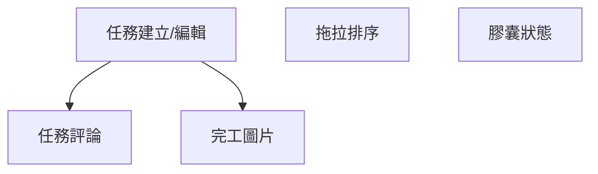

# PRD 分拆任務樹 Prompt

> 將 PRD 需求分拆為可執行的任務樹結構

---

## 🎯 用途

將 PRD 產品需求文件分拆為：

- 開發任務樹
- 子任務與驗收標準
- 依賴關係
- 優先級排序
- 工時估算

---

## 📋 Prompt 模板

```
請將以下 PRD 需求分拆為任務樹：

## PRD 章節
[PRD 章節編號與標題]

## 需求內容
[需求描述]

## 分拆要求
- 單一任務不超過 8 小時
- 每個任務有明確的驗收標準
- 標注任務依賴關係
- 標注優先級 (P0-P3)

## 輸出格式
使用 Markdown 任務樹格式
```

---

## 📝 範例

### 輸入

```
## PRD 章節
4.5 任務系統

## 需求內容
任務系統（主核心模組）需要完成以下功能：

已完成：
- 任務樹狀結構 (TaskTreeComponent)
- 任務表格視圖 (TaskTableComponent)
- 視圖切換功能
- 任務搜尋與篩選
- 狀態/優先級/類型枚舉

待實現：
- 任務膠囊狀態顯示增強
- 完工圖片顯示
- 任務拖拉排序
- 任務建立/編輯對話框
- 任務評論與討論

## 分拆要求
- 單一任務不超過 8 小時
- 每個任務有明確的驗收標準
- 標注任務依賴關係
- 標注優先級 (P0-P3)
```

### 輸出

```markdown
# 任務系統功能開發任務樹

## 總覽

| 指標 | 數值 |
|------|------|
| 總任務數 | 15 |
| 總工時估算 | 72 小時 |
| P0 任務 | 3 |
| P1 任務 | 5 |
| P2 任務 | 5 |
| P3 任務 | 2 |

---

## 任務樹

### 📋 TASK-001: 任務建立/編輯功能 [P0]
> 使用者可以透過對話框建立和編輯任務

**預估工時**: 16 小時  
**依賴**: 無  
**負責角色**: 前端工程師

#### 子任務

##### TASK-001-1: 建立任務對話框元件 (4h)
- [ ] 建立 `task-form-dialog.component.ts`
- [ ] 實作表單欄位（標題、描述、狀態、優先級、類型）
- [ ] 實作日期選擇器（開始日期、截止日期）
- [ ] 實作負責人選擇器

**驗收標準**:
- 對話框可正常開啟/關閉
- 表單驗證正確（必填欄位、日期邏輯）
- 支援鍵盤操作 (Enter 送出, Esc 關閉)

##### TASK-001-2: 實作任務建立 API 整合 (4h)
- [ ] 擴展 `TaskRepository.create()` 方法
- [ ] 在 `TaskStore` 新增 `createTask()` 方法
- [ ] 處理建立成功/失敗回饋

**驗收標準**:
- 建立任務成功後自動更新列表
- 錯誤訊息正確顯示
- Loading 狀態正確顯示

##### TASK-001-3: 實作任務編輯功能 (4h)
- [ ] 複用對話框元件，支援編輯模式
- [ ] 實作 `TaskRepository.update()` 方法
- [ ] 在 `TaskStore` 新增 `updateTask()` 方法

**驗收標準**:
- 點擊任務可開啟編輯對話框
- 編輯後資料正確更新
- 支援取消編輯

##### TASK-001-4: 單元測試 (4h)
- [ ] 對話框元件測試
- [ ] Store 方法測試
- [ ] Repository 方法測試

**驗收標準**:
- 測試覆蓋率 > 80%
- 邊界條件測試完整

---

### 📋 TASK-002: 任務評論系統 [P0]
> 使用者可以在任務下方新增、編輯、刪除評論

**預估工時**: 16 小時  
**依賴**: TASK-001  
**負責角色**: 前端工程師

#### 子任務

##### TASK-002-1: 資料表與 RLS 設計 (2h)
- [ ] 建立 `task_comments` 資料表
- [ ] 設計 RLS 政策

**驗收標準**:
- Migration 腳本正確執行
- RLS 政策測試通過

##### TASK-002-2: Repository 與 Store (4h)
- [ ] 建立 `TaskCommentRepository`
- [ ] 建立 `TaskCommentStore`

**驗收標準**:
- CRUD 操作正常
- 狀態管理正確

##### TASK-002-3: 評論列表元件 (4h)
- [ ] 建立 `task-comment-list.component.ts`
- [ ] 實作評論顯示
- [ ] 實作新增評論

**驗收標準**:
- 評論正確顯示
- 新增評論即時更新

##### TASK-002-4: 評論編輯與刪除 (4h)
- [ ] 實作編輯自己的評論
- [ ] 實作刪除評論

**驗收標準**:
- 只能編輯/刪除自己的評論
- 確認刪除對話框

##### TASK-002-5: @提及功能 (2h)
- [ ] 實作 @ 觸發選單
- [ ] 實作用戶搜尋
- [ ] 儲存提及用戶

**驗收標準**:
- @ 輸入時顯示用戶列表
- 選擇用戶後自動填入

---

### 📋 TASK-003: 任務拖拉排序 [P1]
> 使用者可以透過拖拉調整任務順序

**預估工時**: 8 小時  
**依賴**: 無  
**負責角色**: 前端工程師

#### 子任務

##### TASK-003-1: 整合 CDK Drag Drop (4h)
- [ ] 安裝 @angular/cdk
- [ ] 整合到任務樹元件
- [ ] 整合到任務表格元件

**驗收標準**:
- 拖拉操作流暢
- 支援跨層級拖拉

##### TASK-003-2: 排序持久化 (4h)
- [ ] 新增 `sort_order` 欄位
- [ ] 實作批量更新排序 API
- [ ] 樂觀更新 + 錯誤回滾

**驗收標準**:
- 排序變更即時反映
- 重新整理後順序正確
- 錯誤時回滾到原順序

---

### 📋 TASK-004: 任務膠囊狀態增強 [P1]
> 增強任務狀態顯示，包含進度、子任務數量等

**預估工時**: 8 小時  
**依賴**: 無  
**負責角色**: 前端工程師

#### 子任務

##### TASK-004-1: 膠囊元件設計 (4h)
- [ ] 設計膠囊視覺樣式
- [ ] 實作進度環顯示
- [ ] 實作子任務計數

**驗收標準**:
- 視覺設計符合規範
- 響應式適配

##### TASK-004-2: 整合到現有元件 (4h)
- [ ] 整合到 TaskTreeComponent
- [ ] 整合到 TaskTableComponent
- [ ] 整合到 TaskCardComponent

**驗收標準**:
- 各視圖顯示一致
- 效能無明顯影響

---

### 📋 TASK-005: 完工圖片顯示 [P1]
> 任務完工後顯示上傳的完工照片

**預估工時**: 8 小時  
**依賴**: TASK-001  
**負責角色**: 前端工程師

#### 子任務

##### TASK-005-1: 圖片上傳功能 (4h)
- [ ] 實作圖片上傳 API
- [ ] 整合 Supabase Storage
- [ ] 縮圖生成

**驗收標準**:
- 支援多圖上傳
- 圖片壓縮到合理大小

##### TASK-005-2: 圖片預覽與管理 (4h)
- [ ] 實作圖片預覽元件
- [ ] 實作圖片刪除
- [ ] 實作圖片排序

**驗收標準**:
- 圖片載入流暢
- 支援放大檢視

---

## 依賴關係圖



---

## 優先級矩陣

| 優先級 | 任務 | 工時 |
|--------|------|------|
| P0 | TASK-001, TASK-002 | 32h |
| P1 | TASK-003, TASK-004, TASK-005 | 24h |
| P2 | (其他待補充) | - |
| P3 | (其他待補充) | - |

---

## 建議開發順序

1. **第一週**: TASK-001 (任務建立/編輯)
2. **第二週**: TASK-002 (任務評論)
3. **第三週**: TASK-003 (拖拉排序) + TASK-004 (膠囊狀態)
4. **第四週**: TASK-005 (完工圖片)
```

---

## 📚 參考資源

- [PRD 文件](../../../docs/prd/construction-site-management.md)
- [系統架構](../../../docs/architecture/system-architecture.md)
- [AI 思維導圖](../../../docs/agent/mindmap.md)

---

**最後更新**: 2025-11-27
