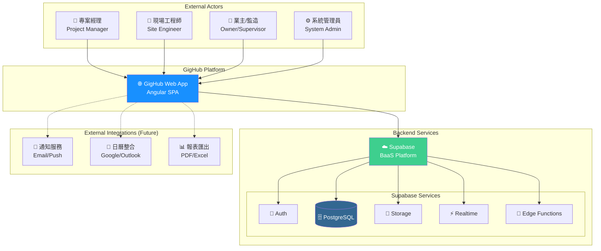
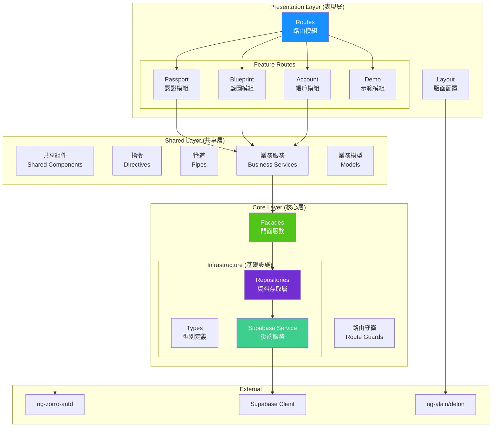
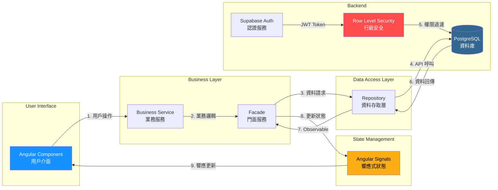
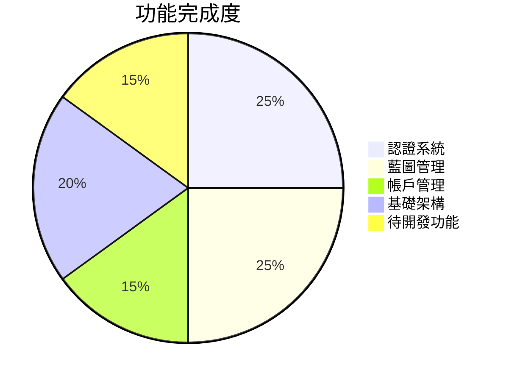
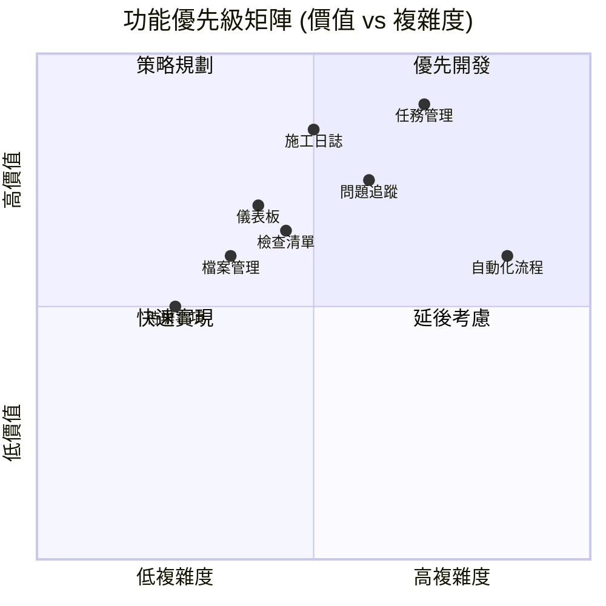
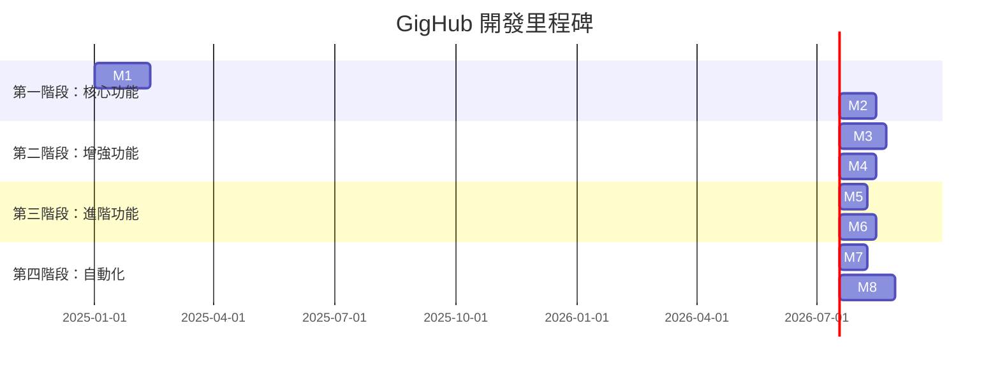
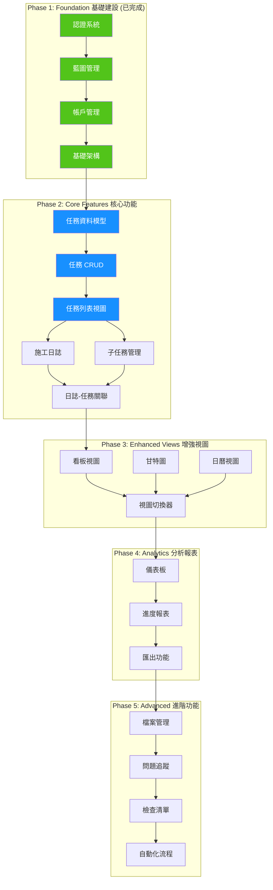

# GigHub - 專案架構分析與開發路線圖

## Executive Summary

GigHub 是一個**營建工程施工管理平台**，旨在提供施工團隊一個現代化的專案協作工具。平台採用 Angular 19 前端框架搭配 Supabase 後端服務，使用 ng-alain/ng-zorro-antd 作為 UI 框架，打造企業級的施工管理解決方案。

### 核心目標
- 📋 **工項任務管理** - 施工進度追蹤與任務指派
- 📝 **施工日誌** - 每日施工記錄與報告
- 👥 **團隊協作** - 多角色權限管理與協作
- 📊 **進度視覺化** - 甘特圖、看板等多維度視圖

---

## 目錄

1. [系統架構總覽](#系統架構總覽)
2. [組件架構分析](#組件架構分析)
3. [資料流分析](#資料流分析)
4. [現有功能模組](#現有功能模組)
5. [待開發功能分析](#待開發功能分析)
6. [專案里程碑](#專案里程碑)
7. [開發路線圖](#開發路線圖)
8. [技術建議與風險分析](#技術建議與風險分析)

---

## 系統架構總覽

### System Context Diagram (系統上下文圖)



### 架構說明

| 層級 | 技術 | 說明 |
|------|------|------|
| **前端** | Angular 19 + ng-alain | 單頁應用程式 (SPA)，Standalone Components |
| **UI 框架** | ng-zorro-antd | Ant Design Angular 實作 |
| **後端** | Supabase | PostgreSQL + Auth + Storage + Realtime |
| **狀態管理** | Angular Signals | 響應式狀態管理 |
| **樣式** | SCSS + Ant Design | 企業級 UI 設計系統 |

---

## 組件架構分析

### Component Diagram (組件圖)



### 架構分層說明

#### 1. Core Layer (核心層) - `/src/app/core`

| 模組 | 用途 | 狀態 |
|------|------|------|
| `infra/repositories` | 資料存取層，封裝 Supabase 操作 | ✅ 已完成 |
| `infra/types` | TypeScript 型別定義 | ✅ 已完成 |
| `facades` | 門面模式，協調服務層 | ✅ 已完成 |
| `guards` | 路由守衛 (認證、權限) | ✅ 已完成 |
| `supabase` | Supabase 客戶端服務 | ✅ 已完成 |

#### 2. Shared Layer (共享層) - `/src/app/shared`

| 模組 | 用途 | 狀態 |
|------|------|------|
| `services` | 業務邏輯服務 | ✅ 已完成 |
| `models` | 業務層資料模型 | ✅ 已完成 |
| `components` | 共享 UI 組件 | 🔄 待擴充 |

#### 3. Routes Layer (路由層) - `/src/app/routes`

| 模組 | 用途 | 狀態 |
|------|------|------|
| `passport` | 登入/註冊/重置密碼 | ✅ 已完成 |
| `blueprint` | 藍圖 CRUD 與概覽 | ✅ 已完成 |
| `account` | 帳戶管理 | ✅ 已完成 |
| `demo` | 示範頁面 (ng-alain) | ✅ 參考用 |

---

## 資料流分析

### Data Flow Diagram (資料流圖)



### 資料流程說明

1. **用戶操作** → Component 接收用戶輸入
2. **業務邏輯** → Service 處理業務規則
3. **門面協調** → Facade 統一服務入口
4. **資料存取** → Repository 封裝 DB 操作
5. **安全驗證** → Supabase RLS 執行權限檢查
6. **狀態更新** → Signal 觸發 UI 重渲染

---

## 現有功能模組

### 已完成功能



#### 1. 認證模組 (Passport) ✅

| 功能 | 路由 | 狀態 |
|------|------|------|
| 登入 | `/passport/login` | ✅ |
| 註冊 | `/passport/register` | ✅ |
| 忘記密碼 | `/passport/forget-password` | ✅ |
| OAuth 登入 | - | 🔄 已支援但待測試 |

#### 2. 藍圖管理模組 (Blueprint) ✅

| 功能 | 路由 | 狀態 |
|------|------|------|
| 藍圖列表 | `/blueprint/list` | ✅ |
| 創建藍圖 | `/blueprint/create` | ✅ |
| 藍圖概覽 | `/blueprint/:id/overview` | ✅ |
| 成員管理 | `/blueprint/:id/members` | ✅ |
| 任務管理 | `/blueprint/:id/tasks` | 🔄 佔位頁面 |

#### 3. 帳戶管理模組 (Account) ✅

| 功能 | 路由 | 狀態 |
|------|------|------|
| 個人資料 | `/account/profile` | ✅ |
| 帳戶設定 | `/account/settings` | ✅ |

---

## 待開發功能分析

### 模組類型定義 (來自程式碼)

```typescript
enum ModuleType {
  TASKS = 'tasks',           // 任務管理 - 核心功能
  DIARY = 'diary',           // 施工日誌 - 核心功能
  DASHBOARD = 'dashboard',   // 儀表板
  BOT_WORKFLOW = 'bot_workflow', // 自動化流程
  FILES = 'files',           // 檔案管理
  TODOS = 'todos',           // 待辦事項
  CHECKLISTS = 'checklists', // 檢查清單
  ISSUES = 'issues'          // 問題追蹤
}
```

### 功能優先級矩陣



---

## 專案里程碑

### Milestone Timeline (里程碑時間線)



### 里程碑詳細說明

#### 🎯 Milestone 1: 任務管理 MVP (6 週)

**目標**: 建立完整的工項任務 CRUD 與基本視圖

| 功能 | 說明 | 預估工時 |
|------|------|----------|
| 任務資料模型 | 資料庫 schema + TypeScript 型別 | 3 天 |
| 任務 Repository | CRUD 資料存取層 | 3 天 |
| 任務 Service | 業務邏輯服務 | 3 天 |
| 任務列表視圖 | 表格 + 篩選 + 排序 | 5 天 |
| 任務詳情/編輯 | 表單 + 驗證 | 5 天 |
| 子任務功能 | 父子關係管理 | 4 天 |
| 任務指派 | 成員指派功能 | 3 天 |
| 狀態流程 | 狀態轉換邏輯 | 3 天 |

**交付物**:
- ✅ 可創建、編輯、刪除任務
- ✅ 任務列表與篩選
- ✅ 子任務支援
- ✅ 成員指派
- ✅ 狀態管理

#### 🎯 Milestone 2: 施工日誌 MVP (4 週)

**目標**: 每日施工記錄與簡易報表

| 功能 | 說明 | 預估工時 |
|------|------|----------|
| 日誌資料模型 | 資料庫 schema | 2 天 |
| 日誌 CRUD | 完整資料操作 | 4 天 |
| 日曆視圖 | 按日期瀏覽日誌 | 4 天 |
| 日誌編輯器 | 富文本編輯 | 5 天 |
| 附件上傳 | 圖片/檔案附件 | 3 天 |
| 與任務關聯 | 連結施工項目 | 2 天 |

#### 🎯 Milestone 3: 多維度視圖 (5 週)

**目標**: 甘特圖、看板、日曆視圖

| 視圖 | 說明 | 預估工時 |
|------|------|----------|
| 看板視圖 | 拖拽式狀態管理 | 8 天 |
| 甘特圖 | 時程排程視覺化 | 10 天 |
| 日曆視圖 | 按日期顯示任務 | 5 天 |
| 視圖切換 | 統一視圖切換器 | 2 天 |

#### 🎯 Milestone 4: 儀表板與報表 (4 週)

**目標**: 專案進度總覽與數據報表

| 功能 | 說明 | 預估工時 |
|------|------|----------|
| 專案儀表板 | 統計卡片 + 圖表 | 8 天 |
| 進度報表 | 施工進度分析 | 5 天 |
| 匯出功能 | PDF/Excel 匯出 | 4 天 |
| 通知中心 | 待辦提醒 | 3 天 |

---

## 開發路線圖

### 詳細開發路線圖



### 下一步行動計劃 (Next Steps)

#### 立即執行 (This Sprint)

```markdown
1. **創建任務資料模型**
   - 設計 PostgreSQL 表結構 (tasks, task_assignments, task_dependencies)
   - 編寫 Supabase 遷移腳本
   - 建立 RLS 政策

2. **建立任務基礎架構**
   - 創建 Task 型別定義 (`core/infra/types/task`)
   - 實作 TaskRepository (`core/infra/repositories/task`)
   - 建立 TaskFacade (`core/facades`)
   - 實作 TaskService (`shared/services/task`)

3. **實作任務列表頁面**
   - 創建 TaskListComponent
   - 實作篩選與排序功能
   - 添加分頁支援
```

#### 短期計劃 (1-2 週)

```markdown
4. **任務詳情與編輯**
   - 創建 TaskDetailComponent
   - 實作表單驗證
   - 添加狀態流程管理

5. **子任務功能**
   - 父子任務關係管理
   - 子任務進度計算
   - 遞迴刪除處理
```

---

## 技術建議與風險分析

### 技術建議

#### 1. 任務管理資料庫設計建議

```sql
-- 建議的任務表結構
CREATE TABLE tasks (
    id UUID PRIMARY KEY DEFAULT gen_random_uuid(),
    blueprint_id UUID NOT NULL REFERENCES blueprints(id) ON DELETE CASCADE,
    parent_id UUID REFERENCES tasks(id) ON DELETE CASCADE,
    title VARCHAR(255) NOT NULL,
    description TEXT,
    status task_status NOT NULL DEFAULT 'pending',
    priority task_priority NOT NULL DEFAULT 'medium',
    assignee_id UUID REFERENCES accounts(id),
    start_date DATE,
    due_date DATE,
    completed_at TIMESTAMPTZ,
    estimated_hours DECIMAL(10,2),
    actual_hours DECIMAL(10,2),
    sort_order INTEGER DEFAULT 0,
    metadata JSONB DEFAULT '{}',
    created_by UUID REFERENCES accounts(id),
    created_at TIMESTAMPTZ DEFAULT NOW(),
    updated_at TIMESTAMPTZ DEFAULT NOW(),
    deleted_at TIMESTAMPTZ
);

-- 任務狀態枚舉
CREATE TYPE task_status AS ENUM (
    'pending',    -- 待處理
    'in_progress', -- 進行中
    'review',     -- 待審核
    'completed',  -- 已完成
    'blocked',    -- 已阻塞
    'cancelled'   -- 已取消
);

-- 任務優先級枚舉
CREATE TYPE task_priority AS ENUM (
    'urgent',  -- 緊急
    'high',    -- 高
    'medium',  -- 中
    'low'      -- 低
);
```

#### 2. 前端架構建議

- **持續使用 Signals**: 任務狀態管理使用 Angular Signals
- **離線支援**: 考慮使用 IndexedDB 支援離線編輯
- **實時更新**: 使用 Supabase Realtime 實現多人協作
- **虛擬滾動**: 大量任務時使用 CDK Virtual Scrolling

#### 3. 效能優化建議

```typescript
// 建議的任務查詢優化
// 使用分頁 + 延遲載入
async loadTasks(blueprintId: string, options: {
  page: number;
  pageSize: number;
  status?: TaskStatus;
}): Promise<PagedResult<Task>> {
  // 實作分頁查詢，避免一次載入過多資料
}
```

### 風險分析

| 風險 | 等級 | 影響 | 緩解措施 |
|------|------|------|----------|
| 資料量增長 | 中 | 效能下降 | 實作分頁、索引優化 |
| 多人協作衝突 | 中 | 資料不一致 | 樂觀鎖 + Realtime 同步 |
| 離線使用需求 | 低 | 功能受限 | 考慮 PWA + IndexedDB |
| 權限管理複雜度 | 中 | 安全風險 | 完善 RLS 政策測試 |
| 甘特圖效能 | 高 | 用戶體驗差 | 選用成熟第三方庫 |

### 建議的第三方庫

| 功能 | 建議庫 | 原因 |
|------|--------|------|
| 甘特圖 | [DHTMLX Gantt](https://dhtmlx.com/docs/products/dhtmlxGantt/) 或 [Frappe Gantt](https://frappe.io/gantt) | 功能完整、效能佳 |
| 看板拖拽 | [@angular/cdk/drag-drop](https://material.angular.io/cdk/drag-drop/overview) | Angular 原生支援 |
| 富文本編輯 | [ngx-quill](https://github.com/KillerCodeMonkey/ngx-quill) 或 [TinyMCE](https://www.tiny.cloud/) | 功能豐富 |
| 日期選擇 | ng-zorro DatePicker | 已整合 |
| 圖表 | [ngx-echarts](https://github.com/xieziyu/ngx-echarts) 或 ng-zorro Charts | 效能好、樣式一致 |

---

## 附錄

### A. 專案結構參考

```
src/app/
├── core/                      # 核心層
│   ├── facades/               # 門面服務
│   ├── guards/                # 路由守衛
│   ├── infra/                 # 基礎設施
│   │   ├── repositories/      # 資料存取層
│   │   └── types/             # 型別定義
│   └── supabase/              # Supabase 服務
├── shared/                    # 共享層
│   ├── components/            # 共享組件
│   ├── models/                # 業務模型
│   └── services/              # 業務服務
├── routes/                    # 路由層 (功能模組)
│   ├── passport/              # 認證模組
│   ├── blueprint/             # 藍圖模組
│   │   ├── create-blueprint/
│   │   ├── list/
│   │   ├── members/
│   │   ├── overview/
│   │   └── tasks/             # ← 待擴充
│   └── account/               # 帳戶模組
└── layout/                    # 版面配置
```

### B. 開發優先順序建議

1. ✅ **Phase 1 已完成** - 基礎架構與認證
2. 🔵 **Phase 2 (當前)** - 任務管理核心功能
3. ⚪ **Phase 3 (短期)** - 施工日誌與多視圖
4. ⚪ **Phase 4 (中期)** - 儀表板與報表
5. ⚪ **Phase 5 (長期)** - 進階功能與自動化

---

*文檔版本: 1.0*  
*更新日期: 2025-01-01*  
*作者: GigHub 架構團隊*
