# GigHub 日誌系統 - 架構分析與建議文件
# GigHub Logging System - Architecture Analysis and Recommendations

## Executive Summary

本文件提供 GigHub 專案日誌系統的全面分析，特別針對用戶（Users）、組織（Organizations）、團隊（Teams）和機器人（Bots）的日誌記錄實踐。經過深入研究，發現現有日誌基礎設施雖然完善，但在實際應用層面採用不足，特別是在關鍵業務操作的審計追蹤方面存在重大缺口。

**主要發現：**
- ✅ 已建立完整的日誌基礎設施（LoggerService + AuditLogService）
- ✅ 資料庫層級有自動觸發器記錄活動
- ❌ 應用服務層日誌採用率低（僅約 4% 服務使用 AuditLogService）
- ❌ 用戶、組織、團隊操作缺乏審計追蹤
- ❌ 無機器人操作專用日誌機制
- ❌ 缺少統一的日誌策略和最佳實踐文件

**建議優先級：**
1. **高優先級**：建立統一日誌策略並強制執行
2. **高優先級**：為關鍵業務操作補充審計日誌
3. **中優先級**：建立機器人操作日誌框架
4. **中優先級**：實施日誌監控和告警系統

---

## Table of Contents

1. [系統背景 (System Context)](#系統背景-system-context)
2. [現況分析 (Current State Analysis)](#現況分析-current-state-analysis)
3. [架構設計 (Architecture Design)](#架構設計-architecture-design)
4. [系統組件 (Component Architecture)](#系統組件-component-architecture)
5. [部署架構 (Deployment Architecture)](#部署架構-deployment-architecture)
6. [資料流程 (Data Flow)](#資料流程-data-flow)
7. [關鍵工作流程 (Key Workflows)](#關鍵工作流程-key-workflows)
8. [階段式實施 (Phased Development)](#階段式實施-phased-development)
9. [非功能性需求 (Non-Functional Requirements)](#非功能性需求-non-functional-requirements)
10. [風險與緩解措施 (Risks and Mitigations)](#風險與緩解措施-risks-and-mitigations)
11. [技術棧建議 (Technology Stack Recommendations)](#技術棧建議-technology-stack-recommendations)
12. [下一步行動 (Next Steps)](#下一步行動-next-steps)

---

## 系統背景 (System Context)

### System Overview

GigHub 是一個基於 Angular 和 Supabase 的企業級專案管理平台，專注於建築工程領域的數位化管理。系統支援多組織、多團隊協作，需要完整的操作審計和活動追蹤能力。

### External Actors

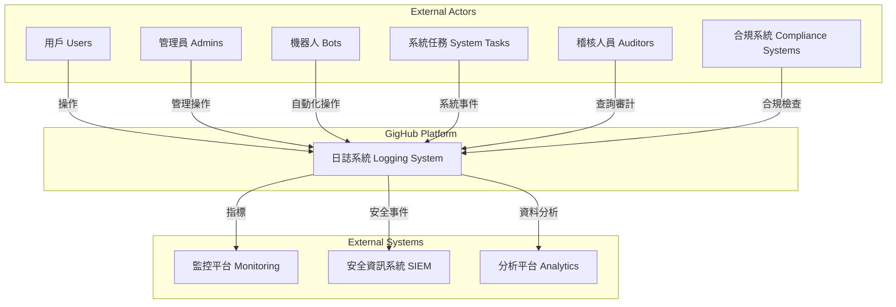

### System Boundary

**日誌系統負責範圍：**
- 應用層操作日誌（Application Logs）
- 審計追蹤（Audit Trails）
- 活動時間軸（Activity Timeline）
- 安全事件記錄（Security Events）
- 性能監控日誌（Performance Monitoring）

**不在範圍內：**
- 基礎設施日誌（由 Supabase 管理）
- 網路層日誌（由雲端供應商管理）
- 前端錯誤追蹤（建議整合 Sentry）

### Key Stakeholders

1. **開發團隊**：需要除錯日誌和性能監控
2. **運維團隊**：需要系統健康狀態和錯誤追蹤
3. **安全團隊**：需要安全事件和異常行為檢測
4. **合規團隊**：需要完整的審計追蹤
5. **產品團隊**：需要用戶行為分析資料

---

## 現況分析 (Current State Analysis)

### Existing Infrastructure

#### 1. LoggerService (Application Logging)

**位置：** `src/app/core/logger/logger.service.ts`

**功能特點：**
- ✅ 統一的日誌介面（debug, info, warn, error）
- ✅ 環境感知的日誌級別（開發/生產）
- ✅ 結構化日誌輸出
- ✅ 時間戳和堆疊追蹤支援
- ⚠️ 預留錯誤追蹤服務整合（未實施）

**使用狀況：**
- 約 65 處引用，但主要用於錯誤處理
- 缺少系統性的日誌記錄策略

#### 2. AuditLogService (Audit Logging)

**位置：** `src/app/shared/services/audit-log/audit-log.service.ts`

**功能特點：**
- ✅ 企業級審計日誌功能
- ✅ 使用 Angular Signals 進行狀態管理
- ✅ 完整的查詢和篩選能力
- ✅ 支援批次記錄
- ✅ 變更追蹤和差異比較
- ✅ 統計和報表功能

**資料模型：**
```typescript
interface AuditLog {
  id: string;
  blueprint_id: string | null;
  organization_id: string | null;
  entity_type: AuditEntityType;  // account, organization, team, etc.
  entity_id: string;
  entity_name: string | null;
  action: AuditAction;  // create, update, delete, etc.
  actor_id: string;
  actor_name: string | null;
  actor_type: 'user' | 'system' | 'bot';
  severity: AuditSeverity;  // info, warning, error, critical
  old_value: Record<string, unknown> | null;
  new_value: Record<string, unknown> | null;
  changes: AuditChange[] | null;
  metadata: AuditMetadata | null;
  context: AuditContext | null;
  created_at: string;
}
```

**使用狀況：**
- ⚠️ **僅 3 個服務使用**：DiaryService, TimelineService
- ❌ **關鍵業務服務未使用**：OrganizationService, TeamService, AccountService

#### 3. Database Triggers (Activity Logging)

**位置：** `supabase/migrations/20251206060000_add_activity_logging_triggers.sql`

**功能：**
- ✅ 自動記錄資料庫層級的 INSERT/UPDATE/DELETE 操作
- ✅ 涵蓋 14 個核心表（tasks, blueprints, diaries, etc.）
- ✅ 使用觸發器函數 `log_entity_activity()`

**限制：**
- ⚠️ 僅記錄資料變更，無業務語意
- ⚠️ 無法捕捉應用層的業務邏輯和決策過程
- ⚠️ 缺少用戶操作意圖的上下文資訊

### Gap Analysis

#### 用戶操作日誌缺口 (User Operations)

**缺少的關鍵操作記錄：**
- ❌ 登入/登出事件
- ❌ 密碼變更
- ❌ 權限變更
- ❌ 個人資料更新
- ❌ 帳戶狀態變更（啟用/停用/刪除）

**影響：**
- 無法追蹤異常登入行為
- 無法審計權限變更歷程
- 安全事件調查困難

#### 組織操作日誌缺口 (Organization Operations)

**OrganizationService 分析：**
```typescript
// src/app/shared/services/account/organization.service.ts
class OrganizationService {
  async createOrganization() {
    // ❌ 無審計日誌
    // ❌ 僅有 console.error 錯誤日誌
  }
  
  async updateOrganization() {
    // ❌ 無審計日誌
    // ❌ 無變更追蹤
  }
  
  async softDeleteOrganization() {
    // ❌ 無刪除記錄
    // ❌ 無通知相關成員
  }
}
```

**缺少的關鍵操作記錄：**
- ❌ 組織建立/更新/刪除
- ❌ 組織成員加入/離開
- ❌ 組織角色變更
- ❌ 組織設定變更
- ❌ 組織級別的資源存取

**影響：**
- 無法追蹤組織變更歷程
- 成員權限變更不透明
- 合規審計資料不足

#### 團隊操作日誌缺口 (Team Operations)

**TeamService 分析：**
```typescript
// src/app/shared/services/account/team.service.ts
class TeamService {
  async createTeam() {
    // ❌ 無審計日誌
  }
  
  async updateTeam() {
    // ❌ 無審計日誌
  }
  
  async addMember() {
    // ❌ 無成員加入記錄
  }
  
  async removeMember() {
    // ❌ 無成員移除記錄
  }
}
```

**缺少的關鍵操作記錄：**
- ❌ 團隊建立/更新/刪除
- ❌ 團隊成員管理
- ❌ 團隊角色分配
- ❌ 團隊資源存取

**影響：**
- 團隊協作透明度不足
- 成員責任歸屬不清
- 團隊管理效率追蹤困難

#### 機器人操作日誌缺口 (Bot Operations)

**現況：**
- ✅ 資料模型支援 `actor_type: 'bot'`
- ❌ 無專用的機器人操作記錄機制
- ❌ 無機器人身份識別和認證
- ❌ 無機器人操作配額和限流

**需要記錄的機器人操作：**
- ❌ 自動化任務執行
- ❌ 批次資料處理
- ❌ 定時任務執行
- ❌ 外部 API 調用
- ❌ 資料同步操作

**影響：**
- 自動化流程不可追蹤
- 異常行為難以偵測
- 性能問題難以定位

### Console.log Usage Analysis

**統計數據：**
- 約 17 個服務直接使用 `console.log/error/warn`
- 主要集中在：
  - 錯誤處理（error handling）
  - 除錯訊息（debug messages）
  - API 調用失敗（API failures）

**問題：**
- ❌ 無法在生產環境控制日誌級別
- ❌ 無結構化日誌格式
- ❌ 無法整合到日誌聚合系統
- ❌ 除錯訊息可能洩漏敏感資訊

---

## 架構設計 (Architecture Design)

### Design Principles

1. **不可變性（Immutability）**
   - 所有日誌記錄一旦建立即不可修改
   - 確保審計追蹤的完整性和可信度

2. **結構化（Structured Logging）**
   - 使用統一的資料模型
   - 支援高效的查詢和分析

3. **上下文感知（Context-Aware）**
   - 記錄完整的執行上下文
   - 包含用戶、會話、請求等資訊

4. **非侵入性（Non-Intrusive）**
   - 日誌記錄失敗不影響業務操作
   - 使用非同步處理減少性能影響

5. **可擴展性（Extensibility）**
   - 支援新的實體類型和操作類型
   - 允許自訂元數據和標籤

6. **隱私保護（Privacy-Aware）**
   - 敏感資料脫敏或加密
   - 符合 GDPR 等隱私法規

### Logging Levels and Categories

#### Application Logging (LoggerService)

```typescript
enum LogLevel {
  DEBUG = 0,   // 開發除錯，不進入生產
  INFO = 1,    // 一般資訊，重要業務流程
  WARN = 2,    // 警告訊息，可能的問題
  ERROR = 3,   // 錯誤訊息，需要關注
  NONE = 4     // 禁用日誌
}
```

**使用指南：**
- `DEBUG`: 詳細的除錯資訊，僅開發環境
- `INFO`: 重要的業務事件（用戶登入、訂單建立）
- `WARN`: 可恢復的錯誤或異常情況
- `ERROR`: 需要立即關注的錯誤

#### Audit Logging (AuditLogService)

```typescript
type AuditSeverity = 'info' | 'warning' | 'error' | 'critical';

type AuditAction =
  | 'create' | 'update' | 'delete' | 'view'
  | 'export' | 'import'
  | 'approve' | 'reject'
  | 'assign' | 'unassign'
  | 'login' | 'logout'
  | 'password_change' | 'permission_change' | 'role_change'
  | 'status_change' | 'archive' | 'restore'
  | 'share' | 'comment' | 'upload' | 'download';
```

**嚴重程度指南：**
- `info`: 一般操作（查看、評論）
- `warning`: 敏感操作（匯出、分享）
- `error`: 失敗操作（刪除失敗、權限不足）
- `critical`: 安全事件（權限變更、帳戶刪除）

---

## 系統組件 (Component Architecture)

### Component Diagram

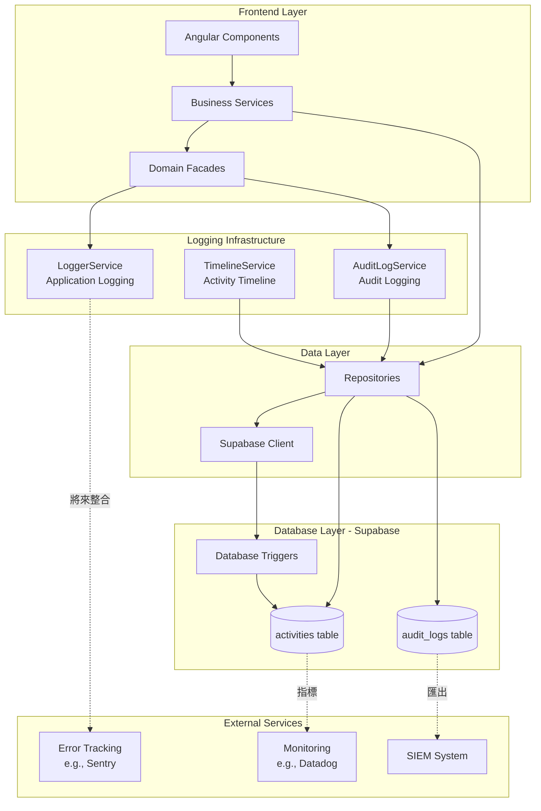

### Component Descriptions

#### 1. LoggerService (Core Logger)

**職責：**
- 提供統一的應用層日誌介面
- 根據環境自動調整日誌級別
- 結構化日誌輸出
- 將來整合外部錯誤追蹤服務

**API：**
```typescript
class LoggerService {
  configure(config: Partial<LoggerConfig>): void
  debug(message: string, data?: any): void
  info(message: string, data?: any): void
  warn(message: string, data?: any): void
  error(message: string, error?: any): void
}
```

**使用場景：**
- 應用程式流程追蹤
- 錯誤和異常記錄
- 性能監控點
- 除錯資訊

#### 2. AuditLogService (Audit Logger)

**職責：**
- 記錄所有業務操作的審計追蹤
- 支援變更追蹤和差異比較
- 提供查詢和篩選能力
- 生成審計報表和統計

**API：**
```typescript
class AuditLogService {
  // 基本記錄
  log(request: CreateAuditLogRequest): Observable<AuditLog | null>
  
  // 快速記錄（簡化版）
  quickLog(
    entityType: AuditEntityType,
    entityId: string,
    action: AuditAction,
    options?: QuickLogOptions
  ): Observable<AuditLog | null>
  
  // 變更追蹤
  logChanges<T>(
    entityType: AuditEntityType,
    entityId: string,
    action: AuditAction,
    oldValue: T | null,
    newValue: T | null,
    options?: LogOptions
  ): Observable<AuditLog | null>
  
  // 批次記錄
  logBatch(requests: CreateAuditLogRequest[]): Observable<AuditLog[]>
  
  // 查詢操作
  loadLogs(options: AuditLogQueryOptions): void
  getEntityHistory(entityType: AuditEntityType, entityId: string): Observable<AuditLog[]>
  getActorHistory(actorId: string): Observable<AuditLog[]>
}
```

**使用場景：**
- 用戶操作記錄
- 資料變更追蹤
- 安全事件記錄
- 合規審計

#### 3. TimelineService (Activity Timeline)

**職責：**
- 提供實體的活動時間軸視圖
- 整合審計日誌和活動記錄
- 支援即時更新

**關係：**
- 使用 AuditLogService 查詢審計記錄
- 整合資料庫觸發器產生的活動記錄

#### 4. Database Triggers

**職責：**
- 自動記錄資料庫層級的變更
- 確保即使應用層漏記，也有基本追蹤

**限制：**
- 無業務語意
- 無法記錄操作意圖
- 不應作為主要審計手段

### Integration Points

#### With External Error Tracking (Future)

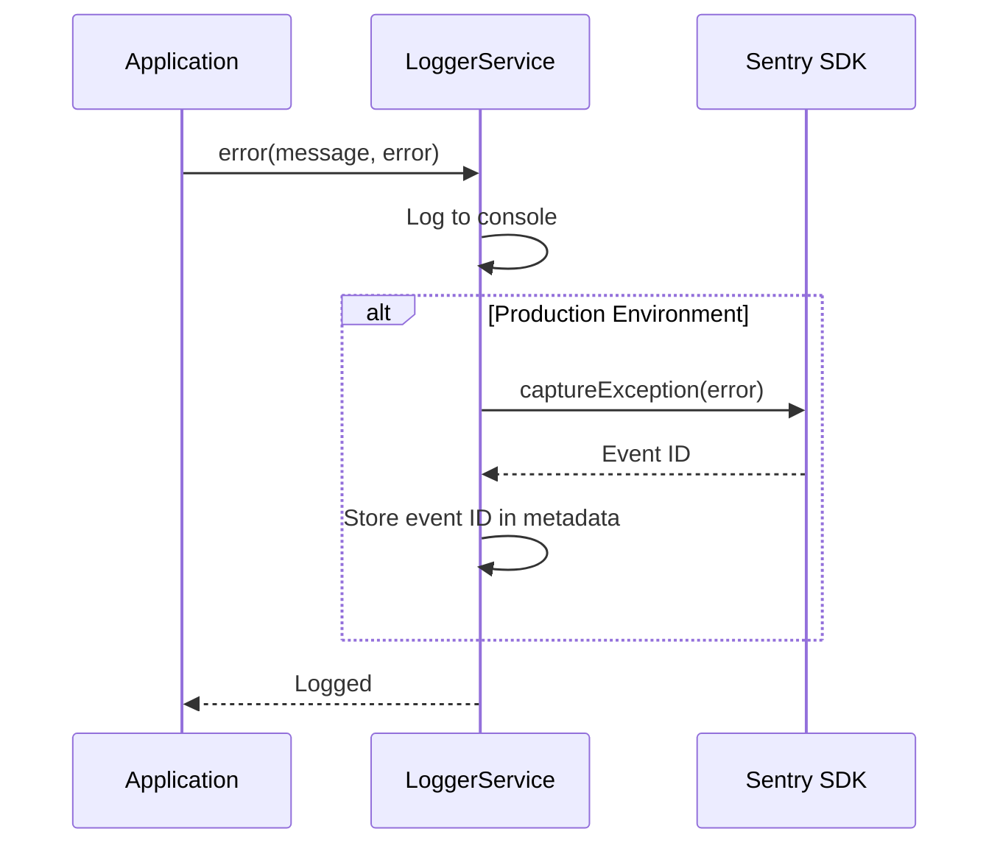

#### With SIEM System (Future)

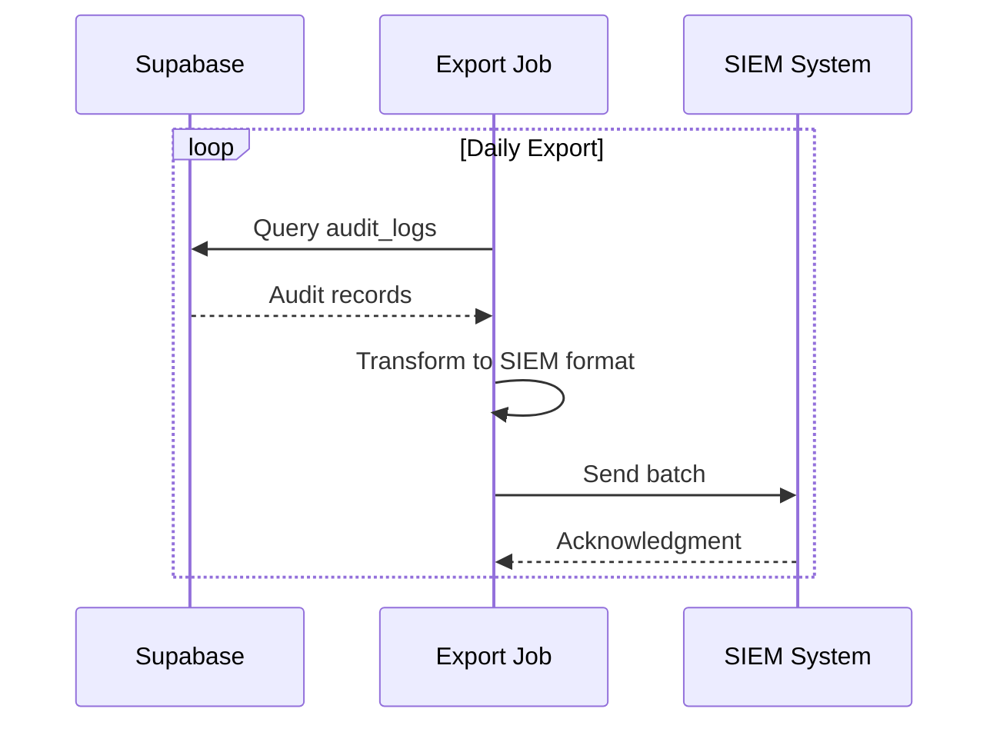

---

## 部署架構 (Deployment Architecture)

### Deployment Diagram

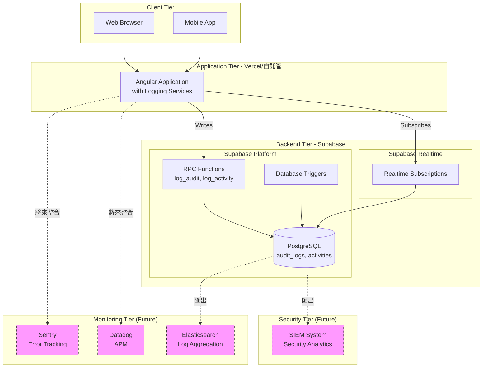

### Environment Configuration

#### Development Environment

```typescript
// development 環境配置
const loggerConfig: LoggerConfig = {
  level: LogLevel.DEBUG,
  enableTimestamp: true,
  enableStackTrace: true
};

// 所有日誌輸出到 console
// 詳細的除錯資訊
// 模擬外部服務整合
```

#### Staging Environment

```typescript
// staging 環境配置
const loggerConfig: LoggerConfig = {
  level: LogLevel.INFO,
  enableTimestamp: true,
  enableStackTrace: false
};

// 記錄 INFO 以上級別
// 啟用錯誤追蹤整合（測試）
// 審計日誌完整記錄
```

#### Production Environment

```typescript
// production 環境配置
const loggerConfig: LoggerConfig = {
  level: LogLevel.WARN,
  enableTimestamp: true,
  enableStackTrace: false
};

// 僅記錄 WARN 和 ERROR
// 整合 Sentry 錯誤追蹤
// 整合 Datadog APM
// 審計日誌永久保留
// 定期匯出到 SIEM
```

### Data Storage Strategy

#### Audit Logs Retention

**策略：**
- **熱資料（0-90 天）**：PostgreSQL 主表，快速查詢
- **溫資料（90 天-2 年）**：PostgreSQL，定期歸檔
- **冷資料（2 年以上）**：S3/Object Storage，長期保存

**實施：**
```sql
-- 自動歸檔 90 天前的審計日誌
CREATE OR REPLACE FUNCTION archive_old_audit_logs()
RETURNS void AS $$
BEGIN
  -- 將舊記錄移至歸檔表
  INSERT INTO audit_logs_archive
  SELECT * FROM audit_logs
  WHERE created_at < NOW() - INTERVAL '90 days';
  
  -- 刪除已歸檔的記錄
  DELETE FROM audit_logs
  WHERE created_at < NOW() - INTERVAL '90 days';
END;
$$ LANGUAGE plpgsql;

-- 排程每週執行
SELECT cron.schedule('archive-audit-logs', '0 0 * * 0', 'SELECT archive_old_audit_logs()');
```

#### Application Logs Retention

**策略：**
- **開發環境**：不持久化，僅 console 輸出
- **Staging 環境**：保留 7 天
- **生產環境**：保留 30 天，ERROR 級別保留 90 天

---

## 資料流程 (Data Flow)

### Data Flow Diagram

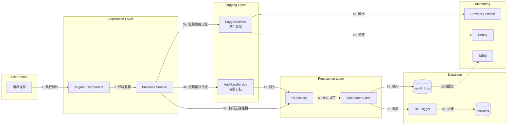

### Data Flow Description

#### Flow 1: Application Logging

1. **觸發**：應用程式執行過程中的事件
2. **記錄**：透過 LoggerService 記錄
3. **處理**：
   - 開發環境：輸出到 console
   - 生產環境：輸出到 console + Sentry（將來）
4. **用途**：除錯、錯誤追蹤、性能監控

**資料格式：**
```typescript
{
  timestamp: '2024-12-08T10:30:00.000Z',
  level: 'INFO',
  message: 'User login successful',
  data: {
    userId: 'uuid-1234',
    sessionId: 'session-5678'
  }
}
```

#### Flow 2: Audit Logging

1. **觸發**：關鍵業務操作（CRUD、權限變更等）
2. **記錄**：透過 AuditLogService.quickLog() 或 logChanges()
3. **處理**：
   - 呼叫 Repository
   - 透過 Supabase RPC 函數 `log_audit()`
   - 插入 audit_logs 表
4. **查詢**：透過 AuditLogService 提供的查詢 API
5. **用途**：合規審計、安全調查、變更追蹤

**資料格式：**
```typescript
{
  id: 'uuid',
  entity_type: 'organization',
  entity_id: 'org-uuid',
  entity_name: 'ACME Corp',
  action: 'update',
  actor_id: 'user-uuid',
  actor_name: 'John Doe',
  actor_type: 'user',
  old_value: { name: 'ACME' },
  new_value: { name: 'ACME Corp' },
  changes: [
    { field: 'name', old_value: 'ACME', new_value: 'ACME Corp' }
  ],
  metadata: {
    source: 'ui',
    module: 'account',
    feature: 'organization-management'
  },
  severity: 'info',
  created_at: '2024-12-08T10:30:00.000Z'
}
```

#### Flow 3: Activity Timeline

1. **觸發**：資料庫表的 INSERT/UPDATE/DELETE 操作
2. **記錄**：透過資料庫觸發器自動記錄
3. **處理**：
   - 觸發器函數 `log_entity_activity()`
   - 插入 activities 表
4. **查詢**：透過 TimelineService
5. **用途**：實體活動歷史、時間軸視圖

**資料格式：**
```typescript
{
  id: 'uuid',
  blueprint_id: 'bp-uuid',
  entity_type: 'task',
  entity_id: 'task-uuid',
  activity_type: 'update',
  actor_id: 'user-uuid',
  summary: 'task updated',
  metadata: {
    table_name: 'tasks',
    operation: 'UPDATE'
  },
  old_value: { status: 'pending' },
  new_value: { status: 'in_progress' },
  created_at: '2024-12-08T10:30:00.000Z'
}
```

### Data Validation and Sanitization

#### Sensitive Data Handling

**敏感欄位清單：**
- 密碼（passwords）
- 令牌（tokens）
- API 金鑰（API keys）
- 個人識別資訊（PII）：身份證號、電話、地址
- 財務資訊：信用卡號、銀行帳號

**處理策略：**
```typescript
// 在記錄前自動清理敏感資料
function sanitizeLogData(data: any): any {
  const SENSITIVE_FIELDS = ['password', 'token', 'apiKey', 'creditCard'];
  
  if (typeof data !== 'object' || data === null) {
    return data;
  }
  
  const sanitized = { ...data };
  
  for (const key of Object.keys(sanitized)) {
    if (SENSITIVE_FIELDS.some(field => 
      key.toLowerCase().includes(field.toLowerCase())
    )) {
      sanitized[key] = '***REDACTED***';
    } else if (typeof sanitized[key] === 'object') {
      sanitized[key] = sanitizeLogData(sanitized[key]);
    }
  }
  
  return sanitized;
}
```

---

## 關鍵工作流程 (Key Workflows)

### Workflow 1: User Operations Logging

#### Sequence: User Login

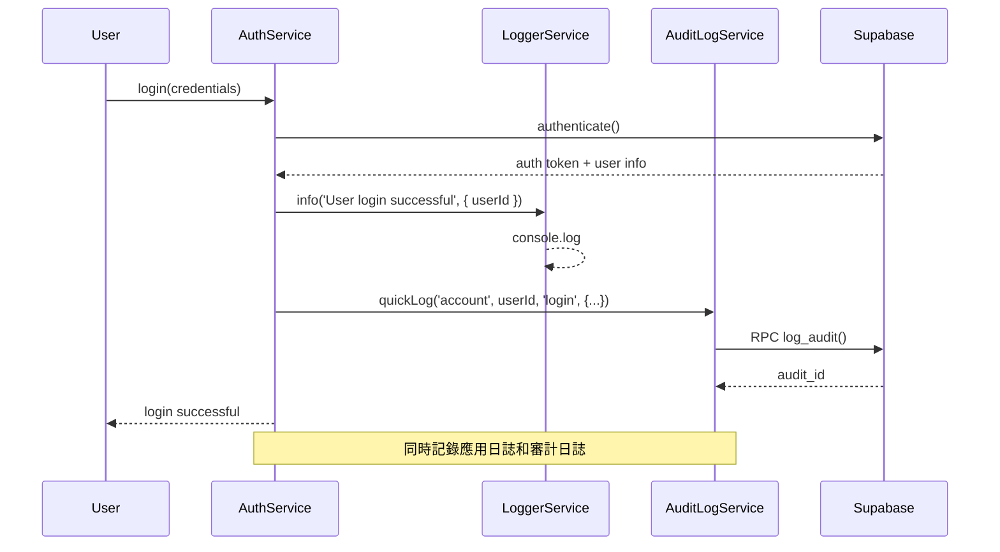

#### Sequence: Password Change

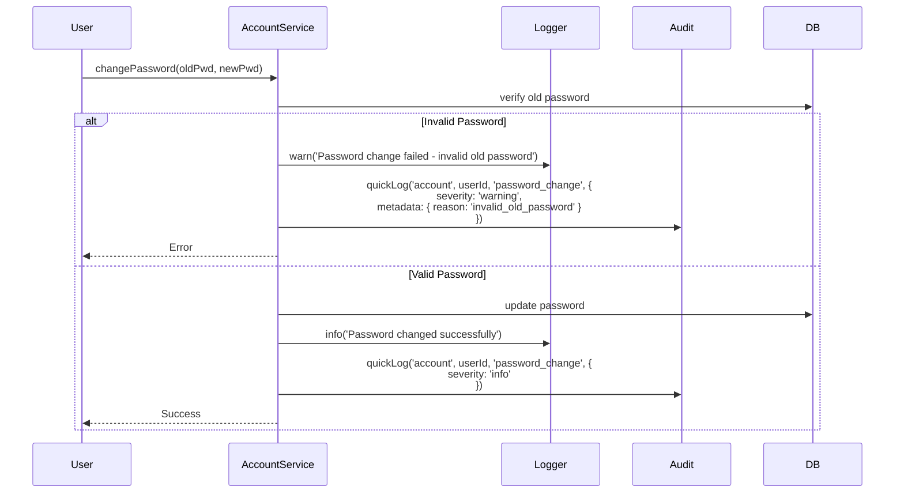

### Workflow 2: Organization Operations Logging

#### Sequence: Create Organization

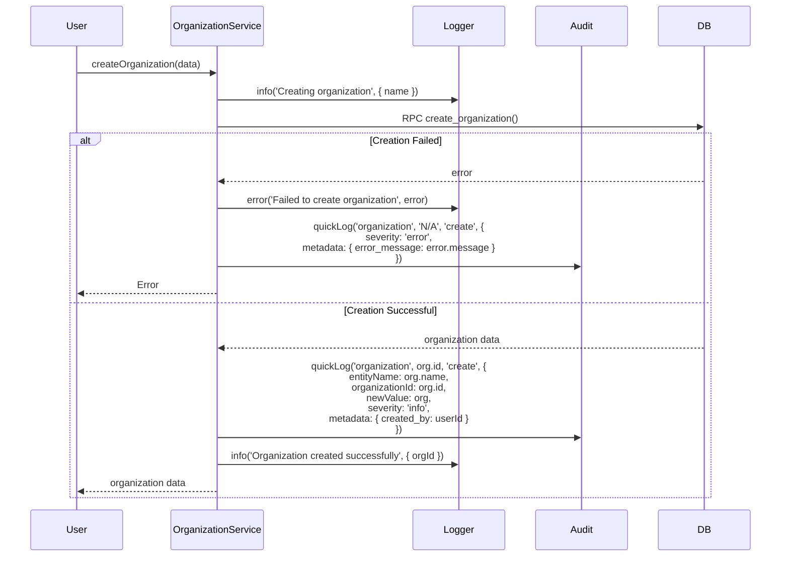

#### Sequence: Update Organization

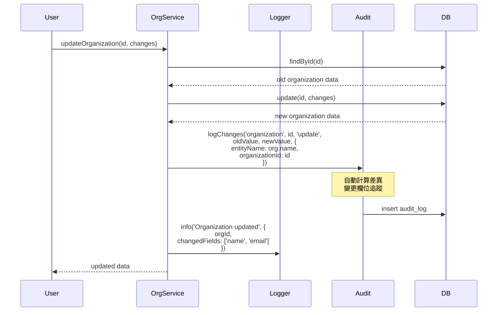

### Workflow 3: Team Operations Logging

#### Sequence: Add Team Member

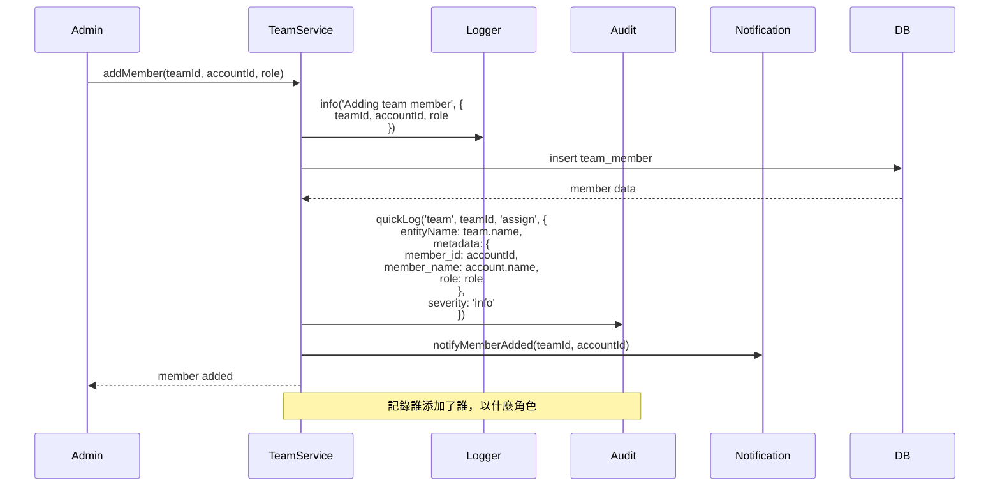

### Workflow 4: Bot Operations Logging

#### Sequence: Automated Task Execution

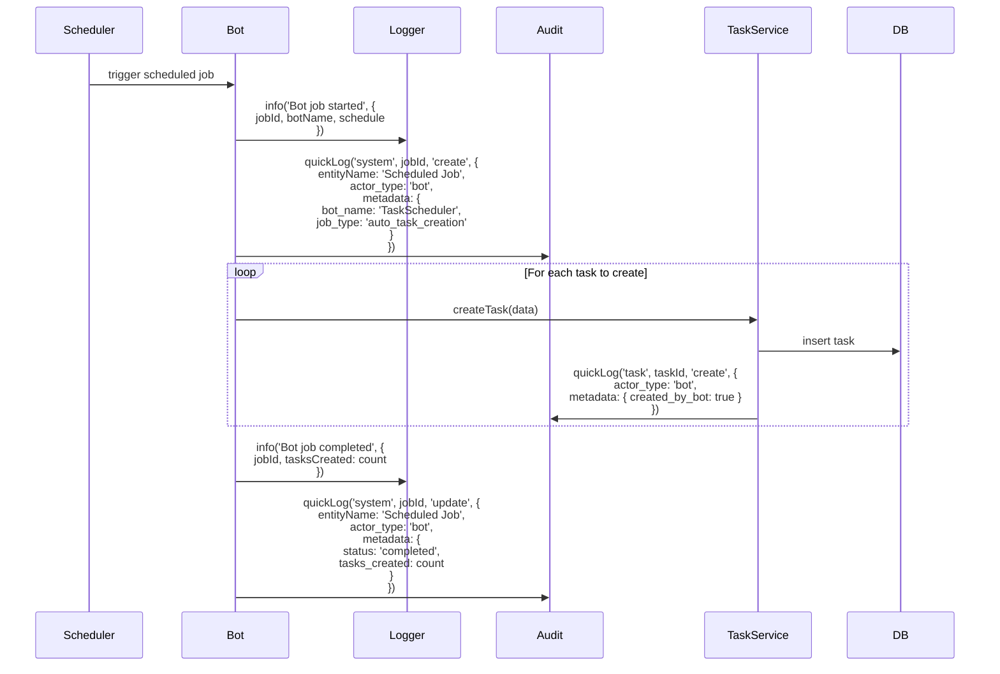

### Workflow 5: Security Event Logging

#### Sequence: Suspicious Activity Detection

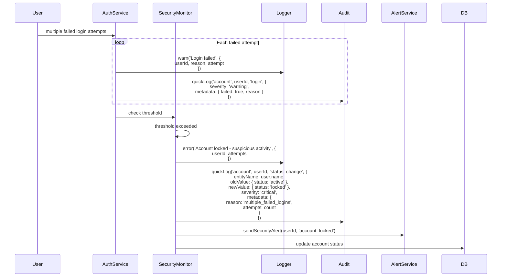

---

## 階段式實施 (Phased Development)

基於現況分析和架構設計，建議分三個階段實施日誌系統的完善化。

### Phase 1: 基礎強化與快速勝利 (Foundation & Quick Wins)

**時程：** 2-3 週

**目標：**
- 建立統一的日誌策略和指南
- 快速修復關鍵服務的日誌缺口
- 提供開發團隊培訓和文件

**任務清單：**

#### 1.1 建立日誌指南文件
- [ ] 建立 `docs/logging/LOGGING_GUIDE.md`
- [ ] 定義各類操作的日誌記錄標準
- [ ] 提供程式碼範例和最佳實踐
- [ ] 建立日誌 checklist 供 code review 使用

#### 1.2 修復關鍵服務日誌
- [ ] **OrganizationService 強化**
  - [ ] createOrganization() 加入審計日誌
  - [ ] updateOrganization() 加入變更追蹤
  - [ ] softDeleteOrganization() 加入刪除記錄
  - [ ] 所有方法加入 LoggerService 錯誤日誌

- [ ] **TeamService 強化**
  - [ ] createTeam() 加入審計日誌
  - [ ] updateTeam() 加入變更追蹤
  - [ ] addMember() 加入成員變更記錄
  - [ ] removeMember() 加入成員變更記錄

- [ ] **AccountService 強化**（如果存在）
  - [ ] 登入/登出事件記錄
  - [ ] 密碼變更記錄
  - [ ] 個人資料更新記錄

#### 1.3 取代 console.log
- [ ] 識別所有使用 console.log 的服務（約 17 個）
- [ ] 逐一替換為 LoggerService
- [ ] 建立 ESLint 規則禁止直接使用 console

#### 1.4 開發者培訓
- [ ] 舉辦日誌策略說明會
- [ ] 提供 API 使用範例
- [ ] Code review checklist 包含日誌檢查

**預期成果：**
- ✅ 核心業務服務都有完整審計日誌
- ✅ 開發團隊理解並遵循日誌策略
- ✅ 降低生產環境除錯困難度

**簡化架構圖（Phase 1）：**

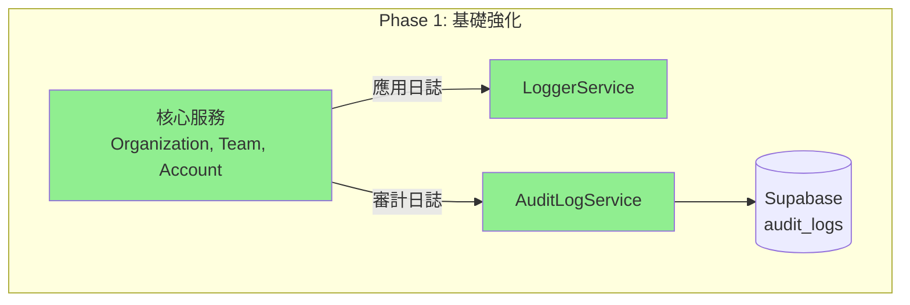

### Phase 2: 擴展覆蓋與機器人支援 (Expand Coverage & Bot Support)

**時程：** 3-4 週

**目標：**
- 擴展日誌覆蓋到所有業務服務
- 建立機器人操作日誌框架
- 實施日誌查詢和分析介面

**任務清單：**

#### 2.1 擴展審計日誌覆蓋
- [ ] **識別所有需要審計的服務**（約 40+ 個服務）
- [ ] 按優先級分批實施：
  - [ ] 高優先級：財務相關（PaymentService, ContractService）
  - [ ] 中優先級：專案相關（BlueprintService, TaskService）
  - [ ] 低優先級：其他業務服務

#### 2.2 機器人操作框架
- [ ] 建立 `BotLoggerService` 或擴展 `AuditLogService`
- [ ] 定義機器人身份識別機制
  ```typescript
  interface BotIdentity {
    bot_id: string;
    bot_name: string;
    bot_type: 'scheduler' | 'integration' | 'automation';
    version: string;
  }
  ```
- [ ] 實施機器人操作配額和限流
- [ ] 建立機器人操作儀表板

#### 2.3 建立審計日誌查詢介面
- [ ] 在管理介面加入「審計日誌」選單
- [ ] 實施以下查詢功能：
  - [ ] 按實體類型篩選
  - [ ] 按操作類型篩選
  - [ ] 按時間範圍篩選
  - [ ] 按操作者篩選
  - [ ] 按嚴重程度篩選
- [ ] 實施匯出功能（CSV, JSON）

#### 2.4 活動時間軸增強
- [ ] 整合審計日誌到時間軸視圖
- [ ] 實施即時更新（Supabase Realtime）
- [ ] 改善變更差異顯示

**預期成果：**
- ✅ 90% 以上業務服務有審計日誌
- ✅ 機器人操作可追蹤和監控
- ✅ 管理員可查詢和匯出審計記錄

**架構圖（Phase 2）：**

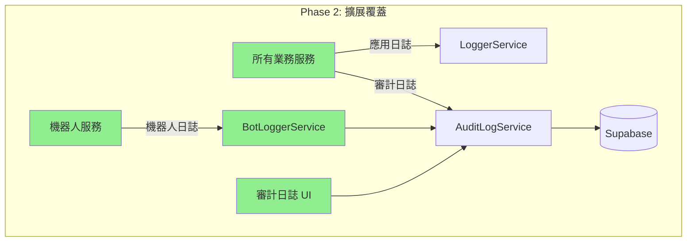

### Phase 3: 外部整合與高級功能 (External Integration & Advanced Features)

**時程：** 4-6 週

**目標：**
- 整合外部監控和錯誤追蹤服務
- 實施進階分析和告警功能
- 建立長期歸檔策略

**任務清單：**

#### 3.1 錯誤追蹤整合（Sentry）
- [ ] 註冊 Sentry 帳號並建立專案
- [ ] 安裝 Sentry Angular SDK
- [ ] 設定 LoggerService 整合
  ```typescript
  private reportToErrorTracking(message: string, error: any): void {
    Sentry.captureException(error, {
      tags: { message },
      level: 'error'
    });
  }
  ```
- [ ] 設定錯誤分組和告警規則
- [ ] 整合 Supabase 錯誤追蹤

#### 3.2 應用性能監控（APM）
- [ ] 選擇 APM 解決方案（Datadog, New Relic, 或 Elastic APM）
- [ ] 安裝 APM Agent
- [ ] 設定關鍵交易追蹤
- [ ] 建立性能基準和告警

#### 3.3 日誌聚合（Elasticsearch）
- [ ] 建立 Elasticsearch 叢集（或使用 Elastic Cloud）
- [ ] 實施日誌匯出管道
  ```typescript
  // 定期匯出到 Elasticsearch
  async exportLogsToElasticsearch(startDate: string, endDate: string) {
    const logs = await this.queryLogs({ startDate, endDate });
    await this.elasticsearchClient.bulk({
      body: logs.flatMap(log => [
        { index: { _index: 'audit-logs' } },
        log
      ])
    });
  }
  ```
- [ ] 建立 Kibana 儀表板
- [ ] 設定日誌保留策略

#### 3.4 安全資訊與事件管理（SIEM）
- [ ] 定義安全事件類型
- [ ] 實施即時安全事件檢測
- [ ] 建立異常行為檢測規則
- [ ] 設定安全告警和回應流程

#### 3.5 進階分析功能
- [ ] **統計報表**
  - [ ] 用戶活動報表
  - [ ] 組織活動報表
  - [ ] 系統使用趨勢
  - [ ] 異常行為分析

- [ ] **自動化告警**
  - [ ] 異常登入告警
  - [ ] 批次操作告警
  - [ ] 權限變更告警
  - [ ] 系統錯誤告警

- [ ] **合規報表**
  - [ ] 存取控制報表
  - [ ] 變更管理報表
  - [ ] 資料外洩風險報表

#### 3.6 長期歸檔策略
- [ ] 實施自動歸檔（90 天以上）
- [ ] 設定 S3/Object Storage 整合
- [ ] 建立歸檔查詢介面
- [ ] 定義資料刪除政策（符合 GDPR）

**預期成果：**
- ✅ 全面的錯誤追蹤和性能監控
- ✅ 即時安全事件檢測和告警
- ✅ 長期日誌保留和合規報表
- ✅ 完整的日誌生態系統

**完整架構圖（Phase 3）：**

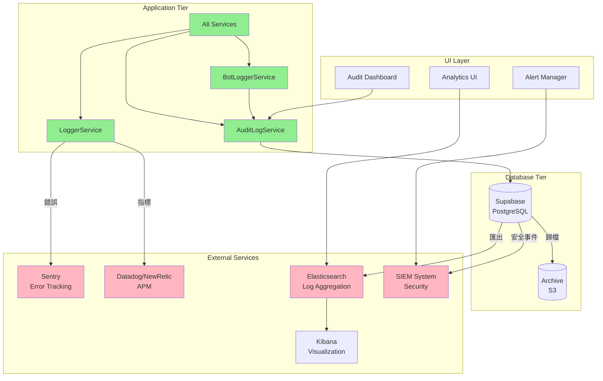

### Migration Path: Phase 1 → Phase 2 → Phase 3

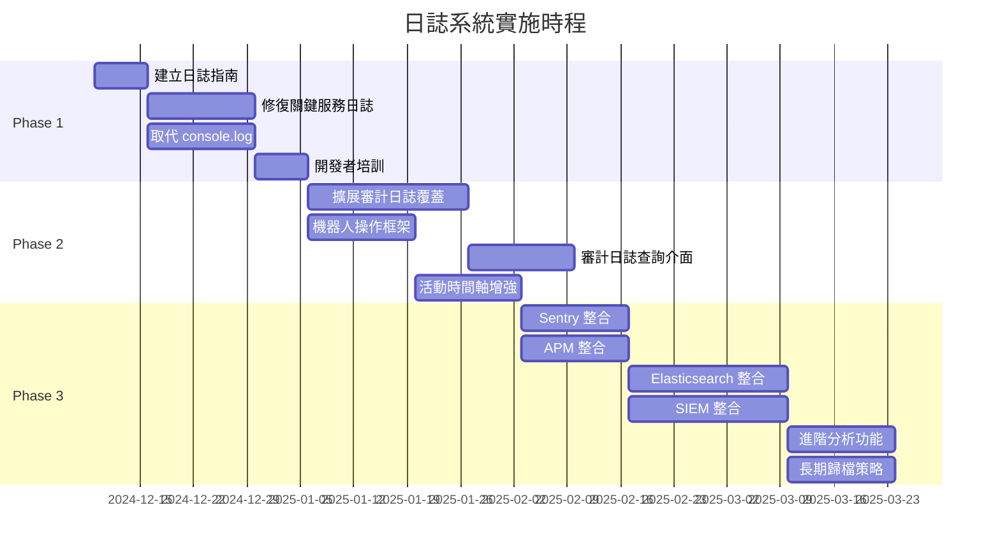

---

## 非功能性需求 (Non-Functional Requirements)

### Scalability (可擴展性)

#### Current State
- **Database**: Supabase PostgreSQL 可支援百萬級記錄
- **Application**: Angular 前端無狀態，易於橫向擴展
- **Bottleneck**: 審計日誌查詢可能成為瓶頸

#### Design for Scale

**策略 1: 資料分區（Partitioning）**
```sql
-- 按月份分區 audit_logs 表
CREATE TABLE audit_logs_2024_12 PARTITION OF audit_logs
FOR VALUES FROM ('2024-12-01') TO ('2025-01-01');

CREATE TABLE audit_logs_2025_01 PARTITION OF audit_logs
FOR VALUES FROM ('2025-01-01') TO ('2025-02-01');
```

**策略 2: 讀寫分離**
- 寫入：主資料庫
- 查詢：只讀副本（Read Replica）
- 分析：資料倉儲（Data Warehouse）

**策略 3: 快取策略**
```typescript
// 快取常用查詢結果
@Injectable()
export class AuditLogCacheService {
  private cache = new Map<string, { data: any; timestamp: number }>();
  private TTL = 5 * 60 * 1000; // 5 分鐘
  
  async getCached<T>(key: string, fetchFn: () => Promise<T>): Promise<T> {
    const cached = this.cache.get(key);
    if (cached && Date.now() - cached.timestamp < this.TTL) {
      return cached.data;
    }
    
    const data = await fetchFn();
    this.cache.set(key, { data, timestamp: Date.now() });
    return data;
  }
}
```

**預期容量：**
- 每日審計日誌：10,000 - 100,000 筆
- 每日活動記錄：50,000 - 500,000 筆
- 總儲存：第一年約 50-500 GB

### Performance (性能)

#### Requirements
- **寫入延遲**: < 100ms (P95)
- **查詢延遲**: < 500ms (P95)
- **非同步處理**: 日誌記錄不阻塞主流程

#### Optimization Strategies

**1. 非同步日誌記錄**
```typescript
// 使用 RxJS 的非同步處理
class AuditLogService {
  private logQueue$ = new Subject<CreateAuditLogRequest>();
  
  constructor() {
    // 批次處理日誌，每 1 秒或 100 筆批次寫入
    this.logQueue$
      .pipe(
        bufferTime(1000, null, 100),
        filter(batch => batch.length > 0),
        switchMap(batch => this.logBatch(batch))
      )
      .subscribe();
  }
  
  quickLog(/* params */): void {
    this.logQueue$.next(request);
    // 立即返回，不等待寫入完成
  }
}
```

**2. 索引優化**
```sql
-- 複合索引支援常見查詢
CREATE INDEX idx_audit_logs_entity_action 
ON audit_logs(entity_type, action, created_at DESC);

CREATE INDEX idx_audit_logs_actor_date 
ON audit_logs(actor_id, created_at DESC);

CREATE INDEX idx_audit_logs_blueprint_date 
ON audit_logs(blueprint_id, created_at DESC) 
WHERE blueprint_id IS NOT NULL;
```

**3. 查詢優化**
```typescript
// 使用 pagination 避免一次載入大量資料
const options: AuditLogQueryOptions = {
  page: 1,
  pageSize: 20,  // 限制每頁數量
  orderBy: 'created_at',
  orderDirection: 'desc'
};
```

### Security (安全性)

#### Authentication & Authorization

**存取控制層級：**
1. **應用層**：Angular 路由守衛
2. **API 層**：Supabase RLS（Row Level Security）
3. **資料庫層**：PostgreSQL GRANT 權限

**RLS 策略範例：**
```sql
-- audit_logs 表的 RLS 策略
-- 用戶只能查看自己相關的審計日誌
CREATE POLICY audit_logs_select_policy ON audit_logs
FOR SELECT
USING (
  -- 超級管理員可以看全部
  EXISTS (
    SELECT 1 FROM accounts
    WHERE id = auth.uid()
    AND role = 'admin'
  )
  OR
  -- 用戶可以看自己的操作
  actor_id = auth.uid()
  OR
  -- 用戶可以看自己組織的日誌
  organization_id IN (
    SELECT organization_id FROM organization_members
    WHERE account_id = auth.uid()
  )
);

-- 只有系統和 service role 可以插入
CREATE POLICY audit_logs_insert_policy ON audit_logs
FOR INSERT
WITH CHECK (
  auth.jwt() ->> 'role' = 'service_role'
);
```

#### Data Protection

**敏感資料處理：**
```typescript
class AuditLogService {
  private sanitizeSensitiveData(data: any): any {
    const SENSITIVE_PATTERNS = [
      /password/i,
      /token/i,
      /secret/i,
      /key/i,
      /credit.*card/i,
      /ssn/i,
      /passport/i
    ];
    
    if (typeof data !== 'object' || data === null) {
      return data;
    }
    
    const sanitized = { ...data };
    
    for (const [key, value] of Object.entries(sanitized)) {
      if (SENSITIVE_PATTERNS.some(pattern => pattern.test(key))) {
        sanitized[key] = '***REDACTED***';
      } else if (typeof value === 'object') {
        sanitized[key] = this.sanitizeSensitiveData(value);
      }
    }
    
    return sanitized;
  }
}
```

**加密策略：**
- **傳輸加密**：HTTPS/TLS 1.3
- **儲存加密**：Supabase 預設啟用 AES-256
- **應用層加密**：對特別敏感的欄位使用應用層加密

#### Audit Trail Integrity

**確保審計日誌的完整性：**
```sql
-- 審計日誌表不允許更新和刪除
REVOKE UPDATE, DELETE ON audit_logs FROM authenticated;

-- 使用觸發器防止修改
CREATE OR REPLACE FUNCTION prevent_audit_log_modification()
RETURNS TRIGGER AS $$
BEGIN
  RAISE EXCEPTION 'Audit logs are immutable';
END;
$$ LANGUAGE plpgsql;

CREATE TRIGGER prevent_audit_log_update
BEFORE UPDATE ON audit_logs
FOR EACH ROW
EXECUTE FUNCTION prevent_audit_log_modification();

CREATE TRIGGER prevent_audit_log_delete
BEFORE DELETE ON audit_logs
FOR EACH ROW
EXECUTE FUNCTION prevent_audit_log_modification();
```

### Reliability (可靠性)

#### High Availability

**Supabase 預設提供：**
- 99.9% SLA
- 自動備份和災難復原
- 多區域部署（付費方案）

**應用層策略：**
```typescript
class AuditLogService {
  log(request: CreateAuditLogRequest): Observable<AuditLog | null> {
    return this.repository.create(request).pipe(
      // 重試機制
      retry({
        count: 3,
        delay: (error, retryCount) => timer(1000 * retryCount)
      }),
      // 錯誤處理
      catchError(error => {
        console.error('[AuditLogService] Failed to log audit', error);
        
        // 記錄失敗的日誌請求到本地儲存，稍後重試
        this.saveFailedLog(request);
        
        // 不阻塞主流程
        return of(null);
      })
    );
  }
  
  private saveFailedLog(request: CreateAuditLogRequest): void {
    const failedLogs = JSON.parse(
      localStorage.getItem('failedAuditLogs') || '[]'
    );
    failedLogs.push({ request, timestamp: Date.now() });
    localStorage.setItem('failedAuditLogs', JSON.stringify(failedLogs));
  }
}
```

#### Fault Tolerance

**優雅降級策略：**
1. **審計服務不可用**：記錄到本地，稍後重試
2. **資料庫連線失敗**：使用斷路器模式
3. **查詢超時**：提供快取資料或部分結果

```typescript
class CircuitBreaker {
  private failureCount = 0;
  private lastFailureTime = 0;
  private state: 'CLOSED' | 'OPEN' | 'HALF_OPEN' = 'CLOSED';
  
  async execute<T>(fn: () => Promise<T>): Promise<T | null> {
    if (this.state === 'OPEN') {
      // 檢查是否可以進入半開狀態
      if (Date.now() - this.lastFailureTime > 60000) {
        this.state = 'HALF_OPEN';
      } else {
        throw new Error('Circuit breaker is OPEN');
      }
    }
    
    try {
      const result = await fn();
      this.onSuccess();
      return result;
    } catch (error) {
      this.onFailure();
      return null;
    }
  }
  
  private onSuccess(): void {
    this.failureCount = 0;
    this.state = 'CLOSED';
  }
  
  private onFailure(): void {
    this.failureCount++;
    this.lastFailureTime = Date.now();
    
    if (this.failureCount >= 5) {
      this.state = 'OPEN';
    }
  }
}
```

### Maintainability (可維護性)

#### Code Organization

**清晰的模組結構：**
```
src/app/
├── core/
│   ├── logger/
│   │   └── logger.service.ts          # 應用日誌
│   └── infra/
│       ├── types/
│       │   └── audit-log/             # 型別定義
│       └── repositories/
│           └── audit-log/             # 資料存取
├── shared/
│   └── services/
│       ├── audit-log/
│       │   ├── audit-log.service.ts   # 審計日誌服務
│       │   └── audit-log.service.spec.ts
│       └── timeline/
│           └── timeline.service.ts    # 時間軸服務
└── routes/
    └── admin/
        └── audit-logs/                # 審計日誌 UI
```

#### Documentation Standards

**服務文件模板：**
```typescript
/**
 * [Service Name] Service
 *
 * [中文名稱] - [簡短描述]
 * [English Description]
 *
 * Features:
 * - [Feature 1]
 * - [Feature 2]
 *
 * Usage Example:
 * ```typescript
 * constructor(private service: ServiceName) {}
 *
 * this.service.method(params).subscribe({
 *   next: result => { /* handle success */ },
 *   error: error => { /* handle error */ }
 * });
 * ```
 *
 * @module [module path]
 */
@Injectable({ providedIn: 'root' })
export class ServiceName {
  /**
   * [Method description]
   * [中文說明]
   *
   * @param param1 - [Description]
   * @param param2 - [Description]
   * @returns [Description]
   *
   * @example
   * ```typescript
   * this.service.method(value1, value2);
   * ```
   */
  method(param1: Type1, param2: Type2): ReturnType {
    // Implementation
  }
}
```

#### Testing Strategy

**測試覆蓋率目標：**
- 服務層：> 80%
- 核心邏輯：> 90%
- 整合測試：關鍵流程

**單元測試範例：**
```typescript
describe('AuditLogService', () => {
  let service: AuditLogService;
  let repository: jasmine.SpyObj<AuditLogRepository>;
  
  beforeEach(() => {
    const repositorySpy = jasmine.createSpyObj('AuditLogRepository', [
      'create',
      'query',
      'findById'
    ]);
    
    TestBed.configureTestingModule({
      providers: [
        AuditLogService,
        { provide: AuditLogRepository, useValue: repositorySpy }
      ]
    });
    
    service = TestBed.inject(AuditLogService);
    repository = TestBed.inject(AuditLogRepository) as jasmine.SpyObj<AuditLogRepository>;
  });
  
  it('should log audit entry', (done) => {
    const request: CreateAuditLogRequest = {
      entity_type: 'organization',
      entity_id: 'test-id',
      action: 'create',
      actor_id: 'user-id'
    };
    
    const expectedLog: AuditLog = {
      ...request,
      id: 'log-id',
      created_at: '2024-12-08T10:00:00Z'
    } as AuditLog;
    
    repository.create.and.returnValue(of(expectedLog));
    
    service.log(request).subscribe({
      next: result => {
        expect(result).toEqual(expectedLog);
        expect(repository.create).toHaveBeenCalledWith(request);
        done();
      }
    });
  });
  
  it('should handle logging errors gracefully', (done) => {
    const request: CreateAuditLogRequest = { /* ... */ };
    repository.create.and.returnValue(throwError(() => new Error('Network error')));
    
    service.log(request).subscribe({
      next: result => {
        expect(result).toBeNull();
        done();
      }
    });
  });
});
```

---

## 風險與緩解措施 (Risks and Mitigations)

### Risk 1: 性能影響

**風險描述：**
大量的日誌記錄可能影響應用性能，特別是在高流量場景下。

**風險等級：** 中

**緩解措施：**
1. **非同步處理**：使用 RxJS 非同步記錄，不阻塞主流程
2. **批次寫入**：累積多筆日誌後批次寫入資料庫
3. **效能監控**：持續監控日誌記錄的性能影響
4. **可配置級別**：允許動態調整日誌級別

**實施計畫：**
- Phase 1：實施非同步處理
- Phase 2：實施批次寫入
- Phase 3：整合 APM 監控

### Risk 2: 儲存成本

**風險描述：**
審計日誌和活動記錄持續增長，可能導致高昂的儲存成本。

**風險等級：** 中

**緩解措施：**
1. **資料分層**：熱/溫/冷資料分層儲存
2. **自動歸檔**：定期將舊資料移至低成本儲存
3. **資料壓縮**：使用 PostgreSQL 的 TOAST 壓縮
4. **保留政策**：定義並執行資料保留政策

**成本估算：**
```
假設：
- 每日 50,000 筆審計日誌
- 平均每筆 2 KB
- 保留 2 年

儲存需求：
50,000 筆/天 × 2 KB × 730 天 = 73 GB

Supabase 成本（Pro Plan）：
- 前 8 GB 免費
- 超過部分 $0.125/GB/月
- 預估：(73 - 8) × $0.125 ≈ $8/月

歸檔後（S3）：
- $0.023/GB/月
- 預估：73 × $0.023 ≈ $1.7/月
```

**實施計畫：**
- Phase 2：實施 90 天自動歸檔
- Phase 3：整合 S3 長期儲存

### Risk 3: 合規風險

**風險描述：**
不完整的審計追蹤可能導致合規問題，特別是在需要 SOC 2、ISO 27001 等認證時。

**風險等級：** 高

**緩解措施：**
1. **完整覆蓋**：確保所有關鍵操作都有審計日誌
2. **不可變性**：確保審計日誌無法被修改或刪除
3. **定期審查**：定期檢查審計日誌的完整性和可用性
4. **法規遵循**：符合 GDPR、CCPA 等隱私法規

**檢查清單：**
- [ ] 所有 CRUD 操作都有審計記錄
- [ ] 權限變更有完整追蹤
- [ ] 敏感資料存取有記錄
- [ ] 審計日誌不可修改
- [ ] 支援資料主體權利請求（GDPR）

**實施計畫：**
- Phase 1：建立審計日誌 checklist
- Phase 2：實施完整覆蓋
- Phase 3：定期合規審查

### Risk 4: 資料洩漏

**風險描述：**
日誌中可能包含敏感資訊，如果未適當保護可能導致資料洩漏。

**風險等級：** 高

**緩解措施：**
1. **資料脫敏**：自動清理敏感欄位
2. **存取控制**：嚴格的 RLS 策略
3. **加密**：傳輸和儲存時都加密
4. **最小權限**：只給予必要的日誌存取權限

**敏感資料清單：**
- 密碼和令牌
- 信用卡號
- 身份證號
- 電話號碼和地址（部分脫敏）
- 財務資訊

**實施計畫：**
- Phase 1：實施自動脫敏
- Phase 2：強化存取控制
- Phase 3：定期安全審計

### Risk 5: 開發團隊採用

**風險描述：**
開發團隊可能不習慣或忘記使用新的日誌機制，導致覆蓋率不足。

**風險等級：** 中

**緩解措施：**
1. **培訓和文件**：提供清晰的指南和範例
2. **程式碼審查**：在 PR 中檢查日誌實施
3. **自動化檢查**：使用 ESLint 規則強制執行
4. **模板和工具**：提供程式碼生成器和模板

**ESLint 規則範例：**
```javascript
// .eslintrc.js
module.exports = {
  rules: {
    'no-console': ['error', {
      allow: [] // 完全禁止 console.log
    }],
    'custom-rules/require-audit-log': 'warn' // 自訂規則
  }
};
```

**實施計畫：**
- Phase 1：培訓和文件
- Phase 1：Code review checklist
- Phase 2：ESLint 規則
- Phase 2：程式碼生成器

### Risk 6: 第三方服務依賴

**風險描述：**
依賴 Sentry、Datadog 等第三方服務可能導致成本增加和服務依賴風險。

**風險等級：** 低

**緩解措施：**
1. **選擇性整合**：將整合設計為可選
2. **降級策略**：服務不可用時使用本地日誌
3. **成本監控**：設定預算告警
4. **自託管選項**：考慮自託管方案（如 ELK Stack）

**成本對比：**
```
Sentry (Team Plan):
- $26/月/用戶
- 100,000 events/月

Datadog (Pro Plan):
- $15/月/主機
- 150 GB logs/月

自託管 ELK:
- 伺服器成本：$50-100/月
- 維護成本：工程師時間
```

**實施計畫：**
- Phase 3：評估並選擇供應商
- Phase 3：實施可選整合
- 持續：監控成本和效益

---

## 技術棧建議 (Technology Stack Recommendations)

### Core Technologies (已採用)

| 技術 | 版本 | 用途 | 說明 |
|------|------|------|------|
| Angular | 21.x | 前端框架 | 主應用框架 |
| TypeScript | 5.9.x | 程式語言 | 型別安全 |
| RxJS | 7.8.x | 反應式程式設計 | 非同步處理 |
| Angular Signals | 21.x | 狀態管理 | 反應式狀態 |
| Supabase | 2.x | Backend as a Service | 資料庫和認證 |
| PostgreSQL | 15.x | 關聯式資料庫 | 資料持久化 |

**建議：** ✅ 保持現有技術棧，無需變更

### Logging Infrastructure (現有)

| 元件 | 狀態 | 說明 |
|------|------|------|
| LoggerService | ✅ 已實施 | 應用日誌 |
| AuditLogService | ✅ 已實施 | 審計日誌 |
| TimelineService | ✅ 已實施 | 活動時間軸 |
| Database Triggers | ✅ 已實施 | 自動活動記錄 |

**建議：** ✅ 無需新增基礎設施，專注於採用和完善

### External Services (建議整合 - Phase 3)

#### Option 1: Sentry (錯誤追蹤)

**優點：**
- ✅ 業界標準，成熟穩定
- ✅ 優秀的錯誤分組和追蹤
- ✅ 支援 Source Maps
- ✅ 與 Angular 整合良好
- ✅ 免費方案可用於開發

**缺點：**
- ❌ 付費方案較貴（生產環境）
- ❌ 資料儲存在第三方

**替代方案：**
- Rollbar
- Bugsnag
- 自託管：Sentry OSS

**建議：** ⭐ 推薦，Phase 3 整合

#### Option 2: Datadog (APM & Monitoring)

**優點：**
- ✅ 完整的 APM 解決方案
- ✅ 強大的日誌聚合功能
- ✅ 優秀的儀表板和告警
- ✅ 支援多種語言和框架

**缺點：**
- ❌ 成本較高
- ❌ 學習曲線陡峭
- ❌ 可能過度設計（小團隊）

**替代方案：**
- New Relic
- Elastic APM
- 自託管：Prometheus + Grafana

**建議：** ⚠️ 視團隊規模和預算決定

#### Option 3: Elasticsearch + Kibana (日誌聚合)

**優點：**
- ✅ 強大的搜尋和分析能力
- ✅ 可自託管
- ✅ 開源，無授權費用
- ✅ 靈活的資料模型

**缺點：**
- ❌ 需要維護和管理
- ❌ 資源消耗較大
- ❌ 學習曲線

**替代方案：**
- Elastic Cloud（託管）
- Splunk
- Loki + Grafana

**建議：** ⚠️ 如果需要進階分析且有運維資源，可考慮

### Recommended Stack by Phase

#### Phase 1: 基礎（無新增技術）
```
Angular + TypeScript
↓
LoggerService (應用日誌)
AuditLogService (審計日誌)
↓
Supabase PostgreSQL
```

#### Phase 2: 擴展（無新增技術）
```
Angular + TypeScript
↓
LoggerService
AuditLogService
BotLoggerService (擴展現有)
↓
Supabase PostgreSQL
```

#### Phase 3: 完整生態（選擇性整合）
```
Angular + TypeScript
↓
LoggerService → Sentry (錯誤追蹤)
↓                ↓
AuditLogService   Datadog (APM - 可選)
↓                ↓
Supabase PostgreSQL
↓                ↓
Elasticsearch (日誌聚合 - 可選)
↓
SIEM System (安全分析 - 可選)
```

**成本估算（Phase 3 全整合）：**
```
Sentry Team Plan: $26/月/用戶 × 5 用戶 = $130/月
Datadog Pro Plan: $15/月/主機 × 2 主機 = $30/月
Elastic Cloud: $95/月（基礎方案）
─────────────────────────────────────
總計：約 $255/月

替代方案（自託管）：
ELK Stack: ~$50-100/月（伺服器成本）
維護成本：工程師時間
```

---

## 下一步行動 (Next Steps)

### Immediate Actions (立即執行 - 本週)

#### 1. 建立日誌策略文件
**負責人：** 架構師 + 技術領導  
**預估時間：** 2-3 天

**具體任務：**
- [ ] 建立 `docs/logging/LOGGING_GUIDE.md`
- [ ] 定義各類操作的日誌記錄標準
- [ ] 提供程式碼範例（每種場景）
- [ ] 建立日誌 Code Review Checklist

**產出物：**
- 完整的日誌指南文件
- Code review checklist
- 開發者快速參考卡片

#### 2. 識別關鍵服務
**負責人：** 技術領導 + 開發團隊  
**預估時間：** 1-2 天

**具體任務：**
- [ ] 列出所有業務服務（~40-50 個）
- [ ] 按優先級分類（高/中/低）
- [ ] 識別每個服務需要記錄的操作
- [ ] 建立實施優先序

**產出物：**
- 服務清單與優先級矩陣
- 每個服務的日誌需求規格

#### 3. 設定開發環境
**負責人：** DevOps + 開發團隊  
**預估時間：** 1 天

**具體任務：**
- [ ] 確認所有開發者都能存取 Supabase Dashboard
- [ ] 設定本地開發環境的日誌級別
- [ ] 建立測試資料和場景

### Short-term Actions (短期 - 2-3 週)

#### 4. Phase 1 實施
**負責人：** 開發團隊  
**預估時間：** 2-3 週

**具體任務：**
- [ ] 修復 OrganizationService 日誌（3 天）
- [ ] 修復 TeamService 日誌（2 天）
- [ ] 修復 AccountService 日誌（3 天）
- [ ] 取代所有 console.log（5 天）
- [ ] 開發者培訓（1 天）

**產出物：**
- 更新的服務程式碼
- 單元測試
- 培訓記錄

#### 5. 建立 ESLint 規則
**負責人：** 技術領導  
**預估時間：** 2 天

**具體任務：**
- [ ] 建立自訂 ESLint 規則禁止 console
- [ ] 建立規則檢查審計日誌使用
- [ ] 整合到 CI/CD pipeline

**產出物：**
- ESLint 配置
- CI/CD 檢查腳本

### Medium-term Actions (中期 - 1-2 個月)

#### 6. Phase 2 實施
**負責人：** 開發團隊  
**預估時間：** 3-4 週

**具體任務：**
- [ ] 擴展到所有業務服務（3 週）
- [ ] 實施機器人日誌框架（1 週）
- [ ] 建立審計日誌 UI（2 週）

#### 7. 監控和優化
**負責人：** DevOps + 開發團隊  
**預估時間：** 持續進行

**具體任務：**
- [ ] 監控日誌記錄的性能影響
- [ ] 優化資料庫查詢
- [ ] 實施快取策略（如需要）

### Long-term Actions (長期 - 3-6 個月)

#### 8. Phase 3 實施
**負責人：** DevOps + 架構師  
**預估時間：** 4-6 週

**具體任務：**
- [ ] 評估並選擇外部服務供應商
- [ ] 整合 Sentry
- [ ] 整合 APM（可選）
- [ ] 實施長期歸檔策略

#### 9. 持續改進
**負責人：** 全團隊  
**預估時間：** 持續

**具體任務：**
- [ ] 定期審查日誌策略
- [ ] 收集團隊反饋
- [ ] 更新文件和最佳實踐
- [ ] 監控合規性

### Success Criteria (成功標準)

**Phase 1 完成標準：**
- ✅ 所有核心服務（Organization, Team, Account）都有完整審計日誌
- ✅ 無直接使用 console.log（ESLint 檢查通過）
- ✅ 日誌指南文件完成並發布
- ✅ 開發團隊完成培訓

**Phase 2 完成標準：**
- ✅ 90% 業務服務有審計日誌
- ✅ 機器人操作有專用日誌框架
- ✅ 審計日誌 UI 可用
- ✅ 日誌覆蓋率報表可用

**Phase 3 完成標準：**
- ✅ Sentry 整合完成（錯誤追蹤）
- ✅ 長期歸檔策略實施
- ✅ 進階分析和告警功能可用
- ✅ 合規報表自動化

### Key Performance Indicators (KPIs)

**定量指標：**
- 日誌覆蓋率：> 90% 的關鍵操作
- 日誌記錄延遲：< 100ms (P95)
- 查詢回應時間：< 500ms (P95)
- 儲存成本：< $20/月（Phase 1-2）

**定性指標：**
- 開發團隊滿意度：> 4/5
- 除錯效率提升：明顯改善
- 安全事件回應時間：縮短 50%
- 合規審計準備時間：縮短 70%

---

## 附錄 A: 日誌記錄範例

### 範例 1: 用戶登入
```typescript
// AuthService
async login(credentials: LoginCredentials): Promise<User> {
  const startTime = Date.now();
  
  try {
    // 記錄登入嘗試
    this.logger.info('User login attempt', {
      email: credentials.email
    });
    
    // 執行登入
    const user = await this.supabase.auth.signInWithPassword(credentials);
    
    // 記錄成功
    this.logger.info('User login successful', {
      userId: user.id,
      duration: Date.now() - startTime
    });
    
    // 審計日誌
    this.auditLog.quickLog(
      'account',
      user.id,
      'login',
      {
        entityName: user.email,
        severity: 'info',
        metadata: {
          source: 'ui',
          login_method: 'password'
        }
      }
    ).subscribe();
    
    return user;
  } catch (error) {
    // 記錄失敗
    this.logger.error('User login failed', error);
    
    // 審計日誌（失敗）
    this.auditLog.quickLog(
      'account',
      credentials.email, // 使用 email 因為還沒有 user id
      'login',
      {
        entityName: credentials.email,
        severity: 'warning',
        metadata: {
          source: 'ui',
          error_message: error.message,
          failed: true
        }
      }
    ).subscribe();
    
    throw error;
  }
}
```

### 範例 2: 組織更新
```typescript
// OrganizationService
async updateOrganization(
  id: string,
  request: UpdateOrganizationRequest
): Promise<Organization> {
  try {
    // 先取得舊值
    const oldOrg = await this.findById(id);
    if (!oldOrg) {
      throw new Error('Organization not found');
    }
    
    this.logger.info('Updating organization', {
      organizationId: id,
      changes: Object.keys(request)
    });
    
    // 執行更新
    const newOrg = await firstValueFrom(
      this.organizationRepo.update(id, request)
    );
    
    // 記錄變更審計
    this.auditLog.logChanges(
      'organization',
      id,
      'update',
      oldOrg,
      newOrg,
      {
        entityName: newOrg.name,
        organizationId: id,
        metadata: {
          source: 'ui',
          module: 'account',
          feature: 'organization-management'
        }
      }
    ).subscribe();
    
    this.logger.info('Organization updated successfully', {
      organizationId: id
    });
    
    return newOrg;
  } catch (error) {
    this.logger.error('Failed to update organization', error);
    
    // 記錄失敗審計
    this.auditLog.quickLog(
      'organization',
      id,
      'update',
      {
        severity: 'error',
        metadata: {
          error_message: error.message,
          failed: true
        }
      }
    ).subscribe();
    
    throw error;
  }
}
```

### 範例 3: 團隊成員新增
```typescript
// TeamService
async addMember(
  teamId: string,
  accountId: string,
  role: TeamRole
): Promise<TeamMember> {
  try {
    // 取得團隊和帳戶資訊
    const team = await this.findById(teamId);
    const account = await this.accountService.findById(accountId);
    
    this.logger.info('Adding team member', {
      teamId,
      accountId,
      role
    });
    
    // 執行新增
    const member = await firstValueFrom(
      this.teamRepo.addMember({
        team_id: teamId,
        account_id: accountId,
        role
      })
    );
    
    if (!member) {
      throw new Error('Failed to add member');
    }
    
    // 記錄審計
    this.auditLog.quickLog(
      'team',
      teamId,
      'assign',
      {
        entityName: team?.name || teamId,
        metadata: {
          source: 'ui',
          module: 'account',
          feature: 'team-management',
          member_id: accountId,
          member_name: account?.name || accountId,
          member_role: role,
          action_detail: 'member_added'
        },
        severity: 'info'
      }
    ).subscribe();
    
    this.logger.info('Team member added successfully', {
      teamId,
      memberId: member.id
    });
    
    return member;
  } catch (error) {
    this.logger.error('Failed to add team member', error);
    
    this.auditLog.quickLog(
      'team',
      teamId,
      'assign',
      {
        severity: 'error',
        metadata: {
          error_message: error.message,
          failed: true,
          attempted_account_id: accountId
        }
      }
    ).subscribe();
    
    throw error;
  }
}
```

### 範例 4: 機器人操作
```typescript
// SchedulerBot
async executeScheduledTasks(): Promise<void> {
  const jobId = uuid();
  const botIdentity = {
    bot_id: 'task-scheduler-001',
    bot_name: 'Task Scheduler Bot',
    bot_type: 'scheduler' as const,
    version: '1.0.0'
  };
  
  try {
    // 記錄機器人任務開始
    this.logger.info('Bot job started', {
      jobId,
      botName: botIdentity.bot_name
    });
    
    this.auditLog.quickLog(
      'system',
      jobId,
      'create',
      {
        entityName: 'Scheduled Job',
        actor_type: 'bot',
        metadata: {
          source: 'scheduler',
          bot_identity: botIdentity,
          job_type: 'auto_task_creation'
        },
        severity: 'info'
      }
    ).subscribe();
    
    // 執行任務
    const tasksCreated = await this.createScheduledTasks();
    
    // 記錄每個建立的任務
    for (const task of tasksCreated) {
      this.auditLog.quickLog(
        'task',
        task.id,
        'create',
        {
          entityName: task.title,
          blueprintId: task.blueprint_id,
          actor_type: 'bot',
          newValue: task,
          metadata: {
            source: 'scheduler',
            bot_identity: botIdentity,
            created_by_bot: true,
            job_id: jobId
          },
          severity: 'info'
        }
      ).subscribe();
    }
    
    // 記錄任務完成
    this.logger.info('Bot job completed', {
      jobId,
      tasksCreated: tasksCreated.length
    });
    
    this.auditLog.quickLog(
      'system',
      jobId,
      'update',
      {
        entityName: 'Scheduled Job',
        actor_type: 'bot',
        metadata: {
          bot_identity: botIdentity,
          status: 'completed',
          tasks_created: tasksCreated.length
        },
        severity: 'info'
      }
    ).subscribe();
  } catch (error) {
    this.logger.error('Bot job failed', error);
    
    this.auditLog.quickLog(
      'system',
      jobId,
      'update',
      {
        entityName: 'Scheduled Job',
        actor_type: 'bot',
        metadata: {
          bot_identity: botIdentity,
          status: 'failed',
          error_message: error.message
        },
        severity: 'error'
      }
    ).subscribe();
  }
}
```

---

## 附錄 B: 日誌查詢範例

### SQL 查詢範例

#### 1. 查詢特定用戶的所有操作
```sql
SELECT 
  created_at,
  entity_type,
  entity_name,
  action,
  severity,
  metadata
FROM audit_logs
WHERE actor_id = 'user-uuid'
ORDER BY created_at DESC
LIMIT 100;
```

#### 2. 查詢組織的所有變更
```sql
SELECT 
  al.created_at,
  al.actor_name,
  al.action,
  al.old_value ->> 'name' as old_name,
  al.new_value ->> 'name' as new_name,
  al.changes
FROM audit_logs al
WHERE al.entity_type = 'organization'
  AND al.entity_id = 'org-uuid'
  AND al.action IN ('update', 'create', 'delete')
ORDER BY al.created_at DESC;
```

#### 3. 查詢安全相關事件
```sql
SELECT 
  created_at,
  actor_name,
  action,
  entity_type,
  entity_name,
  severity,
  metadata ->> 'error_message' as error_message
FROM audit_logs
WHERE action IN ('login', 'password_change', 'permission_change', 'role_change')
  AND severity IN ('warning', 'error', 'critical')
  AND created_at >= NOW() - INTERVAL '7 days'
ORDER BY created_at DESC;
```

#### 4. 統計每日操作數量
```sql
SELECT 
  DATE(created_at) as date,
  action,
  COUNT(*) as count
FROM audit_logs
WHERE created_at >= NOW() - INTERVAL '30 days'
GROUP BY DATE(created_at), action
ORDER BY date DESC, count DESC;
```

#### 5. 查詢機器人操作
```sql
SELECT 
  created_at,
  entity_type,
  action,
  metadata ->> 'bot_name' as bot_name,
  metadata ->> 'job_type' as job_type
FROM audit_logs
WHERE actor_type = 'bot'
  AND created_at >= NOW() - INTERVAL '1 day'
ORDER BY created_at DESC;
```

### TypeScript 查詢範例

#### 1. 查詢實體歷史
```typescript
const history = await this.auditLogService.getEntityHistory(
  'organization',
  'org-uuid',
  50
);

// 顯示時間軸
for (const log of history) {
  console.log({
    time: log.created_at,
    actor: log.actor_name,
    action: log.action,
    changes: log.changes?.length || 0
  });
}
```

#### 2. 查詢用戶操作
```typescript
this.auditLogService.loadLogs({
  actorId: 'user-uuid',
  startDate: '2024-12-01',
  endDate: '2024-12-08',
  pageSize: 50,
  orderBy: 'created_at',
  orderDirection: 'desc'
});

// 使用 Signal 取得結果
const logs = this.auditLogService.logs();
```

#### 3. 篩選特定操作
```typescript
this.auditLogService.updateFilters({
  entityType: ['organization', 'team'],
  action: ['create', 'update', 'delete'],
  severity: ['warning', 'error', 'critical'],
  startDate: '2024-12-01'
});

// logs 會自動更新
```

---

## 附錄 C: Code Review Checklist

### 日誌記錄 Code Review 檢查清單

#### 基本檢查
- [ ] 是否使用 `LoggerService` 而非 `console.log`？
- [ ] 是否為關鍵操作加入審計日誌？
- [ ] 日誌級別是否適當（debug/info/warn/error）？
- [ ] 敏感資料是否已脫敏？

#### 審計日誌檢查（CRUD 操作）
- [ ] **CREATE**: 是否記錄新實體建立？
  - [ ] 包含實體類型和 ID
  - [ ] 包含 `newValue`
  - [ ] 適當的嚴重程度（通常是 `info`）

- [ ] **UPDATE**: 是否使用 `logChanges` 記錄變更？
  - [ ] 包含 `oldValue` 和 `newValue`
  - [ ] 自動計算變更差異

- [ ] **DELETE**: 是否記錄刪除操作？
  - [ ] 包含 `oldValue`（刪除前的狀態）
  - [ ] 適當的嚴重程度（通常是 `warning` 或 `info`）

#### 特殊操作檢查
- [ ] **權限變更**: 嚴重程度是否設為 `warning` 或 `critical`？
- [ ] **登入/登出**: 是否記錄？
- [ ] **失敗操作**: 是否記錄錯誤和原因？
- [ ] **批次操作**: 是否使用 `logBatch`？

#### 效能檢查
- [ ] 日誌記錄是否使用非同步方式（`.subscribe()` 但不等待）？
- [ ] 是否避免在循環中記錄大量日誌？
- [ ] 是否適當使用批次記錄？

#### 安全檢查
- [ ] 是否清理了密碼、令牌等敏感資料？
- [ ] 是否避免記錄完整的錯誤堆疊（可能包含敏感路徑）？
- [ ] 是否適當設定 `actor_type`（user/system/bot）？

#### 可維護性檢查
- [ ] 日誌訊息是否清晰易懂？
- [ ] 是否包含足夠的上下文資訊？
- [ ] 是否使用結構化的 metadata？
- [ ] 錯誤訊息是否有助於除錯？

### 範例：好的日誌實踐
```typescript
// ✅ GOOD
async updateOrganization(id: string, request: UpdateRequest) {
  const old = await this.findById(id);
  const updated = await this.repo.update(id, request);
  
  this.auditLog.logChanges(
    'organization',
    id,
    'update',
    old,
    updated,
    {
      entityName: updated.name,
      organizationId: id,
      metadata: {
        source: 'ui',
        changed_fields: Object.keys(request)
      }
    }
  ).subscribe();
  
  return updated;
}
```

### 範例：需要改進的日誌實踐
```typescript
// ❌ BAD
async updateOrganization(id: string, request: UpdateRequest) {
  console.log('Updating org', id); // 應使用 LoggerService
  
  const updated = await this.repo.update(id, request);
  // ❌ 缺少審計日誌
  // ❌ 未記錄變更詳情
  
  return updated;
}

// ⚠️ NEEDS IMPROVEMENT
async updateOrganization(id: string, request: UpdateRequest) {
  this.logger.info('Updating organization'); // ⚠️ 缺少上下文
  
  const updated = await this.repo.update(id, request);
  
  // ⚠️ 沒有記錄舊值，無法追蹤變更
  this.auditLog.quickLog('organization', id, 'update').subscribe();
  
  return updated;
}
```

---

## 結論

本文件提供了 GigHub 專案日誌系統的全面分析和架構建議。主要發現包括：

**現況優勢：**
- 完善的日誌基礎設施已經建立
- 資料模型設計良好，支援企業級需求
- 資料庫層級有自動觸發器支援

**主要挑戰：**
- 應用服務層採用率低，僅約 4% 服務使用審計日誌
- 關鍵業務操作（用戶、組織、團隊）缺乏審計追蹤
- 無統一的日誌策略和開發指南
- 缺少機器人操作的專用日誌機制

**建議實施路徑：**
1. **Phase 1（2-3 週）**: 建立指南、修復核心服務、培訓團隊
2. **Phase 2（3-4 週）**: 擴展覆蓋、實施機器人框架、建立 UI
3. **Phase 3（4-6 週）**: 外部整合、進階功能、長期歸檔

**預期效益：**
- 提升系統可觀測性和除錯效率
- 滿足合規和審計需求
- 提高安全事件回應能力
- 改善團隊協作和問題追蹤

建議立即開始 Phase 1 實施，優先修復關鍵服務的日誌缺口，並建立完整的日誌策略文件。透過分階段實施，可以在不影響現有開發節奏的情況下，逐步完善整個日誌生態系統。

---

**文件版本：** 1.0  
**建立日期：** 2024-12-08  
**最後更新：** 2024-12-08  
**作者：** Senior Cloud Architect  
**審查者：** [待指定]  
**狀態：** Draft / Under Review

---
