# GigHub 架構健康檢查與治理評估報告

## Executive Summary

本報告針對 GigHub 工地施工進度追蹤管理系統進行全面的架構健康檢查，基於最新的多租戶 SaaS 資料庫架構設計（`20251129000001_create_multi_tenant_saas_schema.sql`）進行分析。

### 評估範圍
- 企業架構治理
- 技術債務評估
- 合規性檢查
- 現有架構分析
- 目標架構設計
- 遷移策略規劃
- 文件一致性檢查

---

## 1. System Context Diagram

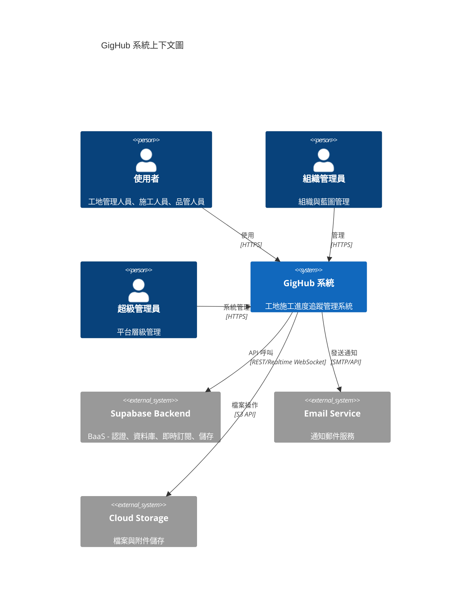

### 說明
- **使用者類型**：系統支援多種角色，從一般施工人員到超級管理員
- **核心系統**：GigHub 前端應用（Angular 20）
- **後端服務**：完全依賴 Supabase 提供的 BaaS 服務
- **外部整合**：郵件通知和雲端儲存服務

---

## 2. Component Architecture Diagram

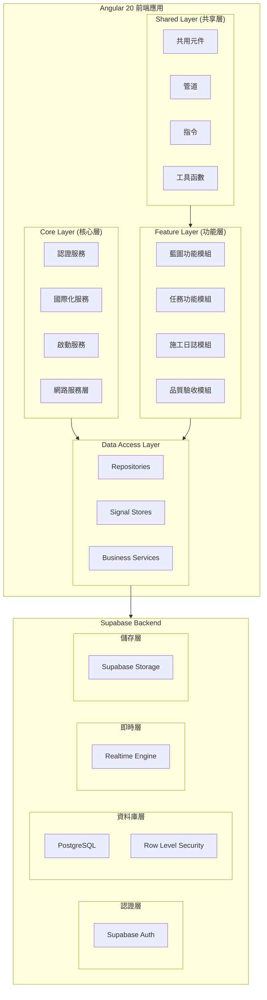

### 架構設計決策

| 層級 | 職責 | 設計原則 |
|------|------|----------|
| Core Layer | 全域服務、認證、啟動邏輯 | 單例模式、全域可用 |
| Feature Layer | 業務功能模組 | 垂直切片、懶載入 |
| Shared Layer | 可重用元件與工具 | DRY 原則、低耦合 |
| Data Access | 資料存取抽象 | Repository 模式 |

---

## 3. Database Schema Architecture

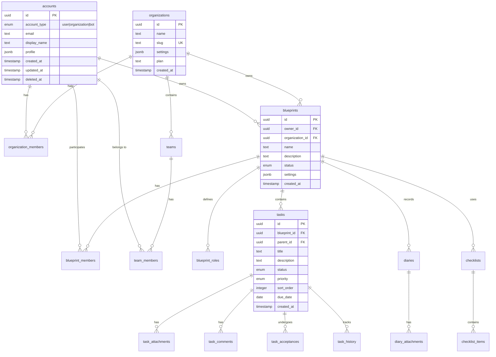

### 新 Schema 關鍵變更

1. **統一帳戶模型** (`accounts` 表)
   - 合併 User、Organization、Bot 為單一多態表
   - 使用 `account_type` 枚舉區分類型
   - 支援軟刪除 (`deleted_at`)

2. **組織層級結構**
   - `organizations` 表獨立管理組織設定
   - `organization_members` 處理用戶-組織關係
   - `teams` 支援組織內團隊劃分

3. **藍圖核心模型**
   - 支援個人與組織擁有權
   - 完整的成員角色系統
   - 可擴展的設定 (JSONB)

---

## 4. Data Flow Diagram

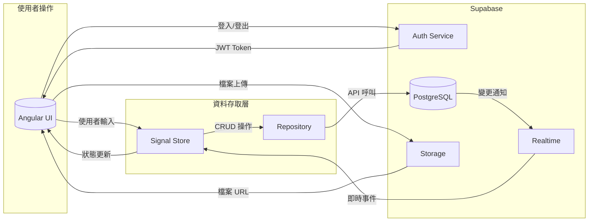

### 資料流程說明

1. **認證流程**
   - 用戶透過 Supabase Auth 進行認證
   - JWT Token 儲存於前端
   - 所有 API 請求附帶 Token

2. **資料操作流程**
   - UI 觸發 Store 方法
   - Store 透過 Repository 呼叫 Supabase API
   - RLS 確保資料安全性
   - 結果更新回 Store，觸發 UI 更新

3. **即時同步流程**
   - 資料庫變更觸發 Realtime 事件
   - 前端訂閱相關頻道
   - 自動更新本地狀態

---

## 5. Deployment Architecture

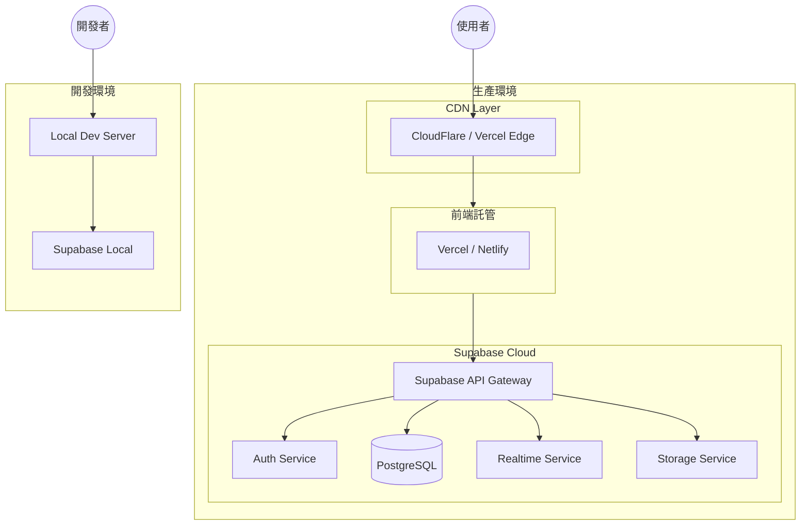

### 部署策略

| 環境 | 前端 | 後端 | 用途 |
|------|------|------|------|
| Development | localhost:4200 | Supabase Local | 本地開發 |
| Staging | Vercel Preview | Supabase Project (Staging) | 測試驗收 |
| Production | Vercel Production | Supabase Project (Prod) | 正式環境 |

---

## 6. 企業架構治理評估

### 6.1 架構原則遵循度

| 原則 | 狀態 | 說明 |
|------|------|------|
| **單一資料來源** | ✅ 符合 | Supabase 作為唯一後端 |
| **關注點分離** | ✅ 符合 | 三層架構明確分離 |
| **Repository 模式** | ✅ 符合 | 資料存取層封裝良好 |
| **依賴注入** | ✅ 符合 | 使用 Angular DI |
| **最小權限原則** | ⚠️ 部分 | RLS 政策需完善 |

### 6.2 架構治理建議

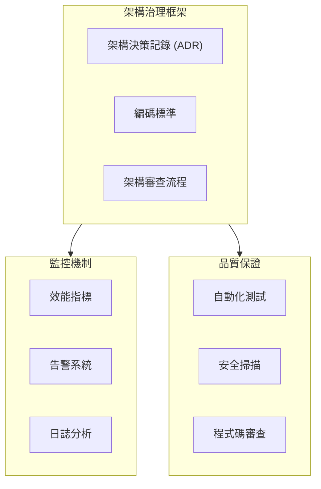

---

## 7. 技術債務評估

### 7.1 識別的技術債務

| ID | 類型 | 嚴重度 | 描述 | 影響範圍 |
|----|------|--------|------|----------|
| TD-001 | Schema 同步 | 🔴 高 | 前端介面與新 Schema 不一致 | 全域 |
| TD-002 | 文件過時 | 🟡 中 | domain-glossary.md 需更新 | 文件 |
| TD-003 | 類型定義 | 🟡 中 | TypeScript 介面需更新 | 類型安全 |
| TD-004 | RLS 覆蓋 | 🟡 中 | 部分表缺少 RLS 政策 | 安全性 |
| TD-005 | 測試覆蓋 | 🟡 中 | 單元測試覆蓋率不足 | 品質 |

### 7.2 技術債務分佈

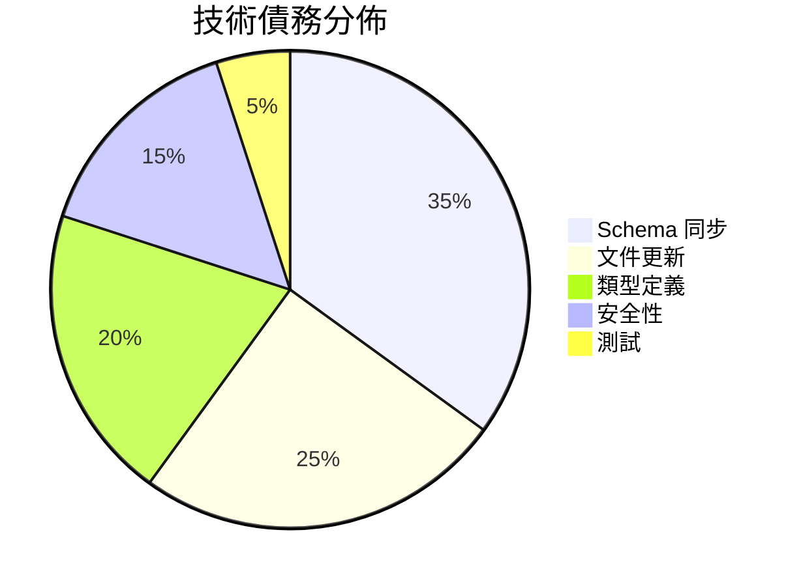

### 7.3 債務清償優先順序

1. **緊急**：Schema 同步 (影響核心功能)
2. **重要**：RLS 政策完善 (安全性)
3. **一般**：類型定義更新 (開發體驗)
4. **低**：文件更新 (知識傳承)

---

## 8. 合規性檢查

### 8.1 資料保護合規

| 要求 | 狀態 | 實施方式 |
|------|------|----------|
| LGPD 合規 | ✅ 設計中 | 軟刪除、資料保留政策 |
| 資料加密 | ✅ 符合 | Supabase TLS + 靜態加密 |
| 存取控制 | ✅ 符合 | RLS + RBAC |
| 稽核日誌 | ⚠️ 部分 | 需完善 history 表 |

### 8.2 安全合規檢查清單

```markdown
✅ 認證：使用 Supabase Auth (JWT)
✅ 授權：RLS + 自訂角色系統
✅ 傳輸加密：HTTPS/TLS
✅ 靜態加密：Supabase 提供
⚠️ 稽核追蹤：需強化 history 表
⚠️ 密碼政策：需在應用層實施
```

---

## 9. 現有架構分析

### 9.1 架構成熟度評估

```mermaid
radar
    title 架構成熟度雷達圖
```

| 維度 | 分數 (1-5) | 說明 |
|------|------------|------|
| **可擴展性** | 4 | Supabase 支援良好 |
| **安全性** | 3.5 | RLS 基礎完善，需強化 |
| **可維護性** | 4 | 模組化設計良好 |
| **效能** | 3.5 | 需優化查詢與快取 |
| **可觀察性** | 2.5 | 缺乏完整監控 |

### 9.2 架構優勢

1. **現代化技術棧**
   - Angular 20 + Signals 狀態管理
   - Supabase BaaS 降低後端複雜度
   - TypeScript 確保類型安全

2. **清晰的分層架構**
   - Foundation → Container → Business 三層模型
   - Repository 模式封裝資料存取
   - 依賴注入促進可測試性

3. **多租戶支援**
   - 統一帳戶模型支援多種實體
   - 組織/團隊層級隔離
   - 藍圖級別的資料隔離

### 9.3 架構弱點

1. **文件與實作不同步**
2. **部分安全機制未完善**
3. **缺乏完整的監控與可觀察性**
4. **測試覆蓋率待提升**

---

## 10. 目標架構設計

### 10.1 Phase 1: 基礎對齊 (短期 1-2 週)

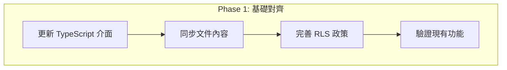

**目標**：
- 消除 Schema 與程式碼的不一致
- 更新所有相關文件
- 確保安全機制完整

### 10.2 Phase 2: 功能強化 (中期 2-4 週)

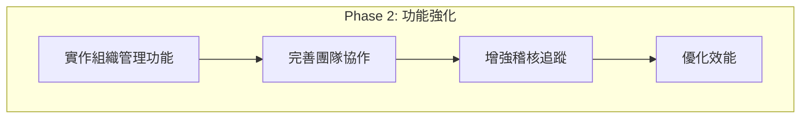

**目標**：
- 實作新 Schema 支援的功能
- 完善協作與權限機制
- 建立完整稽核軌跡

### 10.3 Phase 3: 成熟化 (長期 1-2 月)

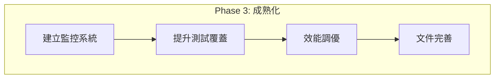

**目標**：
- 建立完整可觀察性
- 達到 80%+ 測試覆蓋率
- 優化使用者體驗

---

## 11. 遷移策略

### 11.1 遷移流程

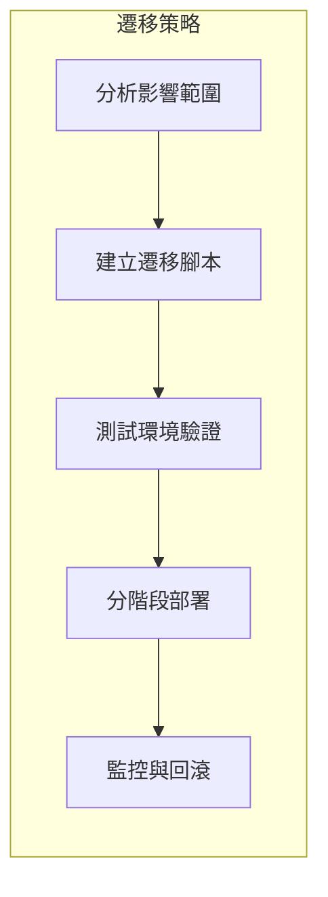

### 11.2 資料遷移考量

| 項目 | 策略 | 風險等級 |
|------|------|----------|
| 帳戶合併 | 漸進式遷移 | 中 |
| 組織結構 | 新建資料 | 低 |
| 藍圖關聯 | 更新外鍵 | 中 |
| 歷史資料 | 保留並映射 | 低 |

### 11.3 回滾計畫

1. **資料庫備份**：遷移前完整備份
2. **版本標記**：使用 Git tags 標記穩定版本
3. **功能開關**：新功能可透過 Feature Flag 控制
4. **監控告警**：異常自動通知

---

## 12. 文件一致性檢查

### 12.1 需更新的文件清單

| 文件路徑 | 衝突類型 | 優先級 | 說明 |
|----------|----------|--------|------|
| `.github/copilot/domain-glossary.md` | 術語定義 | 🔴 高 | 新增帳戶類型、組織概念 |
| `.github/instructions/gighub-domain-concepts.instructions.md` | 領域概念 | 🔴 高 | 更新核心實體定義 |
| `.github/instructions/gighub-architecture-layers.instructions.md` | 架構層級 | 🟡 中 | 更新資料表對應 |
| `.github/instructions/gighub-supabase-practices.instructions.md` | Supabase 實踐 | 🟡 中 | 新增 RLS 範例 |
| `src/app/features/*/domain/interfaces/` | TypeScript 介面 | 🔴 高 | 同步新 Schema |

### 12.2 術語對照更新

| 舊術語 | 新術語 | Schema 對應 |
|--------|--------|-------------|
| User | Account (type: USER) | `accounts` 表 |
| Organization Account | Account (type: ORGANIZATION) | `accounts` 表 |
| - | Bot Account | `accounts` 表 (type: BOT) |
| Blueprint Owner | Account (owner_id) | `blueprints.owner_id` |

### 12.3 新增概念

根據新 Schema，需要在文件中新增：

1. **帳戶類型枚舉** (`account_type`)
   - `user`: 個人用戶
   - `organization`: 組織帳戶
   - `bot`: 自動化機器人

2. **組織成員角色** (`organization_role`)
   - `owner`: 組織擁有者
   - `admin`: 組織管理員
   - `member`: 一般成員

3. **藍圖成員角色** (`blueprint_role`)
   - `owner`: 藍圖擁有者
   - `admin`: 藍圖管理員
   - `editor`: 編輯者
   - `viewer`: 檢視者

4. **通用狀態枚舉** (`common_status`)
   - `draft`: 草稿
   - `active`: 啟用
   - `archived`: 已歸檔
   - `deleted`: 已刪除

---

## 13. 非功能性需求分析

### 13.1 可擴展性 (Scalability)

| 維度 | 現況 | 目標 | 策略 |
|------|------|------|------|
| 用戶數 | 100+ | 10,000+ | Supabase 自動擴展 |
| 併發連接 | 50 | 500 | Connection pooling |
| 資料量 | GB 級 | TB 級 | 分區、索引優化 |

### 13.2 效能 (Performance)

| 指標 | 當前 | 目標 |
|------|------|------|
| FCP | < 2s | < 1.5s |
| LCP | < 3s | < 2.5s |
| API P95 | < 800ms | < 500ms |
| 資料庫查詢 P95 | < 200ms | < 100ms |

### 13.3 安全性 (Security)

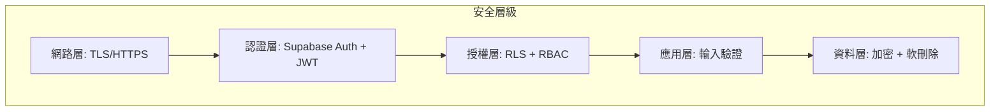

### 13.4 可靠性 (Reliability)

- **SLA 目標**: 99.9% 可用性
- **RPO**: < 1 小時
- **RTO**: < 4 小時
- **備份策略**: Supabase 自動備份

### 13.5 可維護性 (Maintainability)

| 面向 | 實施方式 |
|------|----------|
| 模組化 | 功能模組獨立、懶載入 |
| 文件化 | ADR、API 文件、程式碼註解 |
| 自動化 | CI/CD、自動測試、Lint |
| 監控 | 錯誤追蹤、效能監控 |

---

## 14. 風險與緩解策略

### 14.1 風險矩陣

| 風險 | 可能性 | 影響 | 緩解策略 |
|------|--------|------|----------|
| Schema 遷移失敗 | 中 | 高 | 漸進式遷移、完整測試 |
| 效能退化 | 中 | 中 | 效能測試、監控告警 |
| 安全漏洞 | 低 | 高 | 安全審計、RLS 強化 |
| 資料遺失 | 低 | 高 | 備份策略、軟刪除 |

### 14.2 風險緩解計畫

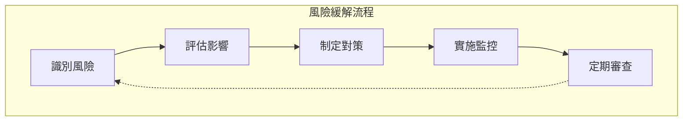

---

## 15. 技術棧建議

### 15.1 當前技術棧

| 層級 | 技術 | 版本 |
|------|------|------|
| 前端框架 | Angular | 20.x |
| UI 元件 | ng-zorro-antd | 20.x |
| 狀態管理 | Angular Signals | Built-in |
| 後端服務 | Supabase | Latest |
| 資料庫 | PostgreSQL | 15+ |
| 樣式 | LESS | - |
| 建構工具 | Angular CLI | 20.x |

### 15.2 建議優化

| 領域 | 建議 | 理由 |
|------|------|------|
| 監控 | 整合 Sentry | 錯誤追蹤 |
| 效能 | 使用 Web Vitals | 效能監控 |
| 測試 | 增加 Playwright E2E | 端到端測試 |
| 文件 | 使用 Compodoc | API 文件自動生成 |

---

## 16. 下一步行動計畫

### 16.1 立即行動 (本週)

- [ ] 審查並確認本評估報告
- [ ] 更新 `domain-glossary.md` 術語定義
- [ ] 更新 `gighub-domain-concepts.instructions.md`
- [ ] 同步 TypeScript 介面定義

### 16.2 短期計畫 (2 週內)

- [ ] 完善 RLS 政策
- [ ] 更新所有相關文件
- [ ] 建立遷移測試環境
- [ ] 執行功能回歸測試

### 16.3 中期計畫 (1 個月內)

- [ ] 實作組織管理功能
- [ ] 完善稽核追蹤機制
- [ ] 建立監控儀表板
- [ ] 提升測試覆蓋率

---

## 17. 附錄

### A. 參考文件

- [Angular 風格指南](https://angular.dev/style-guide)
- [Supabase 文件](https://supabase.com/docs)
- [ng-alain 文件](https://ng-alain.com)
- 專案 KEEP.md 文件

### B. 相關架構決策記錄 (ADR)

建議建立以下 ADR：
1. ADR-001: 統一帳戶模型設計
2. ADR-002: 多租戶資料隔離策略
3. ADR-003: RLS 政策設計原則
4. ADR-004: 軟刪除實施方針

### C. 版本歷史

| 版本 | 日期 | 作者 | 變更說明 |
|------|------|------|----------|
| 1.0 | 2025-11-29 | Architecture Team | 初始版本 |

---

*本文件由 GigHub 架構團隊維護，最後更新：2025-11-29*
