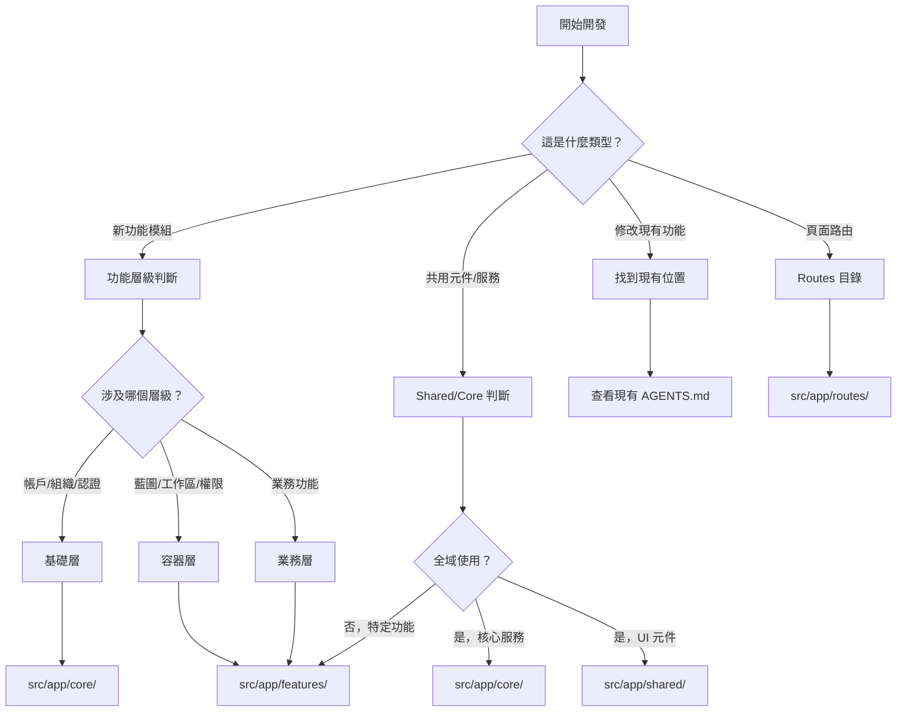
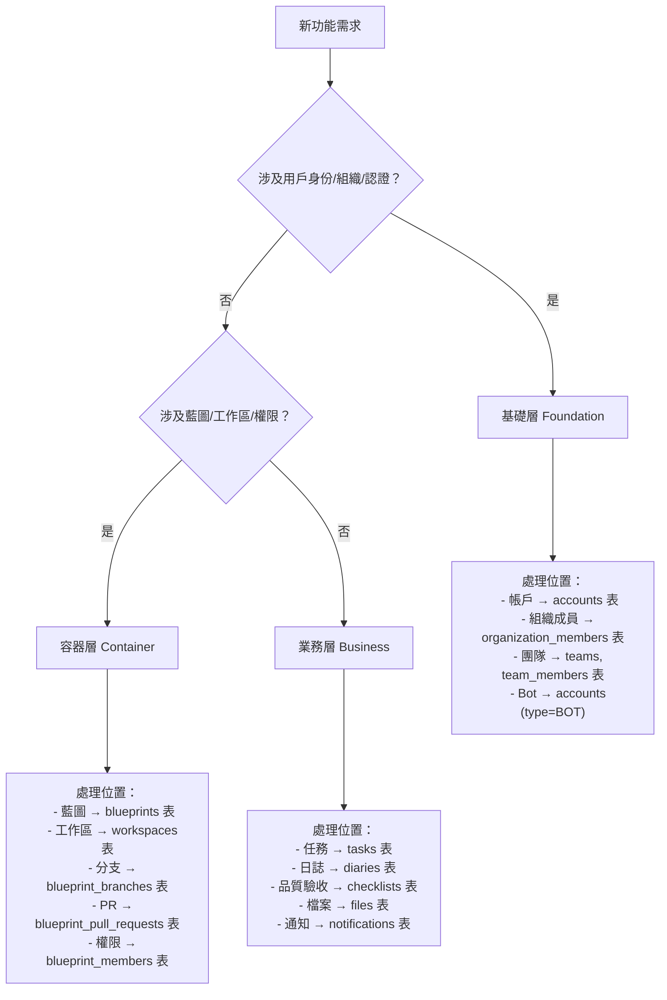
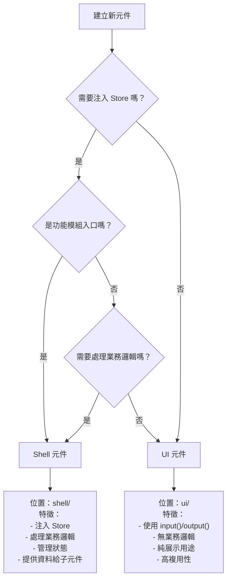
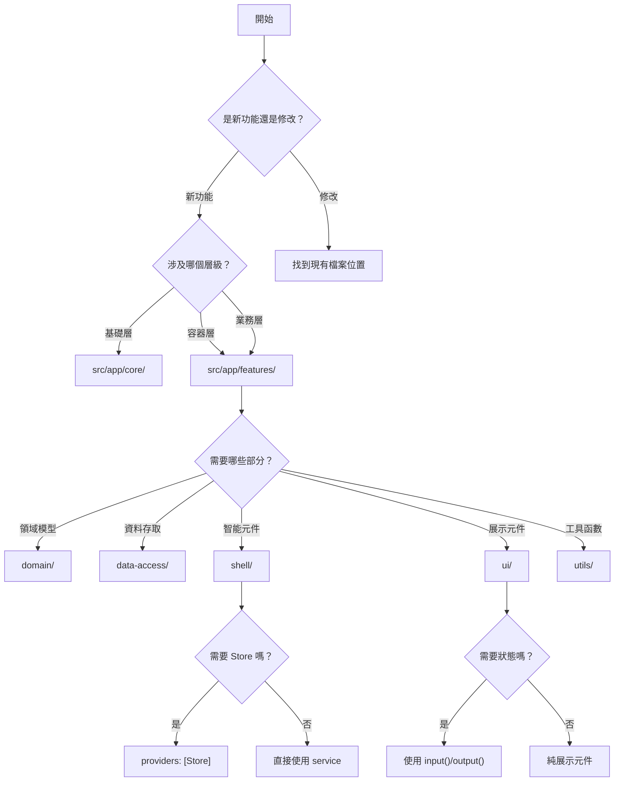

# 🌳 架構決策樹

> **目標**: 最多 3 層決策，快速確定程式碼放置位置

---

## 📑 目錄

- [主決策流程](#主決策流程)
- [層級決策](#層級決策)
- [目錄決策](#目錄決策)
- [元件類型決策](#元件類型決策)
- [狀態管理決策](#狀態管理決策)

---

## 主決策流程



---

## 層級決策

### 三層架構判斷



### 層級速查表

| 問題 | 答案 | 層級 |
|------|------|------|
| 涉及用戶登入/登出？ | 是 | 基礎層 |
| 涉及組織/團隊管理？ | 是 | 基礎層 |
| 涉及藍圖建立/管理？ | 是 | 容器層 |
| 涉及工作區切換？ | 是 | 容器層 |
| 涉及權限分配？ | 是 | 容器層 |
| 涉及任務/日誌/檔案等業務？ | 是 | 業務層 |

---

## 目錄決策

### 應用層目錄選擇

```mermaid
flowchart TD
    A[程式碼放哪裡？] --> B{是什麼類型？}
    
    B -->|頁面路由| C[src/app/routes/]
    B -->|共用 UI 元件| D[src/app/shared/components/]
    B -->|共用指令| E[src/app/shared/directives/]
    B -->|共用管道| F[src/app/shared/pipes/]
    B -->|全域服務| G[src/app/core/services/]
    B -->|HTTP 攔截器| H[src/app/core/net/]
    B -->|路由守衛| I[src/app/core/guards/]
    B -->|功能模組| J[src/app/features/]
    B -->|版面配置| K[src/app/layout/]
    
    J --> J1{功能類型？}
    J1 -->|任務管理| J2[features/task/]
    J1 -->|日誌管理| J3[features/diary/]
    J1 -->|藍圖管理| J4[features/blueprint/]
    J1 -->|其他| J5[features/{feature-name}/]
```

### 功能模組內部結構

```mermaid
flowchart TD
    A[功能模組內部] --> B{檔案類型？}
    
    B -->|領域模型/介面| C[domain/]
    B -->|資料存取| D[data-access/]
    B -->|智能元件| E[shell/]
    B -->|展示元件| F[ui/]
    B -->|工具函數| G[utils/]
    B -->|常數配置| H[constants/]
    B -->|路由定義| I[{feature}.routes.ts]
    
    C --> C1["domain/
    ├── models/
    ├── interfaces/
    ├── types/
    └── enums/"]
    
    D --> D1["data-access/
    ├── stores/
    ├── repositories/
    └── services/"]
    
    E --> E1["shell/
    ├── {feature}-shell/
    └── dialogs/"]
    
    F --> F1["ui/
    ├── {feature}-list/
    ├── {feature}-card/
    └── shared/"]
```

### 目錄速查表

| 問題 | 答案 | 位置 |
|------|------|------|
| 是頁面路由嗎？ | 是 | `src/app/routes/` |
| 是多處使用的 UI 元件？ | 是 | `src/app/shared/components/` |
| 是全域服務？ | 是 | `src/app/core/services/` |
| 是垂直功能切片？ | 是 | `src/app/features/` |
| 是版面配置？ | 是 | `src/app/layout/` |

---

## 元件類型決策

### Shell vs UI 決策



### 元件選擇速查表

| 特徵 | Shell (Smart) | UI (Presentational) |
|------|---------------|---------------------|
| 注入 Store | ✅ | ❌ |
| 業務邏輯 | ✅ | ❌ |
| `input()` / `output()` | 較少 | 大量使用 |
| 狀態管理 | 管理狀態 | 無狀態 |
| 複用性 | 低 | 高 |
| 位置 | `shell/` | `ui/` |

---

## 狀態管理決策

### 狀態管理選擇

```mermaid
flowchart TD
    A[需要管理狀態] --> B{狀態範圍？}
    
    B -->|全域狀態| C[提供於 root]
    B -->|功能模組狀態| D[提供於 Shell]
    B -->|元件本地狀態| E[signal()]
    
    C --> C1["@Injectable({ providedIn: 'root' })
    位置：src/app/core/services/
    
    範例：
    - AuthStore
    - UserStore
    - NotificationStore"]
    
    D --> D1["在 Shell 的 providers 中
    位置：features/{feature}/data-access/stores/
    
    範例：
    - BlueprintStore
    - TaskStore
    - DiaryStore"]
    
    E --> E1["直接在元件中
    
    範例：
    private readonly isOpen = signal(false);
    private readonly count = signal(0);"]
```

### 狀態重置時機

| 觸發情境 | 重置範圍 |
|----------|----------|
| 登出 | 所有 Store Signal |
| 切換組織 | Blueprint, Task, Diary, Todo Store |
| 切換藍圖 | Task, Diary, Todo Store |

---

## 快速決策流程圖

### 完整決策流程



---

## 參考資源

- [AGENTS.md](../../AGENTS.md) - 專案總覽
- [Features AGENTS.md](../../src/app/features/AGENTS.md) - 垂直切片架構
- [system-architecture.md](../architecture/system-architecture.md) - 系統架構圖
- [mindmap.md](../agent/mindmap.md) - AI Agent 思維導圖

---

**最後更新**: 2025-11-27
