# GigHub - Architecture Plan

## 📋 目錄 Table of Contents

1. [Executive Summary 執行摘要](#executive-summary-執行摘要)
2. [System Context 系統上下文](#system-context-系統上下文)
3. [Architecture Overview 架構概覽](#architecture-overview-架構概覽)
4. [Component Architecture 元件架構](#component-architecture-元件架構)
5. [Deployment Architecture 部署架構](#deployment-architecture-部署架構)
6. [Data Flow 資料流](#data-flow-資料流)
7. [Key Workflows 關鍵工作流程](#key-workflows-關鍵工作流程)
8. [Blueprint & Modules System 藍圖與模組系統](#blueprint--modules-system-藍圖與模組系統)
9. [Phased Development 分階段開發](#phased-development-分階段開發)
10. [Non-Functional Requirements 非功能性需求](#non-functional-requirements-非功能性需求)
11. [Missing Features Analysis 缺失功能分析](#missing-features-analysis-缺失功能分析)
12. [Technology Stack 技術棧](#technology-stack-技術棧)
13. [Risks and Mitigations 風險與緩解](#risks-and-mitigations-風險與緩解)
14. [Next Steps 下一步](#next-steps-下一步)

---

## Executive Summary 執行摘要

GigHub 是一個多租戶 SaaS 應用程式，專為建築/工程專案管理設計。系統以「藍圖 (Blueprint)」作為核心資產容器，支援多種業務模組的動態載入與管理。

### 核心概念 Core Concepts

| 概念 | 說明 | 技術實現 |
|------|------|----------|
| **Workspace (工作區)** | 使用者、組織或團隊的上下文環境 | `WorkspaceContextService` |
| **Blueprint (藍圖)** | 專案/資產的邏輯容器 | `BlueprintFacade`, `BlueprintService` |
| **Modules (模組)** | 業務功能單元 (Tasks, Diary, Issues 等) | 待實現的動態模組載入器 |

### 系統層級 System Layers

```
┌─────────────────────────────────────────────────────────┐
│                     Routes Layer                        │
│  (Feature Components - Blueprint, Account, Modules)     │
├─────────────────────────────────────────────────────────┤
│                     Shared Layer                        │
│  (Services, Models, Utils - Business Logic)             │
├─────────────────────────────────────────────────────────┤
│                      Core Layer                         │
│  (Facades, Repositories, Types, Supabase Integration)   │
└─────────────────────────────────────────────────────────┘
```

---

## System Context 系統上下文

### System Context Diagram 系統上下文圖

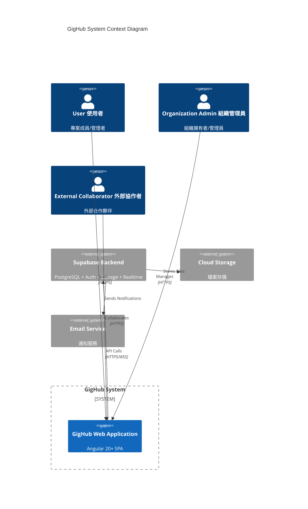

### Context Explanation 上下文說明

**外部角色 External Actors:**
- **User (使用者)**: 專案團隊成員，使用系統進行日常工作管理
- **Organization Admin (組織管理員)**: 管理組織設定、成員和藍圖權限
- **External Collaborator (外部協作者)**: 受邀參與特定藍圖的外部人員

**外部系統 External Systems:**
- **Supabase**: 提供認證、資料庫、即時訂閱和儲存服務
- **Cloud Storage**: 附件和檔案存儲
- **Email Service**: 通知和邀請郵件

---

## Architecture Overview 架構概覽

### High-Level Architecture 高層架構

GigHub 採用 **Clean Architecture** 模式，結合 **Angular Signals** 實現響應式狀態管理：

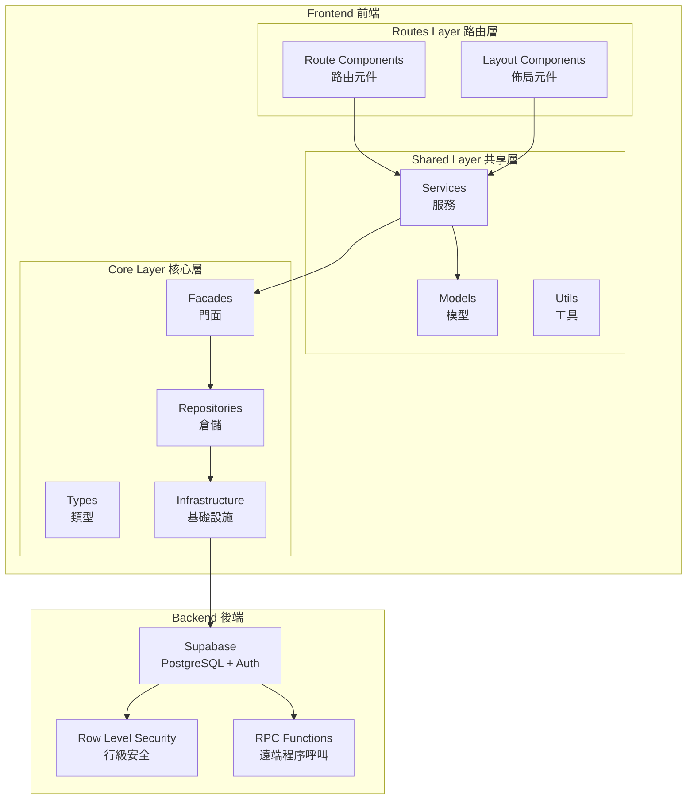

### Design Patterns 設計模式

| 模式 | 應用位置 | 目的 |
|------|----------|------|
| **Facade Pattern** | `BlueprintFacade`, `AccountFacade` | 統一業務操作入口 |
| **Repository Pattern** | `BlueprintRepository`, `AccountRepository` | 資料存取抽象 |
| **Signal-based State** | 所有 Services | 響應式狀態管理 |
| **Dependency Injection** | Angular DI | 鬆耦合元件組合 |
| **Lazy Loading** | Routes | 效能優化 |

---

## Component Architecture 元件架構

### Component Diagram 元件圖

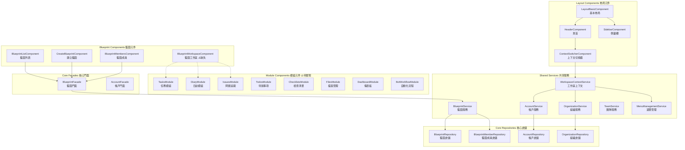

### Component Responsibilities 元件職責

#### Layout Components 佈局元件
| 元件 | 職責 | 狀態 |
|------|------|------|
| `LayoutBasicComponent` | 主佈局框架，管理 Header/Sidebar/Content | ✅ 已實現 |
| `ContextSwitcherComponent` | 切換 User/Organization/Team 上下文 | ✅ 已實現 |
| `MenuManagementService` | 根據上下文動態載入選單 | ✅ 已實現 |

#### Blueprint Components 藍圖元件
| 元件 | 職責 | 狀態 |
|------|------|------|
| `BlueprintListComponent` | 顯示藍圖列表 | ✅ 已實現 |
| `CreateBlueprintComponent` | 建立新藍圖 | ✅ 已實現 |
| `BlueprintMembersComponent` | 管理藍圖成員 | ✅ 已實現 |
| `BlueprintWorkspaceComponent` | 藍圖主工作區 + 模組導航 | ⚠️ 缺失 |
| `BlueprintContextService` | 藍圖層級共享上下文 | ⚠️ 缺失 |

#### Module Components 模組元件
| 模組 | 職責 | 資料表 | 狀態 |
|------|------|--------|------|
| Tasks | 任務管理 | `tasks`, `task_attachments` | ⚠️ 缺失 |
| Diary | 施工日誌 | `diaries`, `diary_attachments` | ⚠️ 缺失 |
| Issues | 問題追蹤 | `issues`, `issue_comments` | ⚠️ 缺失 |
| Todos | 待辦事項 | `todos` | ⚠️ 缺失 |
| Checklists | 檢查清單 | `checklists`, `checklist_items` | ⚠️ 缺失 |
| Files | 檔案管理 | Supabase Storage | ⚠️ 缺失 |
| Dashboard | 儀表板 | 聚合查詢 | ⚠️ 缺失 |
| Bot Workflow | 自動化流程 | 待定義 | ⚠️ 缺失 |

---

## Deployment Architecture 部署架構

### Deployment Diagram 部署圖

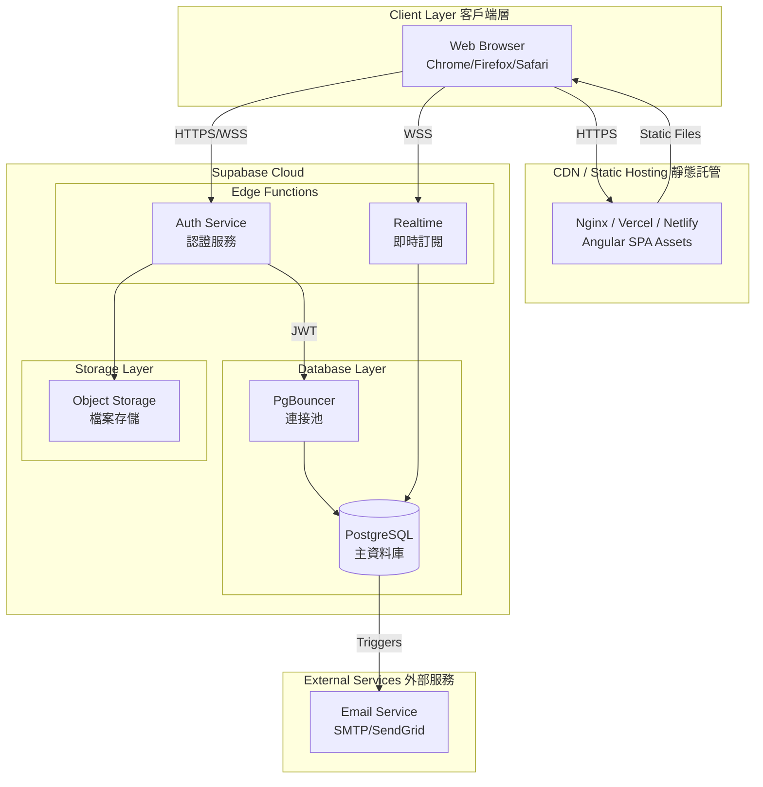

### Infrastructure Components 基礎設施元件

| 元件 | 技術 | 用途 |
|------|------|------|
| **Frontend Hosting** | Vercel/Netlify/Nginx | Angular SPA 靜態檔案 |
| **Database** | PostgreSQL 15+ | 主資料存儲 |
| **Authentication** | Supabase Auth | JWT-based 認證 |
| **Realtime** | Supabase Realtime | WebSocket 即時更新 |
| **Storage** | Supabase Storage | 檔案/附件存儲 |
| **Connection Pool** | PgBouncer | 資料庫連接管理 |

### Environment Configuration 環境配置

```typescript
// environments/environment.ts
export const environment = {
  production: false,
  supabaseUrl: 'https://xxx.supabase.co',
  supabaseAnonKey: 'eyJhbGci...',
  api: {
    baseUrl: '/api'
  }
};
```

---

## Data Flow 資料流

### Data Flow Diagram 資料流圖

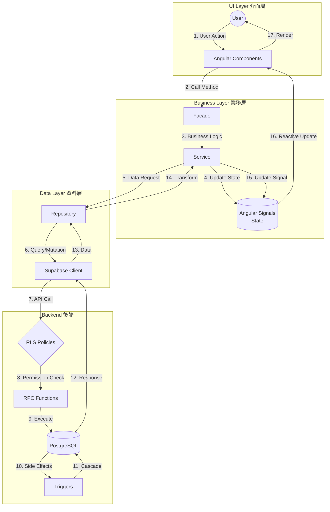

### Data Handling Strategies 資料處理策略

#### 1. State Management 狀態管理
```typescript
// Signal-based state in services
private blueprintsState = signal<BlueprintBusinessModel[]>([]);
readonly blueprints = this.blueprintsState.asReadonly();

// Computed signals for derived state
readonly contextLabel = computed(() => {
  const type = this.contextType();
  // ... derive label from type
});
```

#### 2. Error Handling 錯誤處理
```typescript
// BaseAccountCrudFacade pattern
protected async executeWithErrorHandling<T>(
  operation: () => Promise<T>,
  errorMessage: string
): Promise<T> {
  try {
    return await operation();
  } catch (error) {
    this.handleError(error, errorMessage);
    throw error;
  }
}
```

#### 3. Data Validation 資料驗證
- **Frontend**: TypeScript interfaces + runtime validation
- **Backend**: PostgreSQL constraints + RLS policies

---

## Key Workflows 關鍵工作流程

### Workflow 1: Blueprint Creation 藍圖建立流程

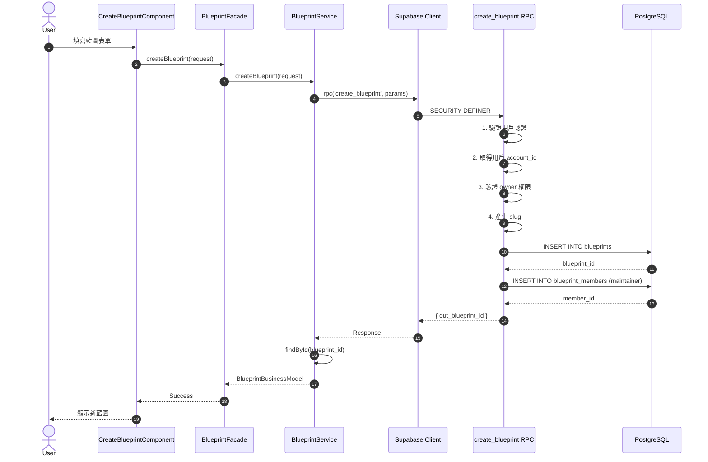

### Workflow 2: Context Switching 上下文切換流程

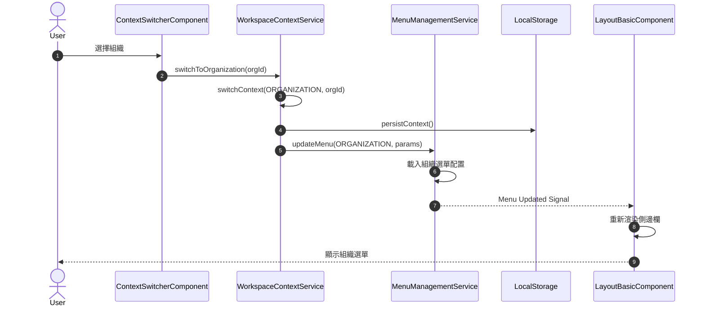

### Workflow 3: Blueprint Module Loading (Target) 藍圖模組載入流程 (目標)

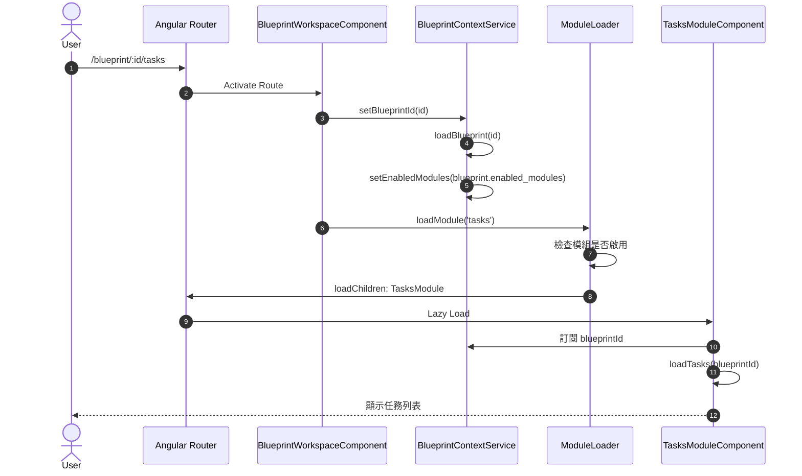

---

## Blueprint & Modules System 藍圖與模組系統

### Architecture Design 架構設計

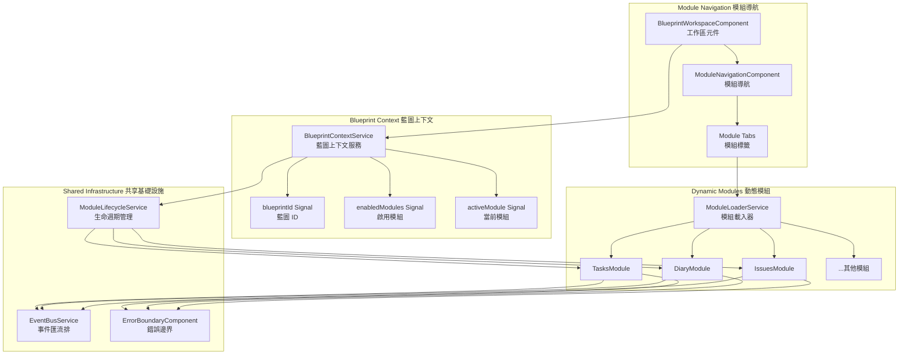

### Technical Requirements 技術需求

| 需求 | 說明 | 狀態 | 優先級 |
|------|------|------|--------|
| **Shared Context** | 藍圖層級的共享上下文 (Signals, DI) | ✅ 已有基礎 | High |
| **Event System** | 跨模組事件通訊 (EventBus) | ⚠️ 缺少集中式 | High |
| **Error Boundary** | 模組級錯誤隔離 | ⚠️ 僅基本 | Medium |
| **Lifecycle Management** | 模組初始化/銷毀管理 | ⚠️ 缺失 | High |
| **Data Sharing** | 透過 Facades/Repos 共享資料 | ✅ 已實現 | High |
| **Module Loader** | 動態載入啟用的模組 | ⚠️ 缺失 | High |

### Proposed BlueprintContextService 建議的藍圖上下文服務

> **Note**: This is a proposed design for future implementation. The service does not exist yet.

```typescript
/**
 * BlueprintContextService
 * 藍圖層級的共享上下文服務
 *
 * @proposed This service is a proposed design for future implementation
 */
@Injectable({ providedIn: 'root' })
export class BlueprintContextService {
  // Core State
  readonly blueprintId = signal<string | null>(null);
  readonly blueprint = signal<BlueprintBusinessModel | null>(null);
  readonly enabledModules = signal<ModuleType[]>([]);
  readonly activeModule = signal<ModuleType | null>(null);

  // Computed
  readonly isModuleEnabled = (module: ModuleType) =>
    computed(() => this.enabledModules().includes(module));

  // Methods
  async loadBlueprint(id: string): Promise<void>;
  setActiveModule(module: ModuleType): void;
  canAccessModule(module: ModuleType): boolean;
}
```

### Proposed Route Structure 建議的路由結構

> **Note**: This is the proposed target route structure. `BlueprintWorkspaceComponent` and related modules do not exist yet and need to be implemented.

```typescript
// routes/blueprint/routes.ts (PROPOSED - not yet implemented)
export const routes: Routes = [
  {
    path: '',
    component: BlueprintListComponent
  },
  {
    path: ':id',
    component: BlueprintWorkspaceComponent,
    resolve: { blueprint: BlueprintResolver },
    children: [
      { path: '', redirectTo: 'dashboard', pathMatch: 'full' },
      {
        path: 'dashboard',
        loadComponent: () => import('./modules/dashboard/dashboard.component')
          .then(m => m.DashboardComponent),
        canActivate: [moduleEnabledGuard(ModuleType.DASHBOARD)]
      },
      {
        path: 'tasks',
        loadChildren: () => import('./modules/tasks/routes')
          .then(m => m.routes),
        canActivate: [moduleEnabledGuard(ModuleType.TASKS)]
      },
      {
        path: 'diary',
        loadChildren: () => import('./modules/diary/routes')
          .then(m => m.routes),
        canActivate: [moduleEnabledGuard(ModuleType.DIARY)]
      },
      // ... other modules
    ]
  }
];
```

---

## Phased Development 分階段開發

### Phase 1: Initial Implementation 初始實現 (MVP)

**目標**: 完成核心藍圖功能和第一個模組 (Tasks)

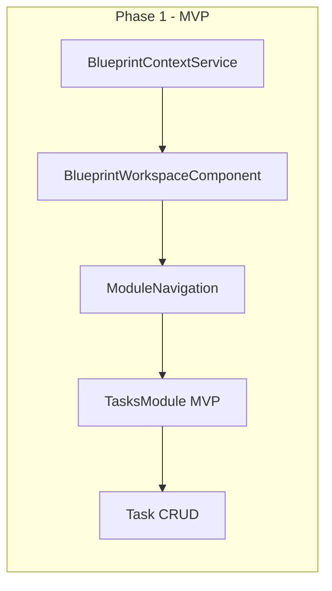

#### Phase 1 Checklist
- [ ] `BlueprintContextService` - 藍圖上下文管理
- [ ] `BlueprintWorkspaceComponent` - 主工作區佈局
- [ ] `ModuleNavigationComponent` - 模組切換導航
- [ ] `TasksModule` - 任務模組 MVP
  - [ ] Task List Component
  - [ ] Task Detail Component
  - [ ] Task Create/Edit Form
  - [ ] TaskRepository
  - [ ] TaskService
  - [ ] TaskFacade

### Phase 2: Core Modules 核心模組

**目標**: 實現常用業務模組

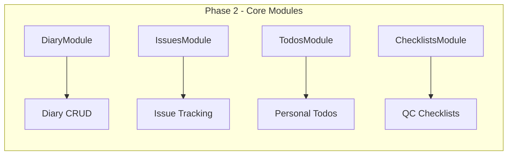

#### Phase 2 Checklist
- [ ] `DiaryModule` - 施工日誌
- [ ] `IssuesModule` - 問題追蹤
- [ ] `TodosModule` - 待辦事項
- [ ] `ChecklistsModule` - 檢查清單
- [ ] `TaskAcceptanceComponent` - 品質驗收

### Phase 3: Advanced Features 進階功能

**目標**: 完整功能和系統優化

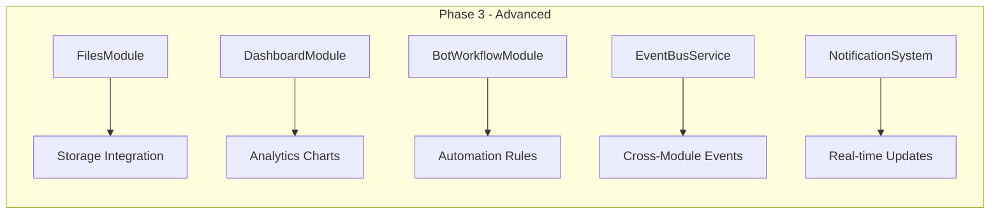

#### Phase 3 Checklist
- [ ] `FilesModule` - 檔案管理 (Supabase Storage)
- [ ] `DashboardModule` - 儀表板分析
- [ ] `BotWorkflowModule` - 自動化流程
- [ ] `EventBusService` - 跨模組事件系統
- [ ] `NotificationService` - 即時通知
- [ ] Supabase Realtime Integration

### Migration Path 遷移路徑

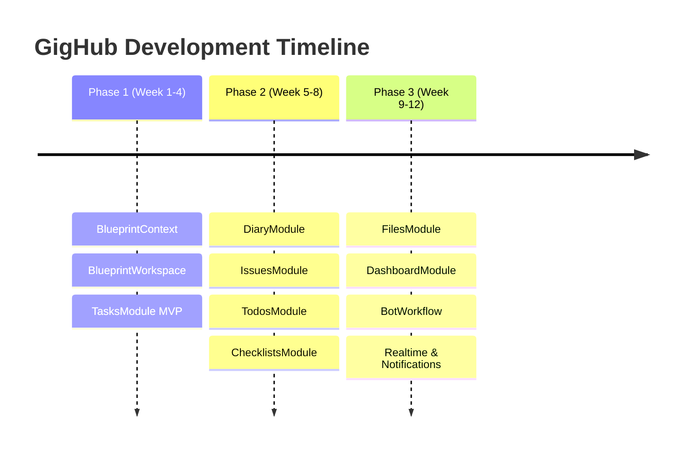

---

## Non-Functional Requirements 非功能性需求

### Scalability 可擴展性

| 指標 | 目標 | 實現方式 |
|------|------|----------|
| **並發用戶** | 1,000+ | Supabase 自動擴展 |
| **資料量** | 100K+ 藍圖 | PostgreSQL 分區 + 索引 |
| **模組擴展** | 無限制 | 動態模組載入 |
| **組織數量** | 無限制 | 多租戶架構 |

**設計考量:**
- 使用 Lazy Loading 減少初始載入時間
- 資料庫索引優化查詢效能
- RLS 策略確保租戶隔離

### Performance 效能

| 指標 | 目標 | 實現方式 |
|------|------|----------|
| **首次載入** | < 3s | Code Splitting |
| **路由切換** | < 500ms | Lazy Loading |
| **API 響應** | < 200ms | 資料庫索引 |
| **即時更新** | < 100ms | WebSocket |

**優化策略:**
```typescript
// Angular Signals for efficient change detection
readonly blueprints = this.blueprintsState.asReadonly();

// Computed signals for derived state
readonly filteredBlueprints = computed(() =>
  this.blueprints().filter(b => b.status === 'active')
);
```

### Security 安全性

| 層級 | 措施 | 實現 |
|------|------|------|
| **認證** | JWT Token | Supabase Auth |
| **授權** | RBAC | RLS Policies |
| **資料隔離** | 租戶隔離 | `private.has_blueprint_access()` |
| **輸入驗證** | 後端驗證 | PostgreSQL Constraints |

**RLS 策略範例:**
```sql
-- 有藍圖存取權的用戶可以讀取
CREATE POLICY "blueprints_select" ON blueprints
FOR SELECT TO authenticated
USING ((SELECT private.has_blueprint_access(id)));
```

### Reliability 可靠性

| 指標 | 目標 | 實現方式 |
|------|------|----------|
| **可用性** | 99.9% | Supabase SLA |
| **資料持久性** | 99.999% | PostgreSQL + Backups |
| **故障恢復** | < 1h | Point-in-time Recovery |
| **錯誤處理** | 優雅降級 | Error Boundaries |

### Maintainability 可維護性

**程式碼組織:**
```
src/app/
├── core/           # 核心層 - 不依賴其他應用模組
│   ├── facades/    # 業務門面
│   ├── infra/      # 基礎設施 (types, repos)
│   └── supabase/   # Supabase 整合
├── shared/         # 共享層 - 可被多處使用
│   ├── models/     # 業務模型
│   ├── services/   # 業務服務
│   └── utils/      # 工具函數
└── routes/         # 路由層 - 功能元件
    ├── blueprint/  # 藍圖功能
    ├── account/    # 帳戶功能
    └── demo/       # 示範功能
```

**文件慣例:**
- 雙語註解 (中/英)
- JSDoc 文件
- 清晰的命名規則

---

## Missing Features Analysis 缺失功能分析

### Current Implementation Status 當前實現狀態

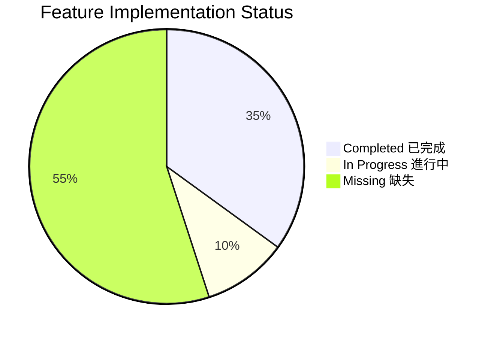

### Detailed Feature Matrix 詳細功能矩陣

#### Infrastructure 基礎設施

| 功能 | 狀態 | 優先級 | 備註 |
|------|------|--------|------|
| Supabase Integration | ✅ | - | 已完成 |
| Auth System | ✅ | - | JWT-based |
| RLS Policies | ✅ | - | 完整實現 |
| Database Schema | ✅ | - | 8 模組表已定義 |

#### Core Features 核心功能

| 功能 | 狀態 | 優先級 | 備註 |
|------|------|--------|------|
| Account Management | ✅ | - | CRUD 完成 |
| Organization Management | ✅ | - | CRUD 完成 |
| Team Management | ✅ | - | CRUD 完成 |
| Workspace Context Switching | ✅ | - | Signal-based |
| Menu Management | ✅ | - | Dynamic menus |
| Blueprint CRUD | ✅ | - | 完整 CRUD |
| Blueprint Members | ✅ | - | 成員管理 |

#### Missing Features 缺失功能

| 功能 | 狀態 | 優先級 | 說明 |
|------|------|--------|------|
| `BlueprintContextService` | ⚠️ | **High** | 藍圖層級共享上下文 |
| `BlueprintWorkspaceComponent` | ⚠️ | **High** | 主工作區佈局 |
| `ModuleLoaderService` | ⚠️ | **High** | 動態模組載入 |
| `TasksModule` | ⚠️ | **High** | 任務管理模組 |
| `DiaryModule` | ⚠️ | **High** | 施工日誌模組 |
| `IssuesModule` | ⚠️ | **Medium** | 問題追蹤模組 |
| `TodosModule` | ⚠️ | **Medium** | 待辦事項模組 |
| `ChecklistsModule` | ⚠️ | **Medium** | 檢查清單模組 |
| `FilesModule` | ⚠️ | **Medium** | 檔案管理模組 |
| `DashboardModule` | ⚠️ | **Low** | 儀表板模組 |
| `BotWorkflowModule` | ⚠️ | **Low** | 自動化流程模組 |
| `EventBusService` | ⚠️ | **Medium** | 跨模組事件系統 |
| `ModuleLifecycleService` | ⚠️ | **Medium** | 模組生命週期管理 |
| `NotificationService` | ⚠️ | **Medium** | 即時通知服務 |
| Realtime Integration | ⚠️ | **Medium** | Supabase Realtime |

### Implementation Roadmap 實現路線圖

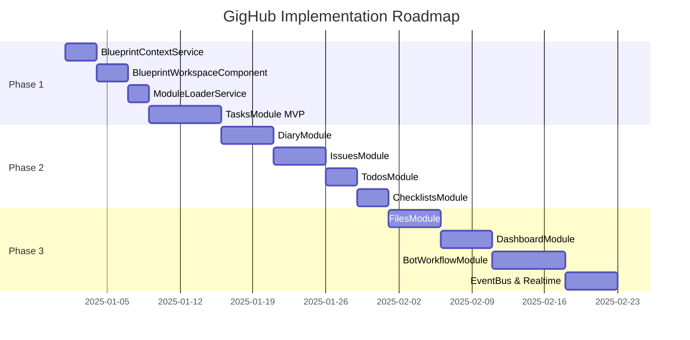

---

## Technology Stack 技術棧

### Frontend 前端

| 技術 | 版本 | 用途 |
|------|------|------|
| **Angular** | 20.x | 主框架 |
| **TypeScript** | 5.x | 程式語言 |
| **RxJS** | 7.x | 響應式程式設計 |
| **NG-ZORRO** | 20.x | UI 元件庫 |
| **@delon** | 20.x | 企業級模組 |
| **Supabase JS** | 2.x | 後端 SDK |

### Backend 後端

| 技術 | 用途 |
|------|------|
| **Supabase** | BaaS 平台 |
| **PostgreSQL** | 主資料庫 |
| **Row Level Security** | 資料授權 |
| **Edge Functions** | 伺服器邏輯 |
| **Realtime** | 即時訂閱 |
| **Storage** | 檔案存儲 |

### DevOps

| 工具 | 用途 |
|------|------|
| **Git** | 版本控制 |
| **GitHub Actions** | CI/CD |
| **ESLint** | 程式碼品質 |
| **Prettier** | 程式碼格式 |
| **Husky** | Git Hooks |

---

## Risks and Mitigations 風險與緩解

### Technical Risks 技術風險

| 風險 | 影響 | 機率 | 緩解措施 |
|------|------|------|----------|
| Supabase Rate Limits | High | Medium | 實現快取策略 |
| Complex RLS Policies | Medium | High | 單元測試覆蓋 |
| Module Load Performance | Medium | Medium | Lazy Loading + 預載入 |
| Cross-Module State Sync | High | Medium | EventBus + Signals |

### Architectural Risks 架構風險

| 風險 | 影響 | 機率 | 緩解措施 |
|------|------|------|----------|
| Module Coupling | Medium | Medium | 嚴格介面定義 |
| State Management Complexity | Medium | High | 明確狀態所有權 |
| Circular Dependencies | High | Low | ESLint 規則檢查 |

### Business Risks 業務風險

| 風險 | 影響 | 機率 | 緩解措施 |
|------|------|------|----------|
| Supabase Vendor Lock-in | Medium | Medium | 抽象化資料存取層 |
| Scaling Costs | Medium | Low | 監控使用量 |

---

## Next Steps 下一步

### Immediate Actions 立即行動

1. **建立 `BlueprintContextService`**
   - 實現藍圖層級的共享上下文
   - Signal-based state management
   - 模組啟用/禁用管理

2. **建立 `BlueprintWorkspaceComponent`**
   - 主工作區佈局
   - 模組導航 UI
   - 路由整合

3. **實現 Tasks Module MVP**
   - TaskRepository
   - TaskService
   - TaskFacade
   - Task List/Detail/Form Components

### Recommended Team Structure 建議團隊結構

```
Tech Lead (1)
├── Frontend Engineer (2)
│   ├── Blueprint & Modules
│   └── UI/UX Components
├── Backend Engineer (1)
│   └── Supabase & Database
└── QA Engineer (1)
    └── Testing & Documentation
```

### Success Metrics 成功指標

| 指標 | 目標 | 測量方式 |
|------|------|----------|
| 功能覆蓋率 | 100% 計畫功能 | Feature checklist |
| 測試覆蓋率 | > 80% | Jest coverage |
| 效能指標 | LCP < 2.5s | Lighthouse |
| 使用者滿意度 | > 4/5 | User feedback |

---

## References 參考資料

### Internal Documentation 內部文件

- [plan/feature-blueprint-module-1.md](../plan/feature-blueprint-module-1.md)
- [plan/feature-organization-switcher-1.md](../plan/feature-organization-switcher-1.md)
- [plan/refactor-route-migration-workspace-context-1.md](../plan/refactor-route-migration-workspace-context-1.md)
- [supabase/seeds/init.sql](../supabase/seeds/init.sql)

### External Resources 外部資源

- [Angular Signals Documentation](https://angular.dev/guide/signals)
- [Supabase Documentation](https://supabase.com/docs)
- [NG-ZORRO Components](https://ng.ant.design/)
- [@delon Framework](https://ng-alain.com/)

---

*Last Updated: 2025-12-01*
*Version: 1.0*
*Author: GigHub Architecture Team*
