# GigHub - Architecture Plan

## Executive Summary

GigHub 是一個基於 Angular 20+ 的企業級多租戶 SaaS 應用程式,構建於 ng-alain 框架並使用 Supabase 作為後端。此架構文檔詳細說明了 Blueprint & Modules 系統的設計,該系統是 GigHub 的核心業務功能。

### 核心概念

- **Workspace (工作區)**: 上下文容器,支持 User、Organization、Team 或 Bot 類型
- **Blueprint (藍圖)**: 邏輯容器,用於組織各種業務模組
- **Modules (模組)**: Blueprint 內的功能單元 (Tasks, Diary, Dashboard, Files, Todos, Checklists, Issues, Bot Workflow)

### 技術棧

- **Frontend**: Angular 20+, TypeScript, ng-alain, ng-zorro-antd
- **Backend**: Supabase (PostgreSQL, Auth, Realtime, Storage)
- **State Management**: Angular Signals, RxJS
- **Build Tool**: Vite/Angular CLI

---

## 1. System Context (系統上下文)

### 1.1 System Context Diagram

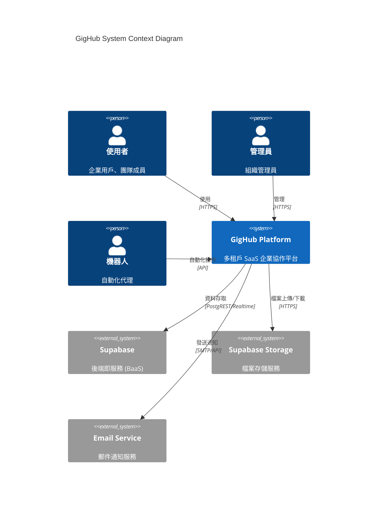

### 1.2 Overview

GigHub 作為一個企業協作平台,提供以下核心功能:

| 功能領域 | 描述 |
|---------|------|
| 身份管理 | 統一帳戶體系 (User, Organization, Bot) |
| 工作區切換 | 多上下文環境 (個人、組織、團隊、機器人) |
| 藍圖管理 | 業務容器的創建、配置、成員管理 |
| 模組系統 | 可啟用的功能模組 (任務、日誌、問題追蹤等) |

### 1.3 Key Components

- **Angular Frontend**: 單頁應用程式 (SPA),提供響應式用戶界面
- **Supabase Backend**: 提供認證、資料庫、即時通訊、存儲功能
- **RLS Policies**: Row Level Security 確保資料隔離和存取控制

### 1.4 Design Decisions

1. **統一帳戶模型**: 使用單一 `accounts` 表處理 User、Organization、Bot,簡化權限管理
2. **Blueprint 為核心容器**: 所有業務模組都掛載在 Blueprint 下,實現功能隔離
3. **基於角色的存取控制**: 使用 PostgreSQL RLS 在資料庫層實施安全策略

---

## 2. Architecture Overview (架構概覽)

### 2.1 High-Level Architecture

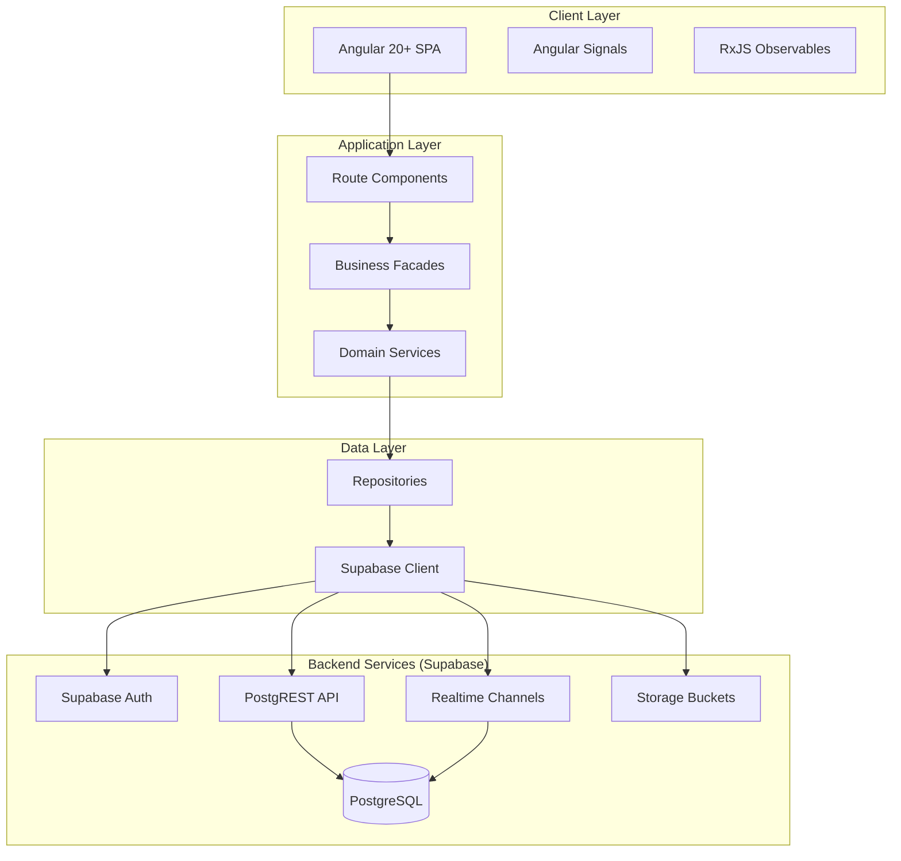

### 2.2 Architectural Patterns Used

| Pattern | Implementation | Purpose |
|---------|---------------|---------|
| **Facade Pattern** | `BlueprintFacade`, `BaseAccountCrudFacade` | 統一業務接口 |
| **Repository Pattern** | `BlueprintRepository`, `AccountRepository` | 資料存取抽象 |
| **Signal-based State** | Angular Signals | 響應式狀態管理 |
| **Lazy Loading** | Route-based code splitting | 效能優化 |
| **Standalone Components** | Angular 20+ standalone | 模組化組件 |

---

## 3. Component Architecture (組件架構)

### 3.1 Component Diagram

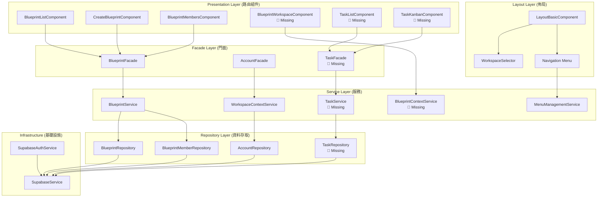

### 3.2 Detailed Component Explanation

#### 3.2.1 Core Components (已實現 ✅)

| Component | Location | Responsibility |
|-----------|----------|---------------|
| `LayoutBasicComponent` | `layout/basic/` | 主佈局框架,包含導航、側邊欄 |
| `BlueprintListComponent` | `routes/blueprint/list/` | 藍圖列表顯示和創建入口 |
| `CreateBlueprintComponent` | `routes/blueprint/create-blueprint/` | 藍圖創建表單 Modal |
| `BlueprintMembersComponent` | `routes/blueprint/members/` | 藍圖成員管理 |
| `WorkspaceContextService` | `shared/services/account/` | 工作區上下文管理 |
| `MenuManagementService` | `shared/services/menu/` | 動態菜單管理 |

#### 3.2.2 Missing Components (待實現 🔴)

| Component | Priority | Description |
|-----------|----------|-------------|
| `BlueprintWorkspaceComponent` | P0 | 藍圖工作區主佈局,含模組導航 |
| `BlueprintContextService` | P0 | 藍圖級別的共享上下文 |
| `TaskListComponent` | P0 | 任務列表視圖 |
| `TaskKanbanComponent` | P0 | 任務看板視圖 |
| `TaskDetailDrawer` | P1 | 任務詳情側邊抽屜 |
| `DiaryListComponent` | P1 | 日誌列表 |

### 3.3 NFR Considerations

#### Scalability
- **Lazy Loading**: 路由級別的程式碼分割,減少初始載入體積
- **Signal-based State**: 細粒度響應式更新,避免不必要的渲染

#### Performance
- **OnPush Change Detection**: 組件使用 OnPush 策略
- **Track by functions**: 列表渲染使用 trackBy 優化

#### Security
- **Route Guards**: 使用 `authSimpleCanActivate` 保護路由
- **RLS Policies**: 資料庫層級的存取控制

#### Maintainability
- **Standalone Components**: 減少模組耦合
- **Facade Pattern**: 隔離業務邏輯與 UI

---

## 4. Deployment Architecture (部署架構)

### 4.1 Deployment Diagram

```mermaid
flowchart TB
    subgraph "Client"
        Browser[Web Browser]
        PWA[PWA Cache<br/>🟡 Future]
    end

    subgraph "CDN / Static Hosting"
        Static[Static Assets<br/>Angular SPA Build]
        Assets[/assets/<br/>Images, Fonts, Config]
    end

    subgraph "Supabase Platform"
        subgraph "API Gateway"
            Kong[Kong API Gateway]
        end

        subgraph "Services"
            GoTrue[GoTrue Auth]
            PostgREST[PostgREST API]
            Realtime[Realtime Server]
            StorageAPI[Storage API]
        end

        subgraph "Database"
            PG[(PostgreSQL 15)]
            PgBouncer[PgBouncer<br/>Connection Pool]
        end

        subgraph "Storage"
            S3[S3-Compatible Storage]
        end
    end

    Browser --> Static
    Browser --> Kong
    PWA -.-> Static

    Kong --> GoTrue
    Kong --> PostgREST
    Kong --> Realtime
    Kong --> StorageAPI

    PostgREST --> PgBouncer
    Realtime --> PgBouncer
    PgBouncer --> PG
    StorageAPI --> S3
```

### 4.2 Environment Configuration

| Environment | Purpose | Supabase Project |
|-------------|---------|------------------|
| Development | 本地開發 | Local Docker / Dev Project |
| Staging | 測試環境 | Staging Project |
| Production | 生產環境 | Production Project |

### 4.3 Infrastructure Choices

| Component | Technology | Rationale |
|-----------|-----------|-----------|
| **Frontend Hosting** | Vercel / Netlify / Cloudflare Pages | 全球 CDN, 自動部署 |
| **Backend** | Supabase | 整合式 BaaS, 減少運維成本 |
| **Database** | PostgreSQL (Supabase) | ACID, RLS, 豐富的擴展 |
| **Real-time** | Supabase Realtime | WebSocket, Presence |
| **Storage** | Supabase Storage | S3 兼容, 整合 RLS |

### 4.4 NFR Considerations

#### Scalability
- **Horizontal Scaling**: Supabase 自動處理 API 擴展
- **Database**: PgBouncer 連接池管理

#### Reliability
- **CDN**: 全球分發減少延遲
- **Database Backups**: Supabase 自動備份

#### Security
- **HTTPS**: 全程加密
- **API Key Management**: 區分 anon key 和 service role key
- **RLS**: 資料庫層安全策略

---

## 5. Data Flow (資料流)

### 5.1 Data Flow Diagram

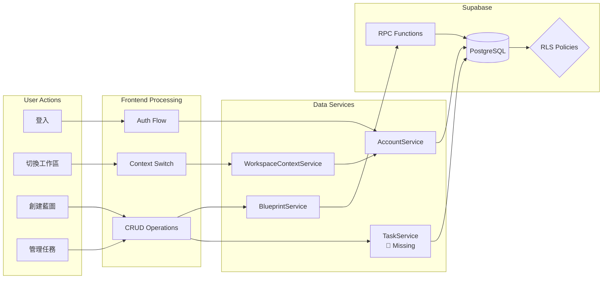

### 5.2 Authentication Flow

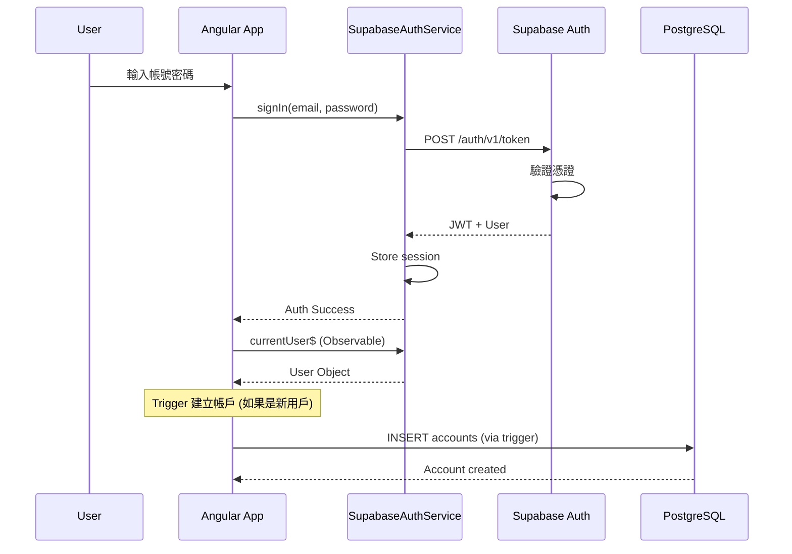

### 5.3 Blueprint Creation Flow

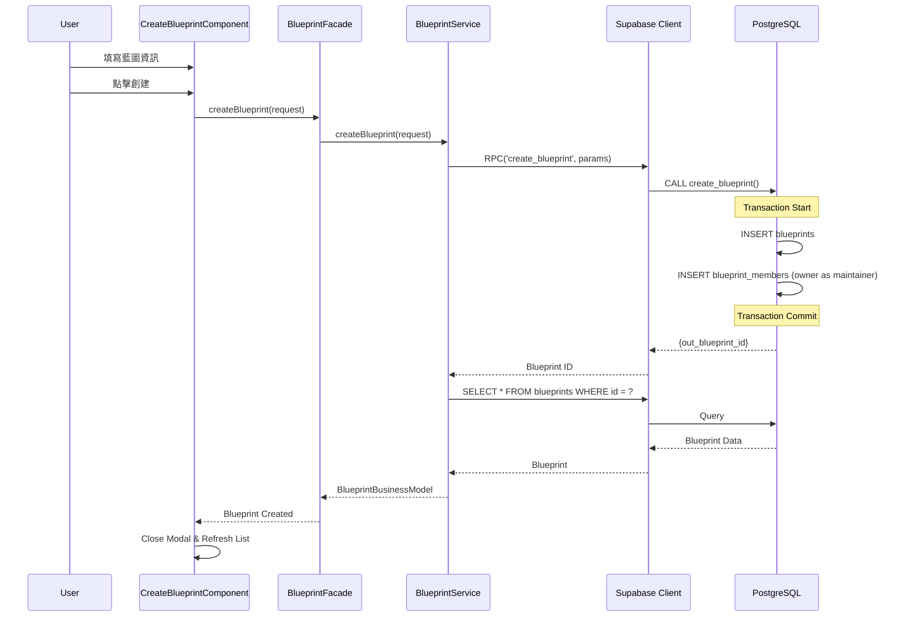

### 5.4 Data Handling Strategy

| Data Type | Storage | Validation | Caching |
|-----------|---------|-----------|---------|
| User Profile | PostgreSQL | Zod Schema (Future) | Signal State |
| Blueprints | PostgreSQL | TypeScript Interfaces | Signal State |
| Tasks | PostgreSQL | TypeScript Interfaces | React Query (Future) |
| Files | Supabase Storage | MIME Type Check | Browser Cache |
| Real-time Events | In-Memory | N/A | N/A |

---

## 6. Key Workflows (關鍵工作流程)

### 6.1 Workspace Context Switching

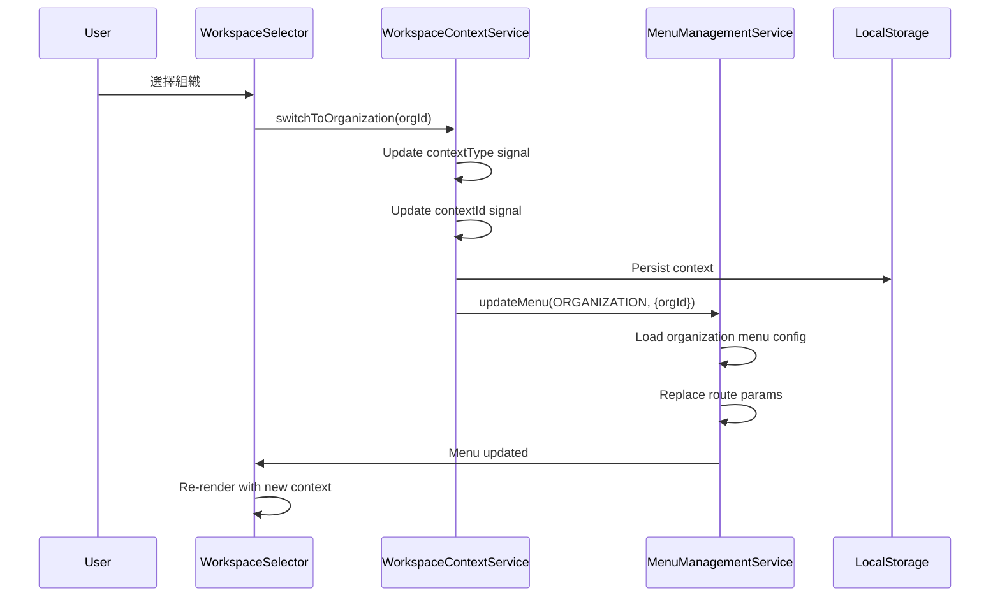

### 6.2 Blueprint Module Loading (Future - @defer)

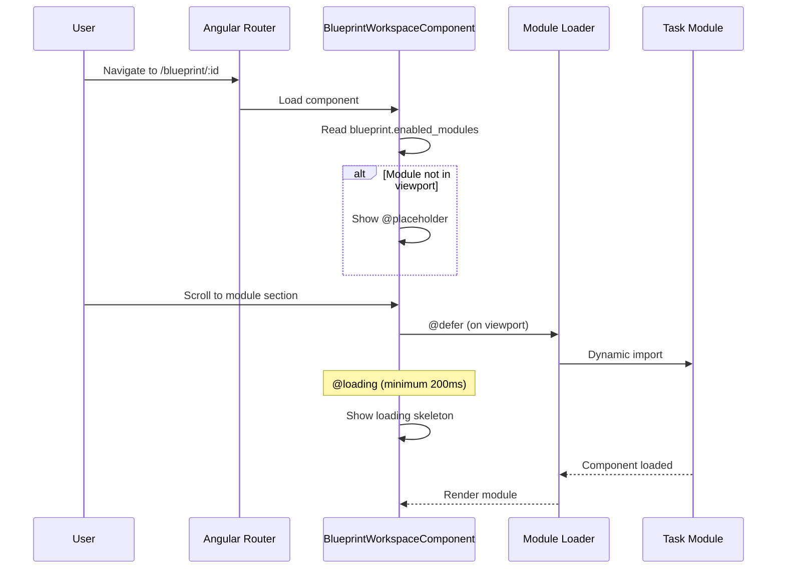

### 6.3 Task CRUD Operations (Future)

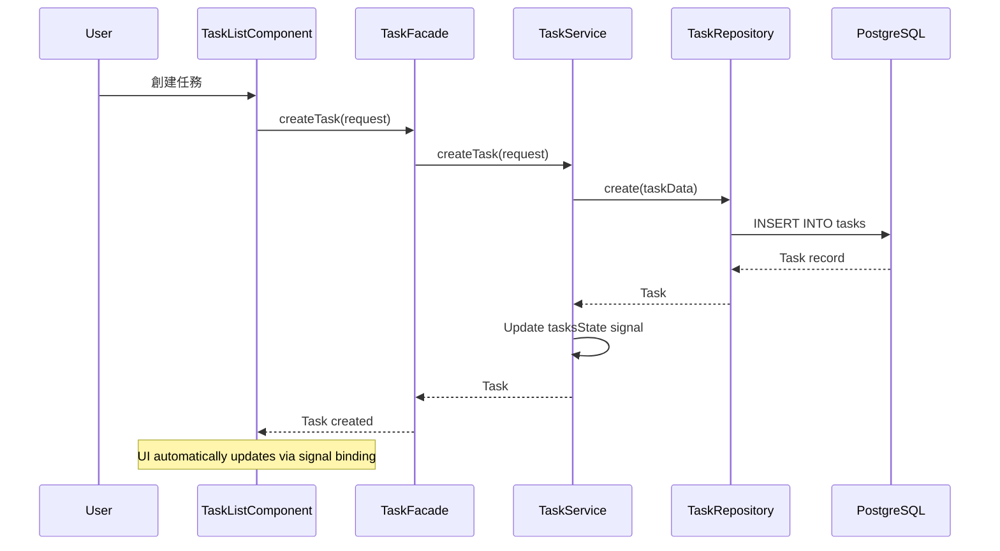

---

## 7. Phased Development (分階段開發)

### 7.1 Phase 1: Core Infrastructure (P0)

**目標**: 建立藍圖工作區的基礎架構

```mermaid
flowchart TB
    subgraph "Phase 1 Deliverables"
        BCS[BlueprintContextService]
        BWC[BlueprintWorkspaceComponent]
        Resolver[Blueprint Route Resolver]
        Defer[@defer Implementation]
    end

    subgraph "Existing Foundation"
        BF[BlueprintFacade ✅]
        BS[BlueprintService ✅]
        BR[BlueprintRepository ✅]
        WCS[WorkspaceContextService ✅]
    end

    BCS --> BS
    BWC --> BCS
    BWC --> Defer
    Resolver --> BS
```

**Components to Implement**:

1. **BlueprintContextService**
   - 藍圖級別的共享上下文
   - 當前藍圖的 Signal state
   - 模組啟用狀態管理

2. **BlueprintWorkspaceComponent**
   - 藍圖工作區主佈局
   - 模組 Tab 導航
   - 麵包屑 (Breadcrumb)

3. **Blueprint Route Resolver**
   - 預載入藍圖資料
   - 驗證存取權限

4. **@defer Block Implementation**
   - 模組懶載入
   - Loading/Placeholder 狀態

### 7.2 Phase 2: Task Module (P0)

**目標**: 實現第一個完整的業務模組

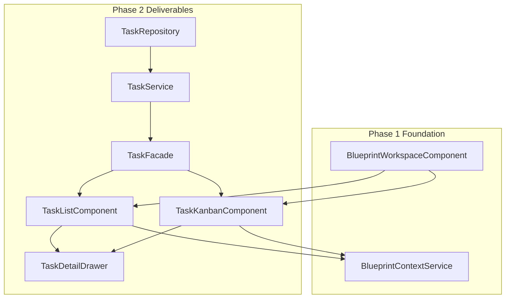

**Components to Implement**:

| Layer | Component | Description |
|-------|-----------|-------------|
| Repository | `TaskRepository` | 任務 CRUD 操作 |
| Service | `TaskService` | 業務邏輯, Signal state |
| Facade | `TaskFacade` | 統一接口 |
| UI | `TaskListComponent` | 列表視圖 |
| UI | `TaskKanbanComponent` | 看板視圖 |
| UI | `TaskDetailDrawer` | 詳情抽屜 (`nz-drawer`) |

### 7.3 Phase 3: Real-time & Dashboard (P1)

**目標**: 實現即時協作和儀表板

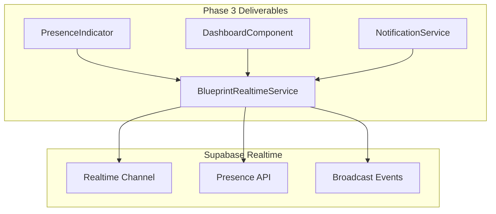

### 7.4 Phase 4-5: Supporting Modules & Advanced (P1-P3)

| Phase | Features | Priority |
|-------|----------|----------|
| Phase 4 | Diary Module, Issues Module, Todos Module, Event Bus Service | P1-P2 |
| Phase 5 | NgRx Signal Store, i18n, PWA/Offline, File Management, Bot Workflow | P2-P3 |

### 7.5 Migration Path

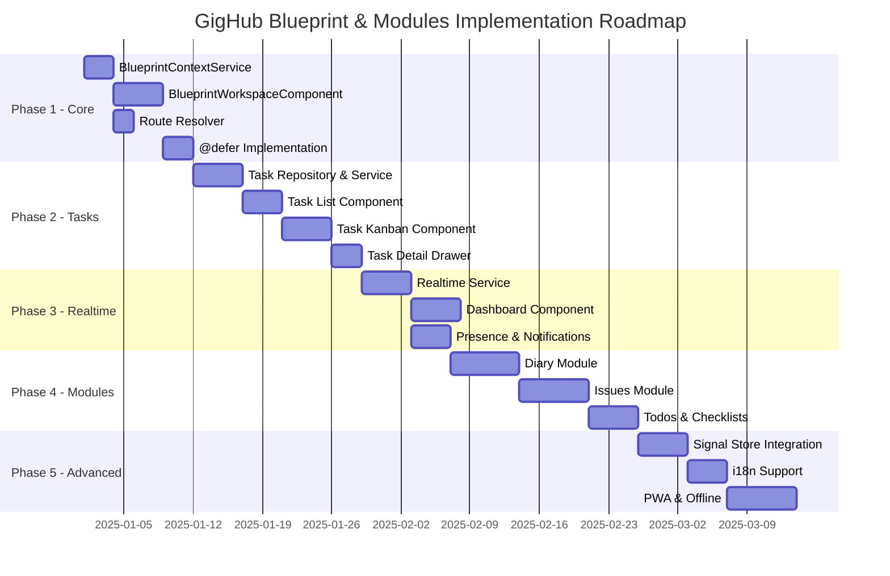

---

## 8. Non-Functional Requirements Analysis (非功能需求分析)

### 8.1 Scalability (可擴展性)

| Aspect | Current State | Target State | Strategy |
|--------|--------------|--------------|----------|
| **Users** | < 100 | 10,000+ | Supabase auto-scaling |
| **Blueprints** | < 1,000 | 100,000+ | Pagination, Indexing |
| **Real-time connections** | N/A | 1,000+ concurrent | Supabase Realtime |
| **Code splitting** | Route-level | Route + Module level | @defer blocks |

### 8.2 Performance (效能)

| Metric | Target | Strategy |
|--------|--------|----------|
| **First Contentful Paint** | < 1.5s | SSG/Prerender, CDN |
| **Time to Interactive** | < 3s | Lazy loading, @defer |
| **Largest Contentful Paint** | < 2.5s | Image optimization |
| **Bundle Size (initial)** | < 200KB | Code splitting |

### 8.3 Security (安全性)

| Layer | Mechanism | Implementation |
|-------|-----------|----------------|
| **Transport** | HTTPS | Mandatory |
| **Authentication** | JWT | Supabase Auth |
| **Authorization** | RLS | PostgreSQL policies |
| **Input Validation** | Type checking | TypeScript + Runtime |
| **XSS Prevention** | Angular sanitization | Default |
| **CSRF Protection** | SameSite cookies | Supabase default |

### 8.4 Reliability (可靠性)

| Aspect | Strategy |
|--------|----------|
| **Error Handling** | Global ErrorHandler, HTTP Interceptor |
| **Data Backup** | Supabase automatic backup |
| **Fault Tolerance** | Graceful degradation UI |
| **Retry Logic** | RxJS retry operators |

### 8.5 Maintainability (可維護性)

| Aspect | Strategy |
|--------|----------|
| **Code Organization** | Feature-based folders |
| **Type Safety** | Strict TypeScript |
| **Documentation** | JSDoc comments, README |
| **Testing** | Unit tests (Jasmine/Karma) |
| **Code Style** | ESLint + Prettier |

---

## 9. Risks and Mitigations (風險與緩解)

| Risk | Impact | Probability | Mitigation |
|------|--------|-------------|------------|
| **Supabase service outage** | High | Low | Implement offline caching, error UI |
| **RLS policy misconfiguration** | Critical | Medium | Thorough testing, security review |
| **Performance degradation with scale** | High | Medium | Pagination, lazy loading, caching |
| **Complex state management** | Medium | Medium | Use Signal Store, clear patterns |
| **Real-time connection limits** | Medium | Low | Connection pooling, graceful degradation |
| **Browser compatibility issues** | Low | Low | Target modern browsers, polyfills |

---

## 10. Technology Stack Recommendations (技術棧建議)

### 10.1 Current Stack (已使用)

| Category | Technology | Version |
|----------|-----------|---------|
| Framework | Angular | 20.3.0 |
| UI Library | ng-zorro-antd | 20.3.1 |
| Admin Framework | ng-alain / @delon | 20.1.0 |
| Backend | Supabase | 2.86.0 |
| Build | Angular CLI | 20.3.1 |
| Type Checking | TypeScript | 5.9.2 |
| Linting | ESLint | 9.35.0 |
| Styling | Less | Included |

### 10.2 Recommended Additions

| Category | Technology | Purpose | Priority |
|----------|-----------|---------|----------|
| State Management | @ngrx/signals | Feature-based stores | P2 |
| Data Fetching | TanStack Query | Server state caching | P2 |
| Form Validation | Zod | Runtime type validation | P1 |
| Testing | Playwright | E2E testing | P2 |
| i18n | @delon/theme i18n | Multi-language | P2 |

---

## 11. Next Steps (下一步行動)

### Immediate Actions (立即行動)

1. **創建 BlueprintContextService**
   - 定義藍圖上下文 Signal state
   - 實現 `loadBlueprint(id)` 方法
   - 提供模組啟用狀態 computed signal

2. **實現 Blueprint Route Resolver**
   - 使用 Angular `ResolveFn`
   - 預載入藍圖資料
   - 處理 404 錯誤

3. **創建 BlueprintWorkspaceComponent**
   - 藍圖工作區主佈局
   - 模組 Tab 導航
   - @defer 懶載入模組

### Short-term Goals (短期目標 - 2 週)

- [ ] 完成 Phase 1 Core Infrastructure
- [ ] 開始 Phase 2 Task Module 開發
- [ ] 建立測試基礎設施

### Medium-term Goals (中期目標 - 1 個月)

- [ ] 完成 Task Module 全部功能
- [ ] 實現基本的即時功能
- [ ] 完成 Dashboard 組件

### Long-term Goals (長期目標 - 3 個月)

- [ ] 完成所有核心模組 (Diary, Issues, Todos)
- [ ] 實現完整的即時協作
- [ ] PWA 支持
- [ ] 多語言支持

---

## Appendix A: Database Schema Reference

詳見 `supabase/seeds/init.sql`:

- PART 1: ENUMS - 列舉類型定義
- PART 3: CORE TABLES - 帳號/組織/團隊
- PART 4: BLUEPRINT TABLES - 藍圖/工作區
- PART 5: MODULE TABLES - 業務模組 (任務/日誌等)
- PART 6: RLS HELPERS - RLS 輔助函數
- PART 8: ROW LEVEL SECURITY - 資料列安全政策
- PART 12: BLUEPRINT API - 藍圖 RPC 函數

## Appendix B: Existing Code References

| Module | Path | Description |
|--------|------|-------------|
| Blueprint Types | `src/app/core/infra/types/blueprint/` | 類型定義 |
| Blueprint Repository | `src/app/core/infra/repositories/blueprint/` | 資料存取層 |
| Blueprint Service | `src/app/shared/services/blueprint/` | 業務服務層 |
| Blueprint Facade | `src/app/core/facades/blueprint/` | 門面層 |
| Blueprint Routes | `src/app/routes/blueprint/` | 路由組件 |
| Workspace Context | `src/app/shared/services/account/workspace-context.service.ts` | 工作區上下文 |

---

*Document Version: 1.0*
*Last Updated: 2025-12-01*
*Author: Senior Cloud Architect Agent*
