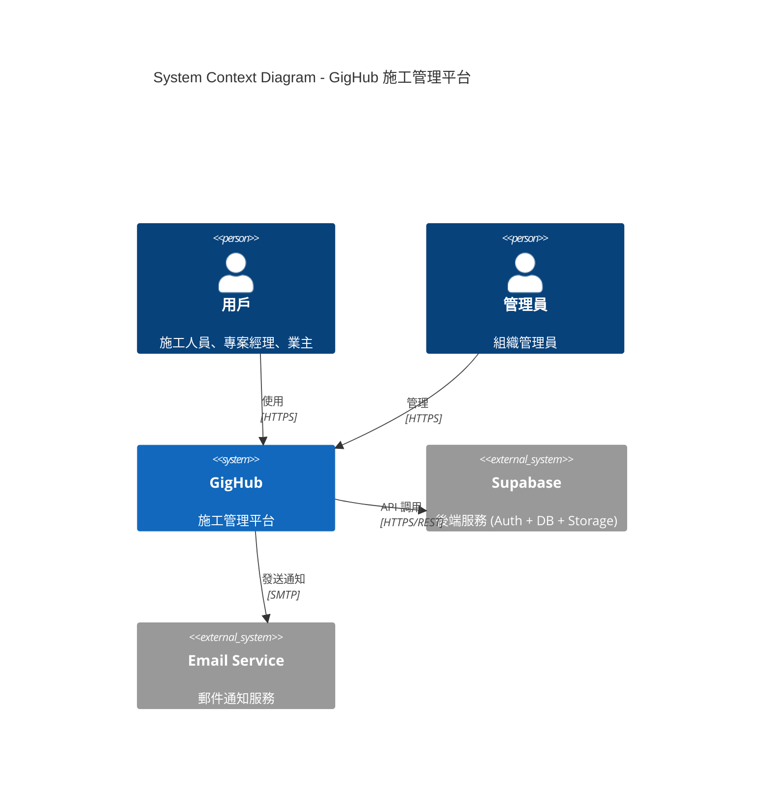
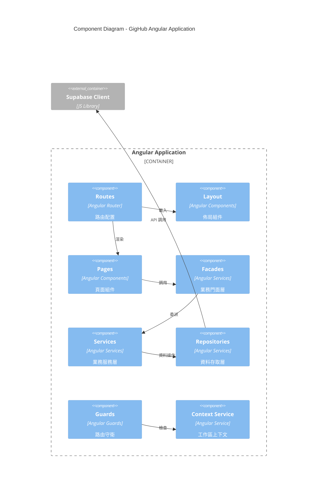
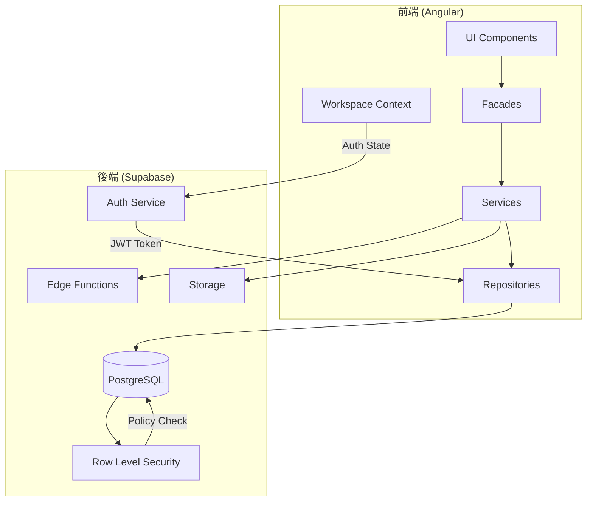
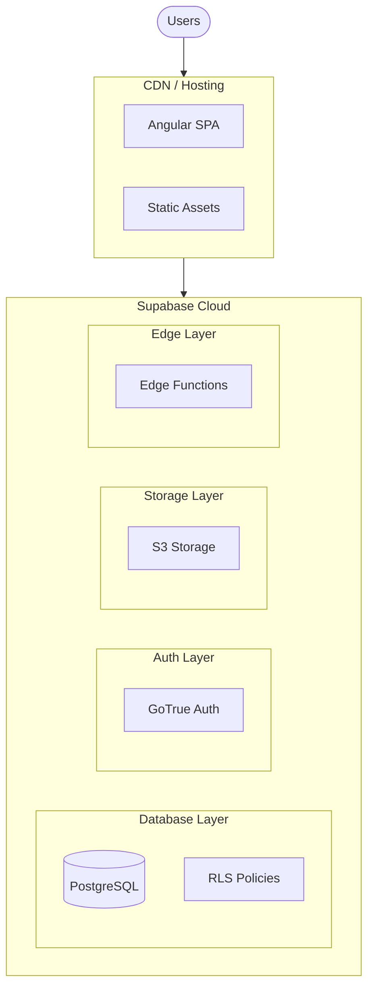
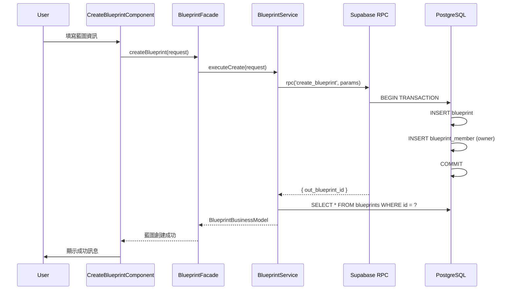
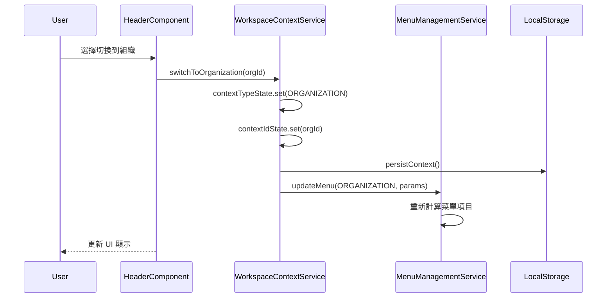
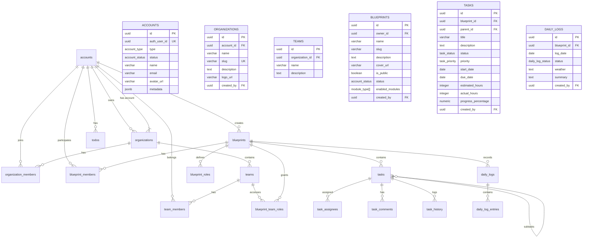
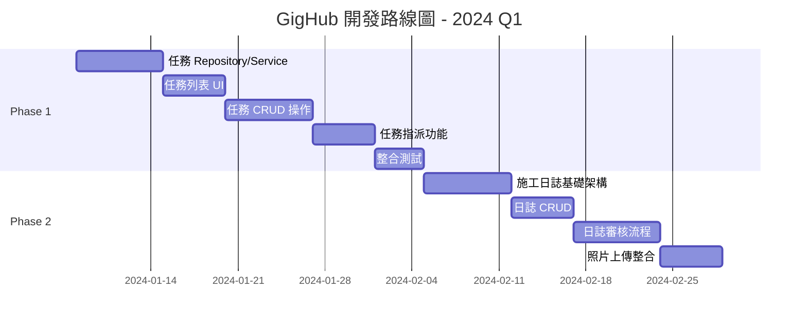
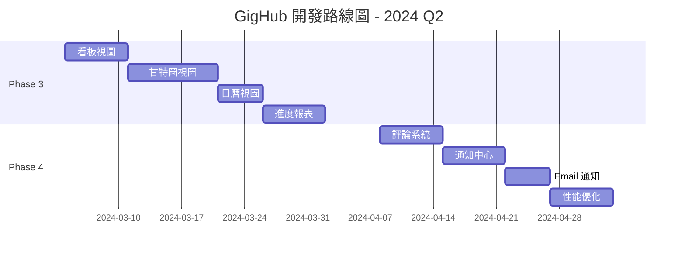
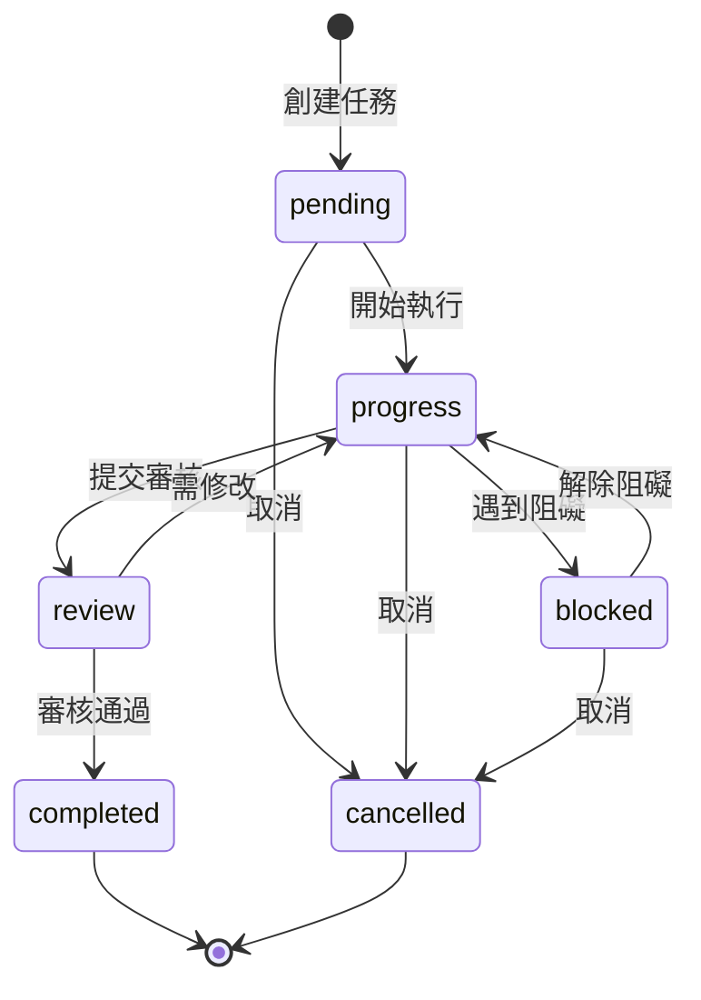

# GigHub - 專案全盤分析與開發路線圖

## 目錄

1. [執行摘要 Executive Summary](#執行摘要-executive-summary)
2. [專案現況分析 Current State Analysis](#專案現況分析-current-state-analysis)
3. [系統架構設計 System Architecture](#系統架構設計-system-architecture)
4. [資料庫架構分析 Database Architecture](#資料庫架構分析-database-architecture)
5. [功能完成度分析 Feature Completion Analysis](#功能完成度分析-feature-completion-analysis)
6. [開發里程碑 Development Milestones](#開發里程碑-development-milestones)
7. [開發路線圖 Development Roadmap](#開發路線圖-development-roadmap)
8. [下一步行動建議 Next Steps](#下一步行動建議-next-steps)

---

## 執行摘要 Executive Summary

### 專案定位
GigHub 是一個施工管理平台（Construction Management Platform），採用 Angular + Supabase 架構，旨在提供：
- **藍圖 (Blueprint)** - 施工專案管理核心
- **組織 (Organization)** - 企業/團隊管理
- **任務 (Tasks)** - 施工進度追蹤
- **待辦 (Todos)** - 個人/團隊待辦事項

### 技術棧
| 層級 | 技術選型 |
|------|---------|
| 前端框架 | Angular 19+ (Standalone Components) |
| UI 框架 | NG-ZORRO + @delon/abc |
| 狀態管理 | Angular Signals |
| 後端服務 | Supabase (PostgreSQL + Auth) |
| 認證 | Supabase Auth + @delon/auth |

### 專案成熟度評估
```
基礎架構：████████░░ 80%
帳戶系統：███████░░░ 70%
藍圖功能：██████░░░░ 60%
任務模組：██░░░░░░░░ 20%
施工日誌：░░░░░░░░░░ 0%
```

---

## 專案現況分析 Current State Analysis

### 目錄結構

```
src/app/
├── core/                    # 核心層 - 業務邏輯
│   ├── facades/             # 業務門面 (Blueprint, Team, Organization)
│   ├── infra/               # 基礎設施
│   │   ├── repositories/    # 資料存取層
│   │   └── types/           # 類型定義
│   ├── supabase/            # Supabase 服務
│   └── guards/              # 路由守衛
├── shared/                  # 共享層
│   ├── services/            # 業務服務
│   ├── models/              # 業務模型
│   └── base/                # 基礎組件
├── routes/                  # 頁面路由
│   ├── account/             # 帳戶相關頁面
│   ├── blueprint/           # 藍圖相關頁面
│   ├── passport/            # 認證相關頁面
│   └── demo/                # 示範頁面
└── layout/                  # 佈局組件
```

### 已實現功能

#### ✅ 帳戶系統 (Account Module)
| 功能 | 狀態 | 備註 |
|------|------|------|
| 用戶註冊/登入 | ✅ 完成 | Supabase Auth |
| 組織創建 | ✅ 完成 | 含帳戶自動創建 |
| 組織成員管理 | ✅ 完成 | 邀請、角色變更、移除 |
| 團隊管理 | ✅ 完成 | 創建、刪除、成員管理 |
| 工作區切換 | ✅ 完成 | User/Organization/Team Context |
| 待辦事項 | ✅ 完成 | 個人/團隊待辦 |

#### ✅ 藍圖系統 (Blueprint Module)
| 功能 | 狀態 | 備註 |
|------|------|------|
| 藍圖創建 | ✅ 完成 | RPC function 原子操作 |
| 藍圖列表 | ✅ 完成 | 根據上下文過濾 |
| 藍圖概覽 | ✅ 完成 | 詳情展示 |
| 藍圖成員管理 | ✅ 完成 | 添加、移除、角色 |
| 藍圖模組啟用 | ⚠️ 部分 | UI 已有，但模組未完成 |

#### ⏳ 待開發功能
| 功能 | 狀態 | 備註 |
|------|------|------|
| 任務管理 | 🚧 開發中 | 有 UI placeholder |
| 施工日誌 | ❌ 未開始 | 資料庫已設計 |
| 甘特圖 | ❌ 未開始 | 需第三方庫 |
| 檔案管理 | ❌ 未開始 | Supabase Storage |
| 機器人工作流 | ❌ 未開始 | 資料庫已設計 |

---

## 系統架構設計 System Architecture

### 1. 系統上下文圖



### 2. 組件架構圖



### 3. 資料流圖



### 4. 部署架構圖



### 5. 核心業務流程序列圖

#### 5.1 藍圖創建流程



#### 5.2 工作區上下文切換



---

## 資料庫架構分析 Database Architecture

### 核心資料表關係圖



### 資料庫已定義枚舉類型

```sql
-- 帳戶類型
CREATE TYPE account_type AS ENUM ('user', 'org', 'bot');

-- 帳戶狀態
CREATE TYPE account_status AS ENUM ('active', 'inactive', 'suspended', 'deleted');

-- 組織角色
CREATE TYPE organization_role AS ENUM ('owner', 'admin', 'member');

-- 團隊角色
CREATE TYPE team_role AS ENUM ('leader', 'member');

-- 藍圖成員角色
CREATE TYPE blueprint_role AS ENUM ('viewer', 'contributor', 'maintainer');

-- 藍圖團隊存取權限
CREATE TYPE blueprint_team_access AS ENUM ('read', 'write', 'admin');

-- 模組類型
CREATE TYPE module_type AS ENUM (
    'tasks', 'diary', 'dashboard', 'bot_workflow',
    'files', 'todos', 'checklists', 'issues'
);

-- 任務狀態
CREATE TYPE task_status AS ENUM (
    'pending', 'progress', 'review', 'completed', 'blocked', 'cancelled'
);

-- 任務優先級
CREATE TYPE task_priority AS ENUM ('urgent', 'high', 'medium', 'low');

-- 施工日誌狀態
CREATE TYPE daily_log_status AS ENUM ('draft', 'submitted', 'approved', 'rejected');
```

### 資料庫缺失項目分析

根據 `init.sql` 分析，以下是資料庫已設計但前端尚未實現的項目：

| 資料表 | 資料庫狀態 | 前端狀態 | 建議優先級 |
|--------|-----------|----------|-----------|
| `tasks` | ✅ 已定義 | ❌ 未實現 | 🔴 高 |
| `task_assignees` | ✅ 已定義 | ❌ 未實現 | 🔴 高 |
| `task_labels` | ✅ 已定義 | ❌ 未實現 | 🟡 中 |
| `task_comments` | ✅ 已定義 | ❌ 未實現 | 🟡 中 |
| `task_history` | ✅ 已定義 | ❌ 未實現 | 🟢 低 |
| `daily_logs` | ✅ 已定義 | ❌ 未實現 | 🔴 高 |
| `daily_log_entries` | ✅ 已定義 | ❌ 未實現 | 🔴 高 |
| `blueprint_roles` | ✅ 已定義 | ⚠️ 部分 | 🟡 中 |
| `blueprint_team_roles` | ✅ 已定義 | ⚠️ 部分 | 🟡 中 |

### 建議新增的資料表

為了完善系統功能，建議未來考慮新增以下資料表：

```sql
-- 1. 檔案管理 (Files)
CREATE TABLE files (
    id UUID PRIMARY KEY DEFAULT uuid_generate_v4(),
    blueprint_id UUID REFERENCES blueprints(id),
    task_id UUID REFERENCES tasks(id),
    daily_log_id UUID REFERENCES daily_logs(id),
    name VARCHAR(255) NOT NULL,
    path VARCHAR(1000) NOT NULL,
    size BIGINT,
    mime_type VARCHAR(100),
    storage_key VARCHAR(500),
    uploaded_by UUID REFERENCES accounts(id),
    created_at TIMESTAMPTZ DEFAULT NOW(),
    deleted_at TIMESTAMPTZ
);

-- 2. 通知系統 (Notifications)
CREATE TABLE notifications (
    id UUID PRIMARY KEY DEFAULT uuid_generate_v4(),
    account_id UUID REFERENCES accounts(id) NOT NULL,
    type VARCHAR(50) NOT NULL,
    title VARCHAR(255) NOT NULL,
    content TEXT,
    data JSONB,
    is_read BOOLEAN DEFAULT FALSE,
    read_at TIMESTAMPTZ,
    created_at TIMESTAMPTZ DEFAULT NOW()
);

-- 3. 活動日誌 (Activity Logs)
CREATE TABLE activity_logs (
    id UUID PRIMARY KEY DEFAULT uuid_generate_v4(),
    blueprint_id UUID REFERENCES blueprints(id),
    actor_id UUID REFERENCES accounts(id),
    action VARCHAR(50) NOT NULL,
    resource_type VARCHAR(50) NOT NULL,
    resource_id UUID,
    changes JSONB,
    metadata JSONB,
    created_at TIMESTAMPTZ DEFAULT NOW()
);

-- 4. 檢查清單 (Checklists)
CREATE TABLE checklists (
    id UUID PRIMARY KEY DEFAULT uuid_generate_v4(),
    blueprint_id UUID REFERENCES blueprints(id) NOT NULL,
    task_id UUID REFERENCES tasks(id),
    name VARCHAR(255) NOT NULL,
    description TEXT,
    created_by UUID REFERENCES accounts(id),
    created_at TIMESTAMPTZ DEFAULT NOW(),
    updated_at TIMESTAMPTZ DEFAULT NOW()
);

CREATE TABLE checklist_items (
    id UUID PRIMARY KEY DEFAULT uuid_generate_v4(),
    checklist_id UUID REFERENCES checklists(id) ON DELETE CASCADE,
    content VARCHAR(500) NOT NULL,
    is_completed BOOLEAN DEFAULT FALSE,
    completed_by UUID REFERENCES accounts(id),
    completed_at TIMESTAMPTZ,
    sort_order INTEGER DEFAULT 0,
    created_at TIMESTAMPTZ DEFAULT NOW()
);
```

---

## 功能完成度分析 Feature Completion Analysis

### 模組完成度矩陣

| 模組 | 資料庫 | Repository | Service | Facade | UI | 測試 | 整體 |
|------|--------|-----------|---------|--------|-----|------|------|
| 帳戶 (Account) | ✅ | ✅ | ✅ | ✅ | ✅ | ⚠️ | 85% |
| 組織 (Organization) | ✅ | ✅ | ✅ | ✅ | ✅ | ⚠️ | 85% |
| 團隊 (Team) | ✅ | ✅ | ✅ | ✅ | ✅ | ⚠️ | 85% |
| 藍圖 (Blueprint) | ✅ | ✅ | ✅ | ✅ | ✅ | ⚠️ | 80% |
| 待辦 (Todos) | ✅ | ✅ | ✅ | ✅ | ✅ | ⚠️ | 80% |
| 任務 (Tasks) | ✅ | ❌ | ❌ | ❌ | ⚠️ | ❌ | 15% |
| 施工日誌 (Diary) | ✅ | ❌ | ❌ | ❌ | ❌ | ❌ | 10% |
| 檔案 (Files) | ⚠️ | ❌ | ❌ | ❌ | ❌ | ❌ | 5% |
| 自動化 (Bot) | ⚠️ | ❌ | ❌ | ❌ | ❌ | ❌ | 5% |

### 前端技術債

1. **測試覆蓋率不足** - 缺少單元測試和 E2E 測試
2. **錯誤處理不一致** - 需統一錯誤處理策略
3. **Loading 狀態管理** - 需要全局 loading indicator
4. **離線支援** - 未實現 PWA 離線功能
5. **國際化** - 僅有繁體中文

---

## 開發里程碑 Development Milestones

### Phase 1: MVP 核心功能 (4-6 週)
**目標：** 完成任務管理模組，形成完整的施工管理閉環

```
週次 1-2: 任務管理基礎
├── TaskRepository 資料存取層
├── TaskService 業務服務層
├── TaskFacade 業務門面
└── 任務列表 UI

週次 3-4: 任務管理進階
├── 任務詳情頁面
├── 任務創建/編輯
├── 任務狀態流轉
└── 任務指派功能

週次 5-6: 整合與測試
├── 藍圖與任務整合
├── 任務進度同步
├── 單元測試
└── Bug 修復
```

### Phase 2: 施工日誌 (3-4 週)
**目標：** 實現施工日誌功能，支援日報填寫與審核

```
週次 7-8: 日誌基礎
├── DailyLogRepository
├── DailyLogService
├── 日誌列表 UI
└── 日誌創建表單

週次 9-10: 日誌進階
├── 日誌條目管理
├── 日誌審核流程
├── 天氣整合
└── 照片上傳
```

### Phase 3: 視覺化與報表 (3-4 週)
**目標：** 提供多維度視圖和進度報表

```
週次 11-12: 多維度視圖
├── 看板視圖 (Kanban)
├── 甘特圖視圖
├── 日曆視圖
└── 時間軸視圖

週次 13-14: 報表與分析
├── 進度報表
├── 工時統計
├── Dashboard 強化
└── 資料匯出
```

### Phase 4: 協作與通知 (2-3 週)
**目標：** 強化團隊協作和通知功能

```
週次 15-16: 協作功能
├── 評論系統
├── @提及功能
├── 通知中心
└── Email 通知

週次 17: 優化
├── 性能優化
├── UX 改進
└── 文檔完善
```

---

## 開發路線圖 Development Roadmap

### 2024 Q1: 基礎功能完善



### 2024 Q2: 進階功能



### 長期規劃 (2024 H2)

| 功能 | 描述 | 預計時程 |
|------|------|---------|
| 檔案管理 | Supabase Storage 整合 | Q3 |
| 權限細粒度控制 | RBAC 權限系統 | Q3 |
| 行動端 App | Ionic/Capacitor | Q3-Q4 |
| 機器人工作流 | 自動化流程 | Q4 |
| API 開放平台 | 第三方整合 | Q4 |
| 離線支援 | PWA 離線功能 | Q4 |

---

## 下一步行動建議 Next Steps

### 立即行動 (本週)

1. **任務模組開發啟動**
   - 創建 `TaskRepository` 資料存取層
   - 創建 `TaskService` 業務服務層
   - 創建 `TaskFacade` 業務門面
   - 設計任務列表 UI

2. **技術準備**
   - 確認 RLS 政策正確性
   - 設計任務狀態機
   - 規劃任務與藍圖的關聯邏輯

### 短期行動 (本月)

1. **完成任務管理 MVP**
   - 任務列表（多維度視圖準備）
   - 任務創建/編輯
   - 任務狀態管理
   - 任務指派

2. **改進開發體驗**
   - 添加單元測試框架
   - 設置 CI/CD 流程
   - 完善錯誤處理

### 中期行動 (本季)

1. **施工日誌功能**
2. **視覺化視圖**
3. **協作功能**
4. **性能優化**

---

## 附錄 A: 檔案結構建議

### 任務模組結構

```
src/app/
├── core/
│   ├── facades/
│   │   └── task/
│   │       ├── task.facade.ts
│   │       └── index.ts
│   └── infra/
│       ├── repositories/
│       │   └── task/
│       │       ├── task.repository.ts
│       │       └── index.ts
│       └── types/
│           └── task/
│               └── index.ts
├── shared/
│   ├── services/
│   │   └── task/
│   │       ├── task.service.ts
│   │       └── index.ts
│   └── models/
│       └── task/
│           ├── task.models.ts
│           └── index.ts
└── routes/
    └── blueprint/
        └── tasks/
            ├── task-list/
            ├── task-detail/
            ├── task-create/
            └── components/
```

---

## 附錄 B: 任務模組詳細設計

### 任務狀態機



### 任務優先級定義

| 優先級 | 顯示顏色 | 描述 |
|--------|---------|------|
| urgent | 🔴 紅色 | 緊急 - 需立即處理 |
| high | 🟠 橙色 | 高 - 重要且緊迫 |
| medium | 🔵 藍色 | 中 - 一般優先級 |
| low | ⚪ 灰色 | 低 - 可延後處理 |

---

## 附錄 C: API 設計參考

### 任務相關 RPC Functions

```sql
-- 創建任務（含子任務支援）
CREATE OR REPLACE FUNCTION create_task(
    p_blueprint_id UUID,
    p_title VARCHAR(255),
    p_description TEXT DEFAULT NULL,
    p_parent_id UUID DEFAULT NULL,
    p_priority task_priority DEFAULT 'medium',
    p_start_date DATE DEFAULT NULL,
    p_due_date DATE DEFAULT NULL,
    p_assignee_ids UUID[] DEFAULT '{}'
) RETURNS TABLE(out_task_id UUID)
LANGUAGE plpgsql
SECURITY DEFINER
AS $$
BEGIN
    -- Implementation
END;
$$;

-- 更新任務狀態
CREATE OR REPLACE FUNCTION update_task_status(
    p_task_id UUID,
    p_status task_status,
    p_comment TEXT DEFAULT NULL
) RETURNS BOOLEAN
LANGUAGE plpgsql
SECURITY DEFINER
AS $$
BEGIN
    -- Implementation with history logging
END;
$$;
```

---

*文檔最後更新：2024-12-02*
*版本：1.0.0*
