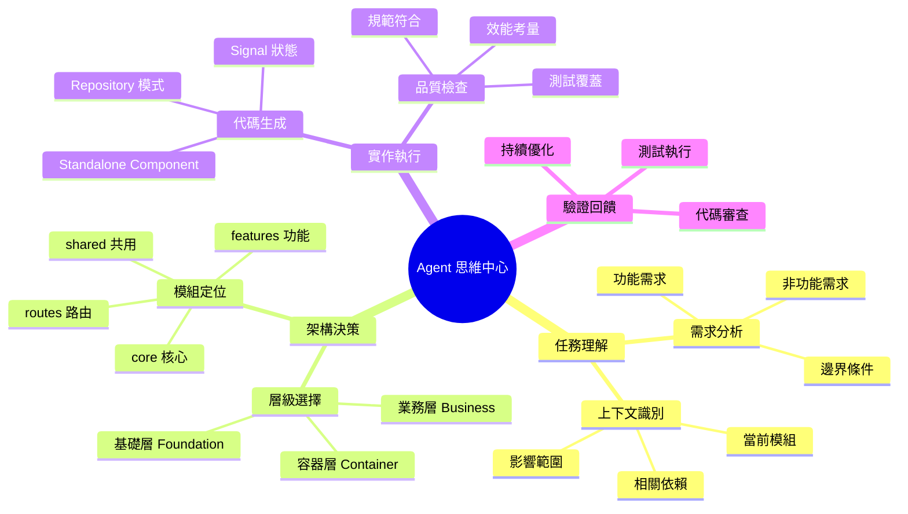
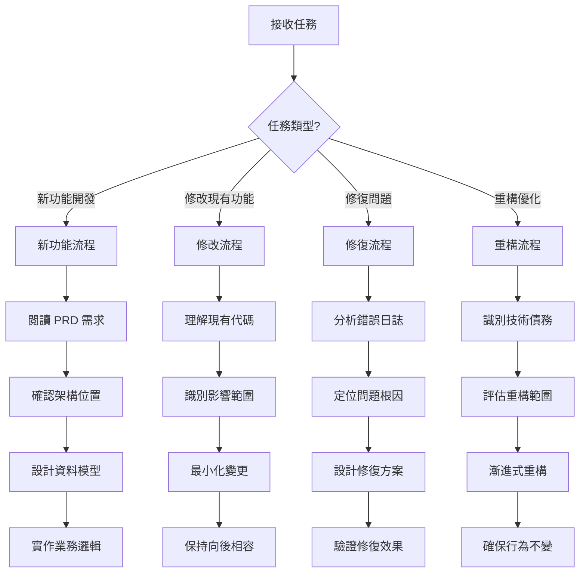
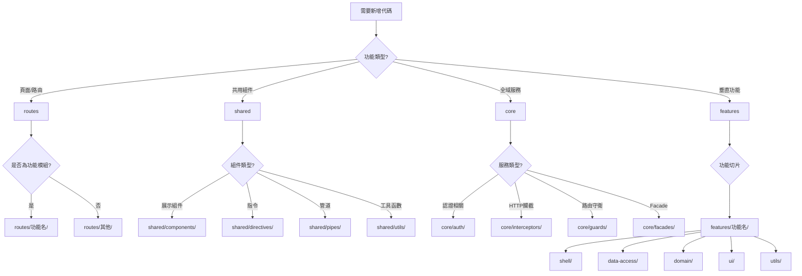
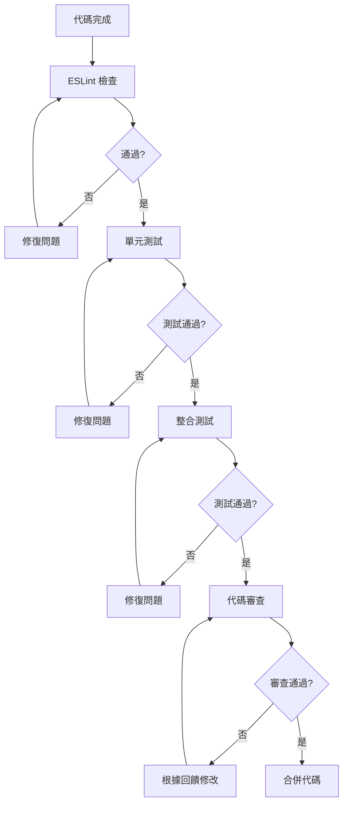
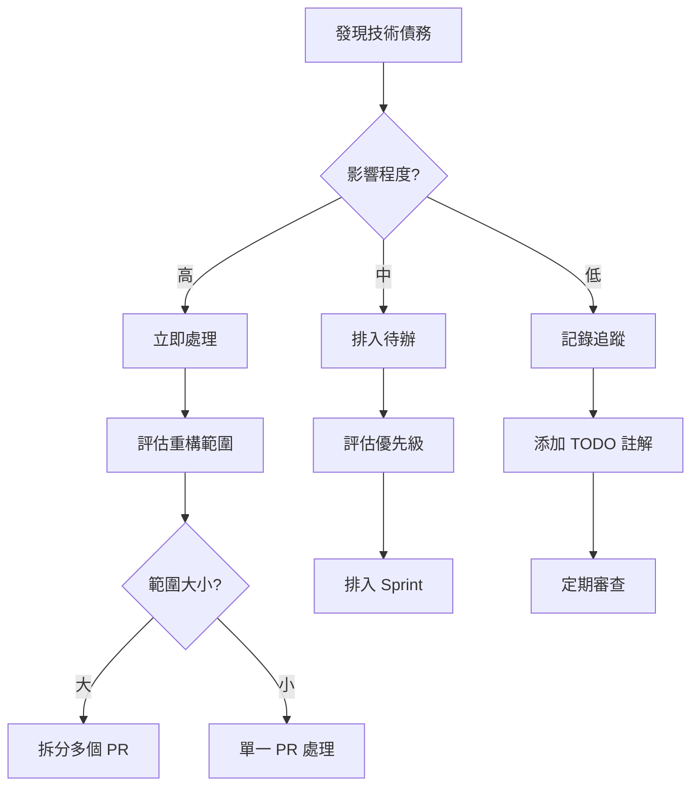

# Agent / Copilot Mindmap（思維導圖骨架）

目的
-
建立一個針對專案內 AI Agent（Copilot、prompt、blueprint）設計與運作的思維導圖骨架，供團隊規劃 agent 能力範圍、prompt 分類、blueprint 管理與工作流程整合。

主要節點（Top-level Nodes）
-
1. Agent 角色與職責
   - prompt-builder: 生成/管理 prompts
   - blueprint-generator: 產生指令藍圖（blueprints）
   - code-review.agent: 自動化程式碼審查輔助
   - prd-assistant: 協助撰寫 PRD 與需求澄清
2. Prompt 分類
   - scaffolding prompts（骨架產生）
   - transformation prompts（格式轉換、重構）
   - review prompts（安全、性能、可讀性檢查）
   - test-generation prompts（單元/整合/E2E 測試生成）
3. Blueprints 與 模板管理
   - 儲存位置：`.github/copilot/blueprints/`
   - 欄位規範：id, title, applyTo, description, intent, template, examples, quality
   - 版本管理與覆寫策略
4. 工作流程（Workflows）
   - prompt -> generate -> review -> apply (PR)
   - CI 驗證：lint / tests / blueprint schema validation
5. 監督與指標（Observability）
   - 成果質量：acceptance pass rate、manual review feedback
   - 使用頻率：prompt / blueprint 的呼叫次數
6. 安全與合規
   - 檔案存取規則、敏感資訊過濾、審計紀錄

示意（ASCII-style mindmap 快覽）

```
Agent Mindmap
├─ Roles
│  ├─ prompt-builder
│  ├─ blueprint-generator
│  └─ code-review.agent
├─ Prompts
│  ├─ scaffolding
│  ├─ transformation
│  └─ review
├─ Blueprints
│  ├─ location: .github/copilot/blueprints
│  └─ schema: id/title/applyTo/...
├─ Workflows
│  └─ prompt -> generate -> review -> PR
└─ Observability
   └─ metrics, feedback loop
```

下一步（Next Actions）
-
1. 把 mindmap 轉為圖形（使用 draw.io 或 Mermaid）並放入 `docs/agent/assets/`。
2. 針對每個 agent 角色列出具體的 capabilities 與 acceptance criteria。
3. 建立 blueprint 與 prompt 的驗證 pipeline（CI step）。

註記
-
- 這是初始骨架，建議以 iterative 方式補充細節並針對每項 node 拆解成可執行任務。

**完成判準（Definition of Done）**
-
- `status` 欄位更新為 `done` 並由 Agent Owner 核准。
- mindmap 圖檔（Mermaid / draw.io）已放入 `docs/agent/assets/` 並與本文連結。
- 每個主要節點已拆成至少一個 Issue 或 Task，並有 owner 與 acceptance checklist。

**Acceptance Checklist 範本（Agent）**

- [ ] Mindmap 圖檔已產出並檢視
- [ ] 各 Agent 角色列出 capabilities 與 acceptance criteria
- [ ] Prompt / Blueprint 管理規範已形成草案並審查
- [ ] CI 驗證（blueprint schema / prompt lint）方案提出
- [ ] 需要的文件（運作手冊 / runbook）已建立

**進度欄位說明（Frontmatter usage）**
- `owners`: Agent 負責人（GitHub username）
- `progress`: 0~100 的整數或已完成 node 的比率
- `due`: 可選，ISO 日期或 null

**驗證證據（Proof）**
- 在 PR 或 Issue 中附上圖檔、blueprint 範例、prompt 範本或 CI 測試結果的連結。

# 🧠 AI Agent 思維導圖

> **目的**: 提供 AI Agent 決策思維流程，確保開發一致性和程式碼品質

---

## 📑 目錄

- [思維導圖總覽](#-思維導圖總覽)
- [任務識別流程](#-任務識別流程)
- [模組選擇決策樹](#-模組選擇決策樹)
- [架構層級思維](#-架構層級思維)
- [開發檢查清單](#-開發檢查清單)
- [品質驗證流程](#-品質驗證流程)
- [錯誤處理思維](#-錯誤處理思維)

---

## 🎯 思維導圖總覽



---

## 🔍 任務識別流程

### 第一步：理解任務類型



### 第二步：上下文分析

```
分析問題：
├── 這是哪個模組的功能？
│   ├── 基礎層：帳戶、認證、授權
│   ├── 容器層：藍圖、工作區、權限
│   └── 業務層：任務、日誌、品質驗收
├── 相關的資料表有哪些？
│   └── 參考 docs/reference/data-model.md
├── 影響的 RLS 政策？
│   └── 參考 docs/supabase/rls-policies.md
└── 涉及的 API 端點？
    └── 參考 docs/reference/api-documentation.md
```

---

## 🌳 模組選擇決策樹



### 目錄結構決策

| 問題 | 答案 | 目錄位置 |
|------|------|----------|
| 這是頁面路由嗎？ | 是 | `src/app/routes/` |
| 這是多處使用的組件嗎？ | 是 | `src/app/shared/components/` |
| 這是全域服務嗎？ | 是 | `src/app/core/services/` |
| 這是垂直功能切片嗎？ | 是 | `src/app/features/` |
| 這是 Supabase 相關嗎？ | 是 | 使用 Repository 模式 |

---

## 🏗️ 架構層級思維

### 三層架構決策

```
┌─────────────────────────────────────────────────────────────────────────┐
│                        基礎層 (Foundation Layer)                         │
│                                                                          │
│   問：涉及用戶身份、組織、Bot、認證嗎？                                    │
│   ├── 是 → 在基礎層處理                                                   │
│   │   ├── 帳戶 CRUD → accounts 表                                        │
│   │   ├── 組織成員 → organization_members 表                             │
│   │   ├── 團隊管理 → teams, team_members 表                              │
│   │   └── Bot 管理 → accounts (type=BOT) + team_bots 表                  │
│   └── 否 → 繼續往下層判斷                                                 │
└─────────────────────────────────────────────────────────────────────────┘
                                    │
                                    ▼
┌─────────────────────────────────────────────────────────────────────────┐
│                        容器層 (Container Layer)                          │
│                                                                          │
│   問：涉及藍圖、工作區、分支、權限嗎？                                     │
│   ├── 是 → 在容器層處理                                                   │
│   │   ├── 藍圖 CRUD → blueprints 表                                      │
│   │   ├── 工作區管理 → workspaces 表                                     │
│   │   ├── Git-like 分支 → blueprint_branches 表                          │
│   │   ├── PR 管理 → blueprint_pull_requests 表                           │
│   │   └── 藍圖權限 → blueprint_members, blueprint_roles 表                │
│   └── 否 → 在業務層處理                                                   │
└─────────────────────────────────────────────────────────────────────────┘
                                    │
                                    ▼
┌─────────────────────────────────────────────────────────────────────────┐
│                        業務層 (Business Layer)                           │
│                                                                          │
│   問：屬於哪個業務模組？                                                  │
│   ├── 任務管理 → tasks, task_attachments, task_comments 表               │
│   ├── 施工日誌 → diaries, diary_attachments 表                           │
│   ├── 品質驗收 → checklists, checklist_items, task_acceptances 表        │
│   ├── 問題追蹤 → issues 表                                               │
│   ├── 檔案管理 → files, file_shares 表                                   │
│   └── 通知系統 → notifications 表                                        │
└─────────────────────────────────────────────────────────────────────────┘
```

### 任務系統核心地位

```
                    ┌─────────────────┐
                    │    任務系統      │
                    │   (主核心模組)   │
                    └────────┬────────┘
                             │
         ┌───────────────────┼───────────────────┐
         │                   │                   │
         ▼                   ▼                   ▼
┌─────────────────┐ ┌─────────────────┐ ┌─────────────────┐
│    施工日誌      │ │    品質驗收      │ │    問題追蹤      │
│   (關聯任務)     │ │   (驗收任務)     │ │   (任務問題)     │
└─────────────────┘ └─────────────────┘ └─────────────────┘
         │                   │                   │
         └───────────────────┼───────────────────┘
                             │
                             ▼
                    ┌─────────────────┐
                    │    進度追蹤      │
                    │   (任務進度)     │
                    └─────────────────┘
```

---

## ✅ 開發檢查清單

### 開發前檢查

```
□ 已理解需求範圍
□ 已確認架構層級
□ 已識別相關資料表
□ 已檢查 RLS 政策
□ 已參考現有類似實作
```

### 代碼生成檢查

```
□ 使用 Standalone Component
□ 使用 inject() 而非 constructor DI
□ 使用 Signal 狀態管理
□ API 呼叫經過 Repository 封裝
□ 遵循 kebab-case 檔案命名
□ Component < 500 行
□ Template < 300 行
□ 無循環依賴
```

### 完成前檢查

```
□ 代碼符合 ESLint 規範
□ 已添加必要測試
□ 已更新相關文檔
□ 已驗證 RLS 政策生效
□ 已測試邊界條件
```

---

## 🔍 品質驗證流程



### 測試覆蓋率要求

| 層級 | 覆蓋率目標 | 測試重點 |
|------|-----------|----------|
| Store 層 | 100% | 狀態變更、computed signals |
| Service 層 | 80%+ | API 呼叫、錯誤處理 |
| Component 層 | 60%+ | 關鍵交互、表單提交 |
| Utils | 100% | 純函數、邊界條件 |

---

## ⚠️ 錯誤處理思維

### 錯誤碼格式

```
{模組代碼}{錯誤類型}{序號}

模組代碼：
10 - AUTH（認證）
20 - ACCOUNT（帳戶）
30 - BLUEPRINT（藍圖）
40 - TASK（任務）
50 - FILE（檔案）
60 - DIARY（日誌）
70 - QA（品質驗收）

錯誤類型：
1 - 驗證錯誤
2 - 權限錯誤
3 - 資源不存在
4 - 狀態衝突
5 - 超過限制
9 - 系統錯誤
```

### 常見錯誤處理

| 錯誤碼 | 說明 | 前端處理 |
|--------|------|----------|
| AUTH102 | Session 過期 | 儲存當前路徑，導向登入頁 |
| ACCOUNT201 | 無權存取組織 | 顯示無權限頁面 |
| TASK401 | 任務狀態衝突 | 刷新頁面，顯示最新狀態 |
| TASK551 | 超過層級限制 | 顯示當前深度與限制 |
| FILE501 | 檔案大小超限 | 顯示壓縮建議 |

---

## 🔄 持續優化思維

### 技術債務識別

```
識別信號：
├── 代碼重複 > 3 處
├── 單一檔案 > 500 行
├── 複雜的巢狀邏輯 > 3 層
├── 過度使用 any 類型
├── 缺少測試覆蓋
└── 過時的依賴版本
```

### 重構決策



---

## 📚 參考資源

- [系統架構設計](../architecture/system-architecture.md)
- [PRD 文件](../prd/construction-site-management.md)
- [技術規範](../specs/README.md)
- [資料模型](../reference/data-model.md)
- [RLS 策略](../supabase/rls-policies.md)

---

**最後更新**: 2025-11-27  
**維護者**: 開發團隊
