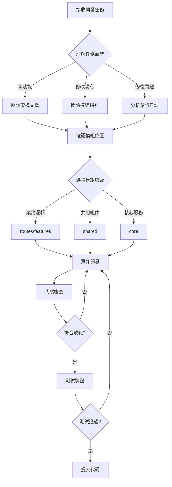

# 🤖 AI Agent 開發指南

> **目的**: 為 AI Agent（GitHub Copilot、Cursor AI）提供開發指引與最佳實踐

---

## 📑 目錄

- [概述](#-概述)
- [開發前必讀](#-開發前必讀)
- [思維導圖](#-思維導圖)
- [開發工作流程](#-開發工作流程)
- [模組特定指引](#-模組特定指引)
- [限制與解決方案](#-限制與解決方案)
- [最佳實踐](#-最佳實踐)

---

## 📋 概述

本指南說明 AI Agent 在本專案中的開發規範，確保生成的代碼符合專案標準，避免技術債務。

### 核心原則

1. **分層架構**: routes → shared → core（嚴禁循環依賴）
2. **Standalone Components**: 禁止建立 NgModule
3. **Signal 優先**: 使用 Signals 取代 RxJS state
4. **Repository 模式**: 所有 API 呼叫必須經過 Repository 層

---

## 📚 開發前必讀

優先級順序閱讀以下文檔：

| 優先級 | 文檔 | 說明 |
|--------|------|------|
| ⭐⭐⭐⭐⭐ | [Agent 思維導圖](./mindmap.md) | 決策流程與邏輯 |
| ⭐⭐⭐⭐⭐ | [系統架構](../architecture/system-architecture.md) | 完整架構設計 |
| ⭐⭐⭐⭐⭐ | [PRD 文件](../prd/construction-site-management.md) | 產品需求定義 |
| ⭐⭐⭐⭐ | [技術規範](../specs/README.md) | 編碼標準 |
| ⭐⭐⭐ | [開發環境](../development/README.md) | 環境設置 |

---

## 🧠 思維導圖

詳見 [Agent 思維導圖](./mindmap.md)，包含：

- 任務類型識別流程
- 模組選擇決策樹
- 代碼生成檢查清單
- 品質驗證流程

---

## 🔄 開發工作流程

---

## 📁 模組特定指引

根據正在編輯的檔案，自動應用對應指引：

| 檔案模式 | 指引檔案 | 說明 |
|----------|----------|------|
| `src/app/routes/**/*` | `.github/instructions/routes.instructions.md` | 路由模組 |
| `src/app/shared/**/*` | `.github/instructions/shared.instructions.md` | 共用組件 |
| `src/app/core/**/*` | `.github/instructions/core.instructions.md` | 核心服務 |
| `src/app/features/**/*` | `.github/instructions/features.instructions.md` | 功能模組 |
| `**/*.spec.ts` | `.github/instructions/testing.instructions.md` | 測試檔案 |
| `supabase/**/*` | `.github/instructions/supabase.instructions.md` | Supabase |

---

## ⚠️ 限制與解決方案

### 大型檔案處理

| 檔案 | 大小 | 處理方式 |
|------|------|----------|
| 代碼庫快照 | > 500KB | 使用 Repomix MCP 工具 |
| 組件索引 | > 200KB | 參考官方文檔 |
| 架構文檔 | < 100KB | 正常索引讀取 |

### 複雜架構理解

1. **Git-like 分支模型**: 先讀 [系統架構](../architecture/system-architecture.md)
2. **51 張資料表**: 參考 [資料模型](../reference/data-model.md)
3. **多層權限**: 參考 [RLS 策略](../supabase/rls-policies.md)

---

## ✅ 最佳實踐

### 代碼生成檢查清單

- [ ] 使用 Standalone Component（非 NgModule）
- [ ] 使用 `inject()` 而非 constructor DI
- [ ] 使用 Signal 取代 RxJS subject
- [ ] API 呼叫經過 Repository 層封裝
- [ ] Component < 500 行，template < 300 行
- [ ] 遵循 kebab-case 檔案命名

### 禁止事項

❌ 在 Component 直接使用 HttpClient  
❌ 使用 localStorage（改用 StorageService）  
❌ 建立 NgModule  
❌ 循環依賴  
❌ Fat components（> 500 行）

### 鼓勵事項

✅ Presentational Components（純展示）  
✅ Repository 模式封裝 API  
✅ Signal 狀態管理  
✅ Feature-based lazy loading  
✅ Application Facade 跨模組溝通

---

## 📚 相關文檔

- [AGENTS.md](../../AGENTS.md) - Agent 規則總覽
- [copilot-instructions.md](../../.github/copilot/copilot-instructions.md) - GitHub Copilot 完整指引
- [技術規範](../specs/README.md) - 所有編碼標準

---

**最後更新**: 2025-11-27  
**維護者**: 開發團隊
