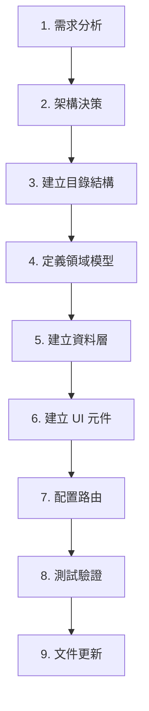

# 🚀 新功能模組工作流程

> 從零開始建立完整功能模組的步驟指南

---

## 工作流程概覽



---

## 步驟 1：需求分析

### 目標
確認功能需求的範圍和邊界

### 檢查項目
- [ ] 功能的業務價值是什麼？
- [ ] 功能的使用者是誰？
- [ ] 功能涉及哪些資料？
- [ ] 功能與其他功能的關係？

### 輸出
- 功能名稱 (英文，kebab-case)
- 功能描述
- 資料模型概要

---

## 步驟 2：架構決策

### 目標
確定功能放置位置和架構模式

### 決策流程

```
問：涉及用戶身份/組織/認證？
├── 是 → 基礎層 (src/app/core/)
└── 否 → 繼續
    │
問：涉及藍圖/工作區/權限？
├── 是 → 容器層 (src/app/features/)
└── 否 → 業務層 (src/app/features/)
```

### 輸出
- 功能位置：`src/app/features/{feature-name}/`
- 架構模式：垂直切片

---

## 步驟 3：建立目錄結構

### 命令

```bash
# 建立功能目錄結構
mkdir -p src/app/features/{feature-name}/{domain/{models,interfaces,types,enums},data-access/{stores,repositories},shell/{feature-name}-shell,ui/{feature-name}-list}}
```

### 目錄結構

```
src/app/features/{feature-name}/
├── {feature-name}.routes.ts
├── index.ts
├── domain/
│   ├── models/
│   ├── interfaces/
│   ├── types/
│   ├── enums/
│   └── index.ts
├── data-access/
│   ├── stores/
│   ├── repositories/
│   └── index.ts
├── shell/
│   └── {feature-name}-shell/
└── ui/
    └── {feature-name}-list/
```

---

## 步驟 4：定義領域模型

### 順序
1. Enum (狀態枚舉)
2. Model (領域模型)
3. Interface (DTO 介面)
4. Types (類型定義)

### 範例

```typescript
// domain/enums/{feature}-status.enum.ts
export enum FeatureStatus {
  DRAFT = 'draft',
  ACTIVE = 'active',
  ARCHIVED = 'archived',
}

// domain/models/{feature}.model.ts
export interface Feature {
  id: string;
  name: string;
  status: FeatureStatus;
  createdAt: Date;
  updatedAt: Date;
}

// domain/interfaces/{feature}.interface.ts
export interface CreateFeatureDto {
  name: string;
  status?: FeatureStatus;
}

// domain/index.ts
export * from './enums/{feature}-status.enum';
export * from './models/{feature}.model';
export * from './interfaces/{feature}.interface';
```

---

## 步驟 5：建立資料層

### 順序
1. Repository (資料存取)
2. Store (狀態管理)

### Repository

使用 [repository.template.md](../module-templates/repository.template.md) 範本

```typescript
// data-access/repositories/{feature}.repository.ts
@Injectable({ providedIn: 'root' })
export class FeatureRepository {
  // CRUD 操作
}
```

### Store

使用 [store.template.md](../module-templates/store.template.md) 範本

```typescript
// data-access/stores/{feature}.store.ts
@Injectable()
export class FeatureStore {
  // 狀態管理
}
```

---

## 步驟 6：建立 UI 元件

### 順序
1. UI 元件 (Presentational)
2. Shell 元件 (Smart)

### UI 元件

使用 [component.template.md](../module-templates/component.template.md) 範本

```typescript
// ui/{feature}-list/{feature}-list.component.ts
@Component({
  // 純展示，使用 input/output
})
export class FeatureListComponent {
  readonly items = input<Feature[]>([]);
  readonly select = output<string>();
}
```

### Shell 元件

```typescript
// shell/{feature}-shell/{feature}-shell.component.ts
@Component({
  providers: [FeatureStore],
})
export class FeatureShellComponent {
  protected readonly store = inject(FeatureStore);

  ngOnInit(): void {
    this.store.loadItems();
  }
}
```

---

## 步驟 7：配置路由

### Feature 路由

```typescript
// {feature-name}.routes.ts
export const FEATURE_ROUTES: Routes = [
  {
    path: '',
    loadComponent: () => import('./shell/{feature}-shell/{feature}-shell.component')
      .then(m => m.FeatureShellComponent),
  },
];
```

### 主路由整合

```typescript
// src/app/routes/routes.ts
{
  path: '{feature-name}',
  loadChildren: () => import('../features/{feature-name}/{feature-name}.routes')
    .then(m => m.FEATURE_ROUTES),
}
```

---

## 步驟 8：測試驗證

### 檢查清單
- [ ] `yarn lint` 通過
- [ ] `yarn build` 成功
- [ ] 頁面可正常訪問
- [ ] CRUD 操作正常
- [ ] 錯誤處理正確
- [ ] 載入狀態顯示正確

### 測試要點
- Store 的狀態變更
- Repository 的 API 調用
- 元件的使用者互動

---

## 步驟 9：文件更新

### 需要更新的文件
- [ ] `features/{feature-name}/AGENTS.md` (如需要)
- [ ] 相關 API 文件
- [ ] 使用說明

---

## 完整範例

### 建立 "Task" 功能模組

```bash
# 1. 建立目錄
mkdir -p src/app/features/task/{domain/{models,interfaces,enums},data-access/{stores,repositories},shell/task-shell,ui/task-list}

# 2. 建立檔案
touch src/app/features/task/task.routes.ts
touch src/app/features/task/index.ts
touch src/app/features/task/domain/index.ts
touch src/app/features/task/domain/enums/task-status.enum.ts
touch src/app/features/task/domain/models/task.model.ts
touch src/app/features/task/domain/interfaces/task.interface.ts
touch src/app/features/task/data-access/index.ts
touch src/app/features/task/data-access/repositories/task.repository.ts
touch src/app/features/task/data-access/stores/task.store.ts
touch src/app/features/task/shell/task-shell/task-shell.component.ts
touch src/app/features/task/shell/task-shell/task-shell.component.html
touch src/app/features/task/shell/task-shell/task-shell.component.less
touch src/app/features/task/ui/task-list/task-list.component.ts
touch src/app/features/task/ui/task-list/task-list.component.html
touch src/app/features/task/ui/task-list/task-list.component.less
```

---

## 參考資源

- [Feature 範本](../module-templates/feature.template.md)
- [Store 範本](../module-templates/store.template.md)
- [Repository 範本](../module-templates/repository.template.md)
- [Component 範本](../module-templates/component.template.md)
- [開發前檢查清單](../checklists/pre-development.md)
- [開發後檢查清單](../checklists/post-development.md)

---

**最後更新**: 2025-11-27
